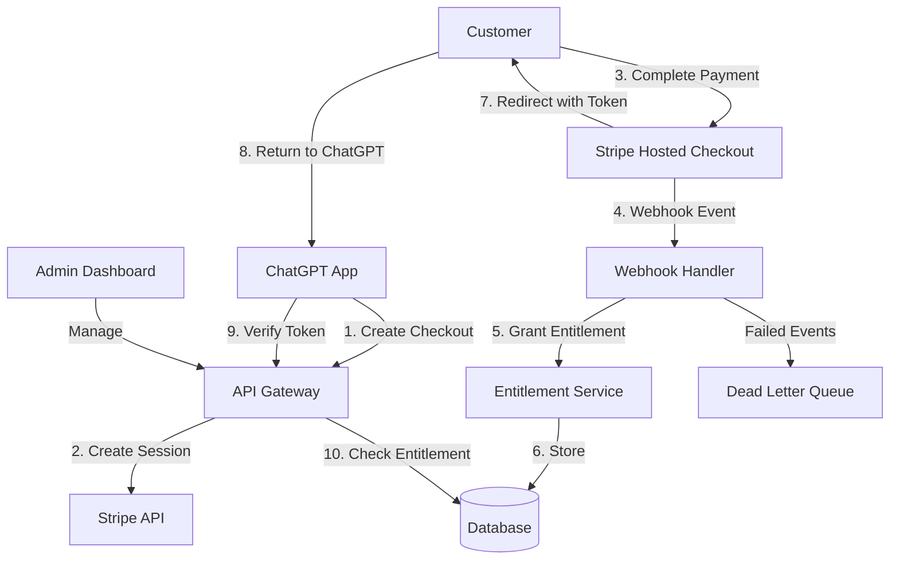
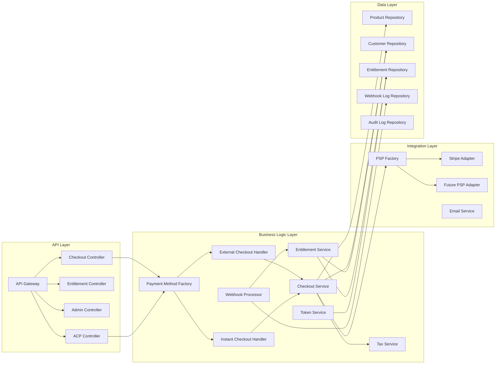
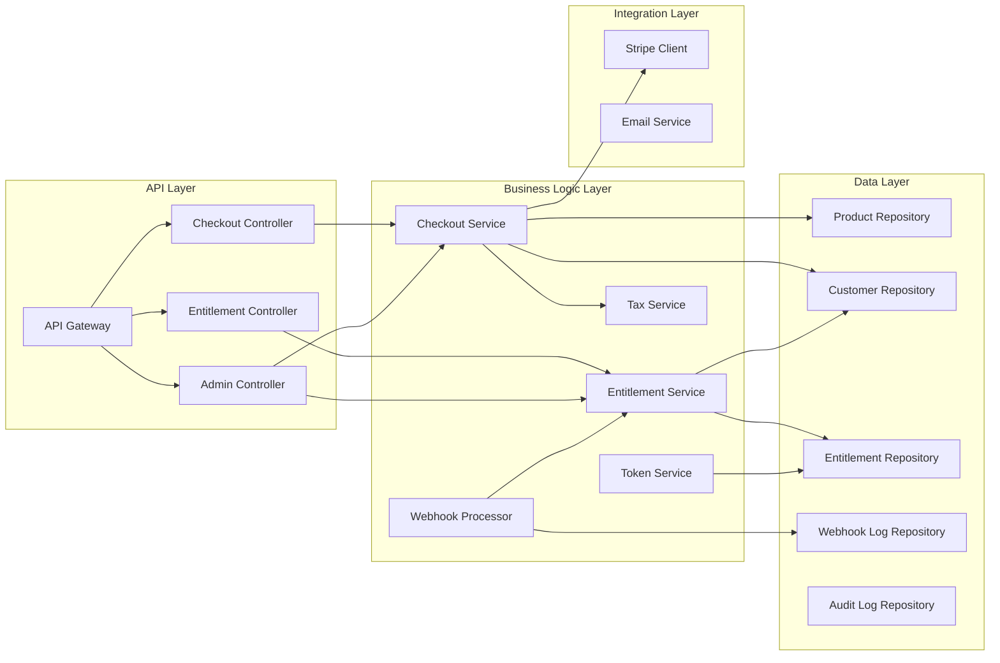

# Design Document: ForgePayBridge

## Overview

ForgePayBridge is a payment integration platform that wraps Stripe to provide turnkey payment solutions for OpenAI ChatGPT Apps. The system architecture follows an event-driven design with three primary layers:

1. **API Layer**: REST endpoints for checkout creation, entitlement verification, and admin operations
2. **Event Processing Layer**: Reliable webhook handling with idempotency and retry logic
3. **Data Layer**: Persistent storage for products, customers, entitlements, and audit logs

The system prioritizes reliability (no lost payments), security (PCI compliance via Stripe), and developer experience (minimal integration code).

## OpenAI Payment Integration Overview

### Two Payment Methods

ForgePayBridge supports both OpenAI payment methods with a unified, extensible architecture:

**Method 1: External Checkout (Recommended, Generally Available)**
- User clicks "Buy" in ChatGPT → Redirects to external checkout page
- Payment processed on your domain using Stripe
- After payment → User returns to ChatGPT with unlock token
- **Status**: Generally available, recommended by OpenAI
- **Use case**: All developers, any product type

**Method 2: Instant Checkout (Private Beta, ACP)**
- User completes purchase entirely within ChatGPT UI
- Uses Agentic Commerce Protocol (ACP) specification
- Requires OpenAI approval and ACP endpoint implementation
- **Status**: Private beta, approved partners only
- **Use case**: Marketplace partners, physical goods retailers

### OpenAI SDK Integration Points

**External Checkout Flow**:
```typescript
// 1. ChatGPT App calls your API to create checkout
POST /api/v1/checkout/sessions
{
  "product_id": "prod_123",
  "price_id": "price_456",
  "purchase_intent_id": "pi_openai_789", // OpenAI's unique ID
  "success_url": "https://chat.openai.com/success",
  "cancel_url": "https://chat.openai.com/cancel"
}

// 2. Your API returns Stripe Checkout URL
{
  "checkout_url": "https://checkout.stripe.com/c/pay/cs_test_...",
  "session_id": "cs_test_..."
}

// 3. User completes payment on Stripe
// 4. Stripe webhook notifies your server
// 5. Your server grants entitlement
// 6. User returns to ChatGPT with unlock_token

// 7. ChatGPT App verifies entitlement
GET /api/v1/entitlements/verify?unlock_token=eyJhbGc...
{
  "status": "active",
  "product_id": "prod_123",
  "expires_at": "2025-12-31T23:59:59Z"
}
```

**Instant Checkout Flow (ACP)**:
```typescript
// 1. ChatGPT calls your ACP endpoint to create session
POST /checkout_sessions
{
  "items": [{ "id": "item_123", "quantity": 1 }],
  "fulfillment_address": { ... }
}

// 2. Your server returns checkout session with line items
{
  "id": "checkout_session_123",
  "status": "ready_for_payment",
  "line_items": [...],
  "totals": [...],
  "payment_provider": {
    "provider": "stripe",
    "merchant_id": "acct_...",
    "supported_payment_methods": ["card", "apple_pay"]
  }
}

// 3. User clicks "Buy" in ChatGPT
// 4. ChatGPT calls complete endpoint with payment token
POST /checkout_sessions/checkout_session_123/complete
{
  "buyer": { "name": "...", "email": "..." },
  "payment_data": {
    "token": "spt_...", // Stripe payment token
    "provider": "stripe"
  }
}

// 5. Your server processes payment and creates order
{
  "id": "checkout_session_123",
  "status": "completed",
  "order": {
    "id": "order_456",
    "permalink_url": "https://yourstore.com/orders/456"
  }
}

// 6. Your server sends webhook to OpenAI
POST <openai_webhook_url>
{
  "type": "order_created",
  "data": {
    "type": "order",
    "checkout_session_id": "checkout_session_123",
    "status": "confirmed"
  }
}
```

## Architecture

### Design Principles

1. **High Cohesion**: Each module has a single, well-defined responsibility
2. **Low Coupling**: Modules communicate through interfaces, not concrete implementations
3. **Open/Closed**: Open for extension (new payment methods), closed for modification
4. **Dependency Inversion**: Depend on abstractions, not concretions
5. **Interface Segregation**: Clients depend only on interfaces they use

### Layered Architecture

```
┌─────────────────────────────────────────────────────────────┐
│                     Presentation Layer                       │
│  ┌──────────────┐  ┌──────────────┐  ┌──────────────┐      │
│  │ External     │  │ Instant      │  │ Admin        │      │
│  │ Checkout API │  │ Checkout API │  │ Dashboard    │      │
│  │ (Method 1)   │  │ (ACP/Method2)│  │ (React)      │      │
│  └──────────────┘  └──────────────┘  └──────────────┘      │
└─────────────────────────────────────────────────────────────┘
                            ↓
┌─────────────────────────────────────────────────────────────┐
│                    Application Layer                         │
│  ┌──────────────────────────────────────────────────────┐   │
│  │         Payment Method Abstraction (Strategy)        │   │
│  │  ┌────────────────┐      ┌────────────────┐         │   │
│  │  │ External       │      │ Instant        │         │   │
│  │  │ Checkout       │      │ Checkout       │         │   │
│  │  │ Handler        │      │ Handler (ACP)  │         │   │
│  │  └────────────────┘      └────────────────┘         │   │
│  └──────────────────────────────────────────────────────┘   │
│                            ↓                                 │
│  ┌──────────────────────────────────────────────────────┐   │
│  │            Core Business Services                    │   │
│  │  • CheckoutService  • EntitlementService            │   │
│  │  • TokenService     • WebhookProcessor              │   │
│  │  • TaxService       • NotificationService           │   │
│  └──────────────────────────────────────────────────────┘   │
└─────────────────────────────────────────────────────────────┘
                            ↓
┌─────────────────────────────────────────────────────────────┐
│                    Integration Layer                         │
│  ┌──────────────────────────────────────────────────────┐   │
│  │         Payment Provider Abstraction (Adapter)       │   │
│  │  ┌────────────────┐      ┌────────────────┐         │   │
│  │  │ Stripe         │      │ Future PSP     │         │   │
│  │  │ Adapter        │      │ Adapter        │         │   │
│  │  └────────────────┘      └────────────────┘         │   │
│  └──────────────────────────────────────────────────────┘   │
└─────────────────────────────────────────────────────────────┘
                            ↓
┌─────────────────────────────────────────────────────────────┐
│                      Data Layer                              │
│  • ProductRepository    • CustomerRepository                 │
│  • EntitlementRepository • WebhookLogRepository             │
│  • AuditLogRepository   • CheckoutSessionRepository         │
└─────────────────────────────────────────────────────────────┘
```

### Extensibility Points (Extension Interfaces)

**1. Payment Method Strategy Interface**:
```typescript
interface IPaymentMethodHandler {
  // Create checkout session
  createCheckout(params: CheckoutParams): Promise<CheckoutResult>;
  
  // Process payment completion
  completePayment(params: CompletionParams): Promise<PaymentResult>;
  
  // Handle payment method specific webhooks
  processWebhook(event: WebhookEvent): Promise<void>;
  
  // Get payment method capabilities
  getCapabilities(): PaymentMethodCapabilities;
}

// Implementations:
class ExternalCheckoutHandler implements IPaymentMethodHandler { ... }
class InstantCheckoutHandler implements IPaymentMethodHandler { ... }
// Future: class PayPalCheckoutHandler implements IPaymentMethodHandler { ... }
```

**2. Payment Service Provider (PSP) Adapter Interface**:
```typescript
interface IPaymentProvider {
  // Create payment session
  createPaymentSession(params: PaymentSessionParams): Promise<PaymentSession>;
  
  // Process payment with token
  processPayment(token: string, amount: number): Promise<PaymentResult>;
  
  // Create refund
  createRefund(paymentId: string, amount?: number): Promise<Refund>;
  
  // Verify webhook signature
  verifyWebhookSignature(payload: string, signature: string): boolean;
  
  // Get provider name
  getProviderName(): string;
}

// Implementations:
class StripeProvider implements IPaymentProvider { ... }
// Future: class AdyenProvider implements IPaymentProvider { ... }
// Future: class PayPalProvider implements IPaymentProvider { ... }
```

**3. Webhook Event Handler Interface**:
```typescript
interface IWebhookEventHandler {
  // Can this handler process this event?
  canHandle(event: WebhookEvent): boolean;
  
  // Process the event
  handle(event: WebhookEvent): Promise<void>;
  
  // Get event types this handler supports
  getSupportedEventTypes(): string[];
}

// Implementations:
class StripeWebhookHandler implements IWebhookEventHandler { ... }
class ACPWebhookHandler implements IWebhookEventHandler { ... }
```

**4. Notification Channel Interface**:
```typescript
interface INotificationChannel {
  // Send notification
  send(recipient: string, message: NotificationMessage): Promise<void>;
  
  // Get channel name
  getChannelName(): string;
}

// Implementations:
class EmailNotificationChannel implements INotificationChannel { ... }
// Future: class SMSNotificationChannel implements INotificationChannel { ... }
// Future: class WebhookNotificationChannel implements INotificationChannel { ... }
```

### High-Level Architecture



### Component Architecture



## Detailed Component Responsibilities

### 1. API Gateway (Entry Point)

**Responsibility**: Route requests, authenticate, rate limit, log

**Key Methods**:
```typescript
class APIGateway {
  // Route to appropriate controller
  route(request: Request): Promise<Response>;
  
  // Authenticate request (API key, JWT, etc.)
  authenticate(request: Request): Promise<AuthContext>;
  
  // Apply rate limiting
  rateLimit(request: Request): Promise<boolean>;
  
  // Log request/response
  logRequest(request: Request, response: Response): void;
}
```

**Extension Points**:
- Add new authentication methods (OAuth, JWT, etc.)
- Add new rate limiting strategies
- Add request/response transformers

### 2. Payment Method Factory (Strategy Pattern)

**Responsibility**: Select appropriate payment method handler based on request type

**Key Methods**:
```typescript
class PaymentMethodFactory {
  // Get handler for payment method
  getHandler(method: PaymentMethod): IPaymentMethodHandler;
  
  // Register new payment method handler
  registerHandler(method: PaymentMethod, handler: IPaymentMethodHandler): void;
}

enum PaymentMethod {
  EXTERNAL_CHECKOUT = 'external_checkout',
  INSTANT_CHECKOUT = 'instant_checkout',
  // Future: PAYPAL_CHECKOUT = 'paypal_checkout'
}
```

**Extension Points**:
- Add new payment method handlers without modifying existing code
- Switch payment methods dynamically based on configuration

### 3. External Checkout Handler (Method 1)

**Responsibility**: Handle OpenAI External Checkout flow

**Key Methods**:
```typescript
class ExternalCheckoutHandler implements IPaymentMethodHandler {
  constructor(
    private checkoutService: CheckoutService,
    private tokenService: TokenService,
    private entitlementService: EntitlementService
  ) {}
  
  // Create Stripe Checkout Session
  async createCheckout(params: ExternalCheckoutParams): Promise<CheckoutResult> {
    // 1. Validate params
    // 2. Create Stripe session via CheckoutService
    // 3. Store session with purchase_intent_id
    // 4. Return checkout URL
  }
  
  // Handle successful payment (called by webhook)
  async completePayment(params: CompletionParams): Promise<PaymentResult> {
    // 1. Verify payment via Stripe
    // 2. Grant entitlement
    // 3. Generate unlock token
    // 4. Return result
  }
  
  // Process Stripe webhooks
  async processWebhook(event: WebhookEvent): Promise<void> {
    // Route to appropriate handler based on event type
  }
  
  getCapabilities(): PaymentMethodCapabilities {
    return {
      supportsSubscriptions: true,
      supportsOneTime: true,
      supportsRefunds: true,
      requiresRedirect: true,
    };
  }
}
```

**Workflow**:
```
ChatGPT App → POST /api/v1/checkout/sessions
            → ExternalCheckoutHandler.createCheckout()
            → CheckoutService.createStripeSession()
            → Stripe API
            → Return checkout_url

User completes payment on Stripe
            → Stripe Webhook
            → WebhookProcessor
            → ExternalCheckoutHandler.processWebhook()
            → EntitlementService.grantEntitlement()
            → TokenService.generateUnlockToken()

ChatGPT App → GET /api/v1/entitlements/verify?unlock_token=...
            → TokenService.verifyToken()
            → EntitlementService.checkStatus()
            → Return entitlement status
```

### 4. Instant Checkout Handler (Method 2 - ACP)

**Responsibility**: Handle OpenAI Instant Checkout (ACP) flow

**Key Methods**:
```typescript
class InstantCheckoutHandler implements IPaymentMethodHandler {
  constructor(
    private checkoutService: CheckoutService,
    private entitlementService: EntitlementService,
    private taxService: TaxService
  ) {}
  
  // Create ACP checkout session
  async createCheckout(params: ACPCheckoutParams): Promise<ACPCheckoutSession> {
    // 1. Validate items
    // 2. Calculate line items with tax
    // 3. Calculate fulfillment options
    // 4. Return ACP-compliant session
  }
  
  // Update ACP checkout session
  async updateCheckout(
    sessionId: string,
    updates: ACPCheckoutUpdates
  ): Promise<ACPCheckoutSession> {
    // 1. Apply updates (address, fulfillment option, etc.)
    // 2. Recalculate totals
    // 3. Return updated session
  }
  
  // Complete ACP checkout
  async completePayment(params: ACPCompletionParams): Promise<ACPOrderResult> {
    // 1. Process payment with Stripe token
    // 2. Create order
    // 3. Grant entitlement
    // 4. Send webhook to OpenAI
    // 5. Return order details
  }
  
  // Cancel ACP checkout
  async cancelCheckout(sessionId: string): Promise<void> {
    // Mark session as canceled
  }
  
  // Get ACP checkout session
  async getCheckout(sessionId: string): Promise<ACPCheckoutSession> {
    // Return current session state
  }
  
  getCapabilities(): PaymentMethodCapabilities {
    return {
      supportsSubscriptions: true,
      supportsOneTime: true,
      supportsRefunds: true,
      requiresRedirect: false,
      supportsInChatPayment: true,
    };
  }
}
```

**Workflow**:
```
ChatGPT → POST /checkout_sessions
        → InstantCheckoutHandler.createCheckout()
        → TaxService.calculateTax()
        → Return ACP session with line_items, totals

ChatGPT → POST /checkout_sessions/{id}
        → InstantCheckoutHandler.updateCheckout()
        → Recalculate with new address/options
        → Return updated ACP session

User clicks "Buy" in ChatGPT
        → POST /checkout_sessions/{id}/complete
        → InstantCheckoutHandler.completePayment()
        → CheckoutService.processStripeToken()
        → EntitlementService.grantEntitlement()
        → Send webhook to OpenAI
        → Return order

Your Server → POST <openai_webhook_url>
            → { type: "order_created", data: {...} }
```

### 5. Checkout Service (Core Business Logic)

**Responsibility**: Orchestrate checkout operations, delegate to PSP

**Key Methods**:
```typescript
class CheckoutService {
  constructor(
    private pspFactory: PSPFactory,
    private productRepo: ProductRepository,
    private customerRepo: CustomerRepository,
    private taxService: TaxService
  ) {}
  
  // Create payment session (PSP-agnostic)
  async createSession(params: CreateSessionParams): Promise<CheckoutSession> {
    const psp = this.pspFactory.getProvider(params.provider);
    const product = await this.productRepo.findById(params.productId);
    const customer = await this.customerRepo.findOrCreate(params.customerEmail);
    
    // Create session via PSP
    const session = await psp.createPaymentSession({
      product,
      customer,
      successUrl: params.successUrl,
      cancelUrl: params.cancelUrl,
      metadata: {
        purchase_intent_id: params.purchaseIntentId,
      },
    });
    
    // Store session
    await this.checkoutSessionRepo.create(session);
    
    return session;
  }
  
  // Process payment with token (for ACP)
  async processPaymentToken(
    token: string,
    amount: number,
    provider: string
  ): Promise<PaymentResult> {
    const psp = this.pspFactory.getProvider(provider);
    return await psp.processPayment(token, amount);
  }
  
  // Get session
  async getSession(sessionId: string): Promise<CheckoutSession> {
    return await this.checkoutSessionRepo.findById(sessionId);
  }
}
```

**Extension Points**:
- Add new PSP providers without changing CheckoutService
- Add pre/post checkout hooks
- Add custom validation logic

### 6. PSP Factory (Adapter Pattern)

**Responsibility**: Provide PSP adapters, abstract payment provider details

**Key Methods**:
```typescript
class PSPFactory {
  private providers: Map<string, IPaymentProvider> = new Map();
  
  constructor() {
    // Register default providers
    this.registerProvider('stripe', new StripeProvider());
  }
  
  // Get provider by name
  getProvider(name: string): IPaymentProvider {
    const provider = this.providers.get(name);
    if (!provider) {
      throw new Error(`Payment provider ${name} not found`);
    }
    return provider;
  }
  
  // Register new provider
  registerProvider(name: string, provider: IPaymentProvider): void {
    this.providers.set(name, provider);
  }
  
  // Get all available providers
  getAvailableProviders(): string[] {
    return Array.from(this.providers.keys());
  }
}
```

**Extension Points**:
- Add new PSP adapters (Adyen, PayPal, etc.) by implementing IPaymentProvider
- Switch PSPs without changing business logic
- Use multiple PSPs simultaneously

### 7. Stripe Adapter (PSP Implementation)

**Responsibility**: Implement Stripe-specific payment operations

**Key Methods**:
```typescript
class StripeProvider implements IPaymentProvider {
  private stripe: Stripe;
  
  constructor(apiKey: string) {
    this.stripe = new Stripe(apiKey, {
      apiVersion: '2024-09-30.acacia',
    });
  }
  
  async createPaymentSession(params: PaymentSessionParams): Promise<PaymentSession> {
    const session = await this.stripe.checkout.sessions.create({
      mode: params.product.type === 'subscription' ? 'subscription' : 'payment',
      line_items: [{
        price: params.product.stripePriceId,
        quantity: 1,
      }],
      success_url: params.successUrl,
      cancel_url: params.cancelUrl,
      customer: params.customer.stripeCustomerId,
      metadata: params.metadata,
      automatic_tax: { enabled: true },
    });
    
    return {
      id: session.id,
      url: session.url,
      status: session.status,
      provider: 'stripe',
    };
  }
  
  async processPayment(token: string, amount: number): Promise<PaymentResult> {
    const paymentIntent = await this.stripe.paymentIntents.create({
      amount,
      currency: 'usd',
      payment_method: token,
      confirm: true,
    });
    
    return {
      id: paymentIntent.id,
      status: paymentIntent.status,
      amount: paymentIntent.amount,
    };
  }
  
  async createRefund(paymentId: string, amount?: number): Promise<Refund> {
    const refund = await this.stripe.refunds.create({
      payment_intent: paymentId,
      amount,
    });
    
    return {
      id: refund.id,
      amount: refund.amount,
      status: refund.status,
    };
  }
  
  verifyWebhookSignature(payload: string, signature: string): boolean {
    try {
      this.stripe.webhooks.constructEvent(
        payload,
        signature,
        process.env.STRIPE_WEBHOOK_SECRET
      );
      return true;
    } catch (err) {
      return false;
    }
  }
  
  getProviderName(): string {
    return 'stripe';
  }
}
```

### 8. Webhook Processor (Event-Driven)

**Responsibility**: Process webhooks from multiple sources, ensure idempotency

**Key Methods**:
```typescript
class WebhookProcessor {
  private handlers: IWebhookEventHandler[] = [];
  
  constructor(
    private webhookLogRepo: WebhookLogRepository,
    private entitlementService: EntitlementService
  ) {
    // Register handlers
    this.registerHandler(new StripeWebhookHandler(entitlementService));
    this.registerHandler(new ACPWebhookHandler(entitlementService));
  }
  
  // Process webhook
  async processWebhook(
    payload: string,
    signature: string,
    source: string
  ): Promise<ProcessResult> {
    // 1. Verify signature
    // 2. Parse event
    // 3. Check idempotency (event already processed?)
    // 4. Find handler
    // 5. Process event
    // 6. Log result
    // 7. Handle retries if failed
  }
  
  // Register handler
  registerHandler(handler: IWebhookEventHandler): void {
    this.handlers.push(handler);
  }
  
  // Retry failed webhook
  async retryFailedWebhook(webhookLogId: string): Promise<ProcessResult> {
    // Retrieve from DLQ and retry
  }
}
```

**Extension Points**:
- Add new webhook handlers for different event sources
- Customize retry logic
- Add event transformers

### 9. Entitlement Service (Core Business Logic)

**Responsibility**: Manage entitlement lifecycle

**Key Methods**:
```typescript
class EntitlementService {
  constructor(
    private entitlementRepo: EntitlementRepository,
    private auditLogRepo: AuditLogRepository
  ) {}
  
  // Grant entitlement
  async grantEntitlement(params: GrantEntitlementParams): Promise<Entitlement> {
    // 1. Create entitlement record
    // 2. Set expiration (null for one-time, date for subscription)
    // 3. Log action
    // 4. Return entitlement
  }
  
  // Check entitlement status
  async checkEntitlementStatus(purchaseIntentId: string): Promise<EntitlementStatus> {
    // 1. Query by purchase_intent_id
    // 2. Check expiration
    // 3. Return status
  }
  
  // Renew entitlement (subscription renewal)
  async renewEntitlement(entitlementId: string, expiresAt: Date): Promise<Entitlement> {
    // 1. Update expiration
    // 2. Log action
    // 3. Return updated entitlement
  }
  
  // Suspend entitlement (payment failure)
  async suspendEntitlement(entitlementId: string, reason: string): Promise<Entitlement> {
    // 1. Update status to 'suspended'
    // 2. Log action with reason
    // 3. Return updated entitlement
  }
  
  // Revoke entitlement (refund/chargeback)
  async revokeEntitlement(entitlementId: string, reason: string): Promise<Entitlement> {
    // 1. Update status to 'revoked'
    // 2. Log action with reason
    // 3. Return updated entitlement
  }
}
```

**Extension Points**:
- Add custom entitlement rules
- Add entitlement tiers/levels
- Add usage-based entitlements

### 10. Token Service (Security)

**Responsibility**: Generate and verify unlock tokens

**Key Methods**:
```typescript
class TokenService {
  constructor(
    private redis: RedisClient,
    private jwtSecret: string
  ) {}
  
  // Generate unlock token
  async generateUnlockToken(
    entitlementId: string,
    purchaseIntentId: string
  ): Promise<string> {
    const payload = {
      entitlement_id: entitlementId,
      purchase_intent_id: purchaseIntentId,
      iat: Math.floor(Date.now() / 1000),
      exp: Math.floor(Date.now() / 1000) + 300, // 5 minutes
      jti: uuidv4(), // Unique token ID
    };
    
    return jwt.sign(payload, this.jwtSecret, { algorithm: 'HS256' });
  }
  
  // Verify unlock token
  async verifyUnlockToken(token: string): Promise<TokenPayload> {
    // 1. Verify JWT signature
    // 2. Check expiration
    // 3. Check if already used (Redis)
    // 4. Return payload
  }
  
  // Mark token as used
  async markTokenUsed(token: string): Promise<void> {
    const payload = jwt.decode(token) as TokenPayload;
    await this.redis.setex(`token:used:${payload.jti}`, 300, '1');
  }
}
```

## Extension Strategy Summary

### Adding a New Payment Method (e.g., PayPal)

1. **Create Handler**:
```typescript
class PayPalCheckoutHandler implements IPaymentMethodHandler {
  // Implement interface methods
}
```

2. **Register in Factory**:
```typescript
paymentMethodFactory.registerHandler(
  PaymentMethod.PAYPAL_CHECKOUT,
  new PayPalCheckoutHandler(...)
);
```

3. **Add API Routes** (if needed):
```typescript
router.post('/api/v1/paypal/checkout', async (req, res) => {
  const handler = paymentMethodFactory.getHandler(PaymentMethod.PAYPAL_CHECKOUT);
  const result = await handler.createCheckout(req.body);
  res.json(result);
});
```

### Adding a New PSP (e.g., Adyen)

1. **Create Adapter**:
```typescript
class AdyenProvider implements IPaymentProvider {
  // Implement interface methods
}
```

2. **Register in Factory**:
```typescript
pspFactory.registerProvider('adyen', new AdyenProvider(apiKey));
```

3. **Use in Checkout**:
```typescript
const result = await checkoutService.createSession({
  ...params,
  provider: 'adyen', // Switch PSP
});
```

### Adding a New Notification Channel (e.g., SMS)

1. **Create Channel**:
```typescript
class SMSNotificationChannel implements INotificationChannel {
  async send(recipient: string, message: NotificationMessage): Promise<void> {
    // Send SMS via Twilio, etc.
  }
  
  getChannelName(): string {
    return 'sms';
  }
}
```

2. **Register in Service**:
```typescript
notificationService.registerChannel(new SMSNotificationChannel());
```

3. **Use**:
```typescript
await notificationService.send('sms', recipient, message);
```

## Clear Separation of Concerns

| Layer | Responsibility | Knows About | Doesn't Know About |
|-------|---------------|-------------|-------------------|
| **Presentation** | HTTP routing, request/response | API contracts, DTOs | Business logic, database |
| **Application** | Business workflows, orchestration | Domain models, services | HTTP, database details |
| **Integration** | External service communication | Service APIs, protocols | Business rules |
| **Data** | Data persistence, queries | Database schema | Business logic, HTTP |

## Configuration-Driven Extensibility

```typescript
// config/payment-methods.ts
export const paymentMethodConfig = {
  external_checkout: {
    enabled: true,
    handler: ExternalCheckoutHandler,
    psp: 'stripe',
  },
  instant_checkout: {
    enabled: false, // Enable when approved by OpenAI
    handler: InstantCheckoutHandler,
    psp: 'stripe',
  },
  // Future
  paypal_checkout: {
    enabled: false,
    handler: PayPalCheckoutHandler,
    psp: 'paypal',
  },
};

// config/psp-providers.ts
export const pspConfig = {
  stripe: {
    enabled: true,
    adapter: StripeProvider,
    apiKey: process.env.STRIPE_SECRET_KEY,
  },
  adyen: {
    enabled: false,
    adapter: AdyenProvider,
    apiKey: process.env.ADYEN_API_KEY,
  },
};
```

This architecture ensures:
- ✅ **High Cohesion**: Each component has a single, clear responsibility
- ✅ **Low Coupling**: Components depend on interfaces, not implementations
- ✅ **Easy Extension**: Add new payment methods/PSPs without modifying existing code
- ✅ **Easy Testing**: Mock interfaces for unit testing
- ✅ **Easy Maintenance**: Changes isolated to specific components

### Component Architecture



## Stripe Integration Guide

### Overview

ForgePayBridge is built entirely on top of Stripe's existing infrastructure. We **do not implement payment processing from scratch**. Instead, we leverage Stripe's battle-tested APIs and services:

- **Stripe Checkout**: Hosted payment pages (PCI-compliant)
- **Stripe Billing**: Subscription management
- **Stripe Tax**: Automatic tax calculation
- **Stripe Radar**: Fraud detection
- **Stripe Webhooks**: Real-time event notifications
- **Stripe Customer Portal**: Self-service subscription management

### Stripe SDK Installation and Configuration

**Install Stripe Node.js SDK**:

```bash
npm install stripe
# or
yarn add stripe
```

**Current Version**: Latest stable version supports Node.js 16+ (LTS versions)

**Initialize Stripe Client**:

```typescript
import Stripe from 'stripe';

// Initialize with API key
const stripe = new Stripe(process.env.STRIPE_SECRET_KEY, {
  apiVersion: '2024-09-30.acacia', // Use latest API version
  typescript: true,
  maxNetworkRetries: 3,
  timeout: 80000, // 80 seconds
  telemetry: true,
});

// For test mode
const stripeTest = new Stripe(process.env.STRIPE_TEST_SECRET_KEY, {
  apiVersion: '2024-09-30.acacia',
});
```

**Environment Variables**:

```bash
# .env file
STRIPE_SECRET_KEY=sk_live_...
STRIPE_TEST_SECRET_KEY=sk_test_...
STRIPE_WEBHOOK_SECRET=whsec_...
STRIPE_PUBLISHABLE_KEY=pk_live_...
```

### Using Stripe Checkout Sessions

**Create a Checkout Session** (one-time payment):

```typescript
async function createOneTimeCheckoutSession(params: {
  productId: string;
  priceId: string;
  purchaseIntentId: string;
  successUrl: string;
  cancelUrl: string;
}) {
  const session = await stripe.checkout.sessions.create({
    mode: 'payment', // One-time payment
    line_items: [
      {
        price: params.priceId, // Stripe Price ID
        quantity: 1,
      },
    ],
    success_url: `${params.successUrl}?session_id={CHECKOUT_SESSION_ID}`,
    cancel_url: params.cancelUrl,
    client_reference_id: params.purchaseIntentId, // OpenAI's purchase_intent_id
    metadata: {
      purchase_intent_id: params.purchaseIntentId,
      product_id: params.productId,
    },
    automatic_tax: {
      enabled: true, // Enable Stripe Tax
    },
    customer_creation: 'always', // Always create a customer
    payment_method_types: ['card'], // Accept cards
    expires_at: Math.floor(Date.now() / 1000) + 86400, // 24 hours
  });

  return {
    sessionId: session.id,
    checkoutUrl: session.url, // Redirect customer here
  };
}
```

**Create a Subscription Checkout Session**:

```typescript
async function createSubscriptionCheckoutSession(params: {
  priceId: string;
  purchaseIntentId: string;
  successUrl: string;
  cancelUrl: string;
}) {
  const session = await stripe.checkout.sessions.create({
    mode: 'subscription', // Recurring payment
    line_items: [
      {
        price: params.priceId, // Stripe Price ID with recurring interval
        quantity: 1,
      },
    ],
    success_url: `${params.successUrl}?session_id={CHECKOUT_SESSION_ID}`,
    cancel_url: params.cancelUrl,
    client_reference_id: params.purchaseIntentId,
    metadata: {
      purchase_intent_id: params.purchaseIntentId,
    },
    automatic_tax: {
      enabled: true,
    },
    customer_creation: 'always',
    subscription_data: {
      metadata: {
        purchase_intent_id: params.purchaseIntentId,
      },
    },
  });

  return {
    sessionId: session.id,
    checkoutUrl: session.url,
  };
}
```

### Creating Products and Prices in Stripe

**Create a Product**:

```typescript
async function createProduct(params: {
  name: string;
  description: string;
  type: 'one_time' | 'subscription';
}) {
  const product = await stripe.products.create({
    name: params.name,
    description: params.description,
    metadata: {
      type: params.type,
    },
  });

  return product;
}
```

**Create a Price** (one-time):

```typescript
async function createOneTimePrice(params: {
  productId: string;
  amount: number; // Amount in cents (e.g., 2000 = $20.00)
  currency: string; // 'usd', 'eur', 'gbp', etc.
}) {
  const price = await stripe.prices.create({
    product: params.productId,
    unit_amount: params.amount,
    currency: params.currency,
    tax_behavior: 'exclusive', // Tax calculated separately
  });

  return price;
}
```

**Create a Price** (subscription):

```typescript
async function createSubscriptionPrice(params: {
  productId: string;
  amount: number;
  currency: string;
  interval: 'month' | 'year';
}) {
  const price = await stripe.prices.create({
    product: params.productId,
    unit_amount: params.amount,
    currency: params.currency,
    recurring: {
      interval: params.interval,
    },
    tax_behavior: 'exclusive',
  });

  return price;
}
```

### Configuring Stripe Tax

**Enable Stripe Tax in Dashboard**:
1. Go to Stripe Dashboard → Settings → Tax
2. Add your tax registrations (countries/states where you collect tax)
3. Configure tax behavior (inclusive vs. exclusive)

**Use Stripe Tax in API**:

```typescript
// Tax is automatically calculated when automatic_tax.enabled = true
const session = await stripe.checkout.sessions.create({
  // ... other params
  automatic_tax: {
    enabled: true,
  },
});

// For custom tax calculations
const taxCalculation = await stripe.tax.calculations.create({
  currency: 'usd',
  line_items: [
    {
      amount: 2000,
      reference: 'product_123',
    },
  ],
  customer_details: {
    address: {
      line1: '123 Main St',
      city: 'San Francisco',
      state: 'CA',
      postal_code: '94111',
      country: 'US',
    },
    address_source: 'billing',
  },
});
```

### Setting Up Stripe Webhooks

**Configure Webhook Endpoint in Stripe Dashboard**:
1. Go to Developers → Webhooks
2. Click "Add endpoint"
3. Enter your endpoint URL: `https://yourdomain.com/api/v1/webhooks/stripe`
4. Select events to listen for:
   - `checkout.session.completed`
   - `invoice.paid`
   - `invoice.payment_failed`
   - `customer.subscription.updated`
   - `customer.subscription.deleted`
   - `charge.refunded`
   - `charge.dispute.created`
   - `charge.dispute.closed`
5. Copy the webhook signing secret (starts with `whsec_`)

**Verify Webhook Signatures**:

```typescript
import Stripe from 'stripe';

async function handleWebhook(req: Request) {
  const signature = req.headers['stripe-signature'];
  const payload = req.body; // Raw body (not parsed JSON)

  let event: Stripe.Event;

  try {
    // Verify signature using Stripe SDK
    event = stripe.webhooks.constructEvent(
      payload,
      signature,
      process.env.STRIPE_WEBHOOK_SECRET
    );
  } catch (err) {
    console.error('Webhook signature verification failed:', err.message);
    return { status: 401, error: 'Invalid signature' };
  }

  // Process the event
  switch (event.type) {
    case 'checkout.session.completed':
      await handleCheckoutCompleted(event.data.object);
      break;
    case 'invoice.paid':
      await handleInvoicePaid(event.data.object);
      break;
    // ... other event handlers
  }

  return { status: 200, received: true };
}
```

**Important**: Always use the **raw request body** for signature verification, not parsed JSON.

### Using Stripe Customer Portal

**Create a Customer Portal Session**:

```typescript
async function createCustomerPortalSession(params: {
  customerId: string;
  returnUrl: string;
}) {
  const session = await stripe.billingPortal.sessions.create({
    customer: params.customerId,
    return_url: params.returnUrl,
  });

  return {
    portalUrl: session.url, // Redirect customer here
  };
}
```

**Configure Portal Settings in Dashboard**:
1. Go to Settings → Billing → Customer portal
2. Enable features:
   - Update payment method
   - Cancel subscription
   - View invoices
   - Update billing information

### Processing Refunds

**Create a Full Refund**:

```typescript
async function createFullRefund(paymentIntentId: string) {
  const refund = await stripe.refunds.create({
    payment_intent: paymentIntentId,
    reason: 'requested_by_customer', // or 'duplicate', 'fraudulent'
  });

  return refund;
}
```

**Create a Partial Refund**:

```typescript
async function createPartialRefund(params: {
  paymentIntentId: string;
  amount: number; // Amount in cents
}) {
  const refund = await stripe.refunds.create({
    payment_intent: params.paymentIntentId,
    amount: params.amount,
    reason: 'requested_by_customer',
  });

  return refund;
}
```

### Configuring Stripe Radar (Fraud Prevention)

**Enable Stripe Radar**:
1. Go to Stripe Dashboard → Radar
2. Configure risk rules and thresholds
3. Radar automatically scores all payments

**Handle Radar Events**:

```typescript
// Radar automatically blocks high-risk payments
// You can also listen to early fraud warnings
async function handleRadarEarlyFraudWarning(event: Stripe.Event) {
  const charge = event.data.object as Stripe.Charge;
  
  // Log the fraud warning
  console.warn('Fraud warning for charge:', charge.id);
  
  // Optionally revoke entitlement
  await revokeEntitlement(charge.metadata.purchase_intent_id);
}
```

### Managing Customers

**Create or Retrieve Customer**:

```typescript
async function findOrCreateCustomer(email: string) {
  // Search for existing customer
  const customers = await stripe.customers.list({
    email: email,
    limit: 1,
  });

  if (customers.data.length > 0) {
    return customers.data[0];
  }

  // Create new customer
  const customer = await stripe.customers.create({
    email: email,
  });

  return customer;
}
```

### Handling Subscriptions

**Cancel a Subscription**:

```typescript
async function cancelSubscription(params: {
  subscriptionId: string;
  immediately: boolean;
}) {
  if (params.immediately) {
    // Cancel immediately
    const subscription = await stripe.subscriptions.cancel(params.subscriptionId);
    return subscription;
  } else {
    // Cancel at period end
    const subscription = await stripe.subscriptions.update(params.subscriptionId, {
      cancel_at_period_end: true,
    });
    return subscription;
  }
}
```

**Update Subscription**:

```typescript
async function updateSubscription(params: {
  subscriptionId: string;
  newPriceId: string;
}) {
  const subscription = await stripe.subscriptions.retrieve(params.subscriptionId);

  const updatedSubscription = await stripe.subscriptions.update(params.subscriptionId, {
    items: [
      {
        id: subscription.items.data[0].id,
        price: params.newPriceId,
      },
    ],
    proration_behavior: 'create_prorations', // Prorate the change
  });

  return updatedSubscription;
}
```

### Error Handling with Stripe

**Handle Stripe Errors**:

```typescript
import Stripe from 'stripe';

async function handleStripeOperation() {
  try {
    const session = await stripe.checkout.sessions.create({
      // ... params
    });
    return session;
  } catch (error) {
    if (error instanceof Stripe.errors.StripeCardError) {
      // Card was declined
      console.error('Card error:', error.message);
    } else if (error instanceof Stripe.errors.StripeRateLimitError) {
      // Too many requests
      console.error('Rate limit error');
      // Retry with backoff
    } else if (error instanceof Stripe.errors.StripeInvalidRequestError) {
      // Invalid parameters
      console.error('Invalid request:', error.message);
    } else if (error instanceof Stripe.errors.StripeAPIError) {
      // Stripe API error
      console.error('Stripe API error:', error.message);
    } else if (error instanceof Stripe.errors.StripeConnectionError) {
      // Network error
      console.error('Connection error');
      // Retry
    } else if (error instanceof Stripe.errors.StripeAuthenticationError) {
      // Authentication error (invalid API key)
      console.error('Authentication error');
    }
    throw error;
  }
}
```

### Testing with Stripe Test Mode

**Use Test API Keys**:
- Test Secret Key: `sk_test_...`
- Test Publishable Key: `pk_test_...`

**Test Card Numbers**:
```
Success: 4242 4242 4242 4242
Decline: 4000 0000 0000 0002
3DS Required: 4000 0025 0000 3155
Insufficient Funds: 4000 0000 0000 9995
```

**Trigger Test Webhooks**:
```bash
# Install Stripe CLI
stripe listen --forward-to localhost:3000/api/v1/webhooks/stripe

# Trigger test events
stripe trigger checkout.session.completed
stripe trigger invoice.paid
stripe trigger charge.refunded
```

### Stripe Dashboard Configuration Checklist

**Before Going Live**:
1. ✅ Add business information (Settings → Business settings)
2. ✅ Configure tax settings (Settings → Tax)
3. ✅ Set up webhook endpoints (Developers → Webhooks)
4. ✅ Enable Stripe Radar (Radar → Settings)
5. ✅ Configure customer portal (Settings → Billing → Customer portal)
6. ✅ Add bank account for payouts (Settings → Payouts)
7. ✅ Complete identity verification (if required)
8. ✅ Test with test mode thoroughly
9. ✅ Switch to live API keys
10. ✅ Monitor first transactions closely

### Key Stripe Concepts

**Products vs Prices**:
- **Product**: The item being sold (e.g., "Pro Plan")
- **Price**: The cost and billing interval (e.g., "$20/month")
- One product can have multiple prices (different currencies, intervals)

**Payment Intent vs Checkout Session**:
- **Payment Intent**: Low-level payment object
- **Checkout Session**: High-level hosted checkout page (we use this)

**Customer vs Subscription**:
- **Customer**: The person/entity making purchases
- **Subscription**: Recurring payment schedule attached to a customer

**Idempotency Keys**:
- Stripe uses idempotency keys to prevent duplicate operations
- The SDK automatically generates them for POST requests
- You can provide custom keys for critical operations

### Stripe API Rate Limits

**Rate Limits**:
- Test mode: 25 requests/second
- Live mode: 100 requests/second (can be increased)

**Best Practices**:
- Use exponential backoff for retries
- Cache frequently accessed data
- Batch operations when possible
- Monitor rate limit headers

### Summary

ForgePayBridge leverages Stripe's complete payment infrastructure:
- ✅ **No custom payment processing** - Stripe handles all card data
- ✅ **PCI compliance** - Stripe Checkout is PCI-DSS Level 1 certified
- ✅ **Automatic tax** - Stripe Tax calculates taxes for 100+ countries
- ✅ **Fraud prevention** - Stripe Radar blocks fraudulent transactions
- ✅ **Subscription management** - Stripe Billing handles recurring payments
- ✅ **Customer portal** - Stripe provides self-service subscription management

Our role is to:
1. Call Stripe APIs to create checkout sessions
2. Process Stripe webhooks to grant/revoke entitlements
3. Provide a developer-friendly wrapper around Stripe
4. Add ChatGPT App-specific features (unlock tokens, purchase_intent_id tracking)

## Components and Interfaces

### 1. API Gateway

**Responsibility**: Route requests, authenticate API calls, rate limiting

**Endpoints**:

```
POST   /api/v1/checkout/sessions
  - Create a new checkout session
  - Input: { product_id, price_id, purchase_intent_id, success_url, cancel_url }
  - Output: { checkout_url, session_id }

GET    /api/v1/entitlements/verify
  - Verify entitlement by unlock token or purchase_intent_id
  - Input: { unlock_token } OR { purchase_intent_id }
  - Output: { status, entitlement_id, expires_at, product_id }

POST   /api/v1/webhooks/stripe
  - Receive Stripe webhook events
  - Input: Stripe event payload + signature header
  - Output: { received: true }

POST   /api/v1/admin/products
GET    /api/v1/admin/products
PUT    /api/v1/admin/products/:id
DELETE /api/v1/admin/products/:id
  - CRUD operations for products

POST   /api/v1/admin/refunds
  - Process refund
  - Input: { payment_id, amount, reason }
  - Output: { refund_id, status }

GET    /api/v1/admin/customers/:id
  - Get customer details and entitlements
  - Output: { customer, entitlements[], payments[] }

GET    /api/v1/admin/audit-logs
  - Query audit logs
  - Input: { start_date, end_date, event_type, customer_id }
  - Output: { logs[] }
```

**Authentication**:
- API key authentication for developer endpoints
- Webhook signature verification for Stripe webhooks
- Session-based auth for admin dashboard

**Rate Limiting**:
- 100 requests per minute per API key
- 1000 requests per minute for webhook endpoint (higher for reliability)

### 2. Checkout Service

**Responsibility**: Create and manage Stripe checkout sessions

**Interface**:

```typescript
interface CheckoutService {
  createSession(params: CreateSessionParams): Promise<CheckoutSession>
  getSession(sessionId: string): Promise<CheckoutSession>
  expireSession(sessionId: string): Promise<void>
}

interface CreateSessionParams {
  productId: string
  priceId: string
  purchaseIntentId: string
  customerId?: string
  successUrl: string
  cancelUrl: string
  metadata?: Record<string, string>
}

interface CheckoutSession {
  id: string
  url: string
  status: 'open' | 'complete' | 'expired'
  purchaseIntentId: string
  expiresAt: Date
}
```

**Implementation Details**:
- Calls Stripe API to create Checkout Session
- Stores session metadata in database with purchase_intent_id mapping
- Configures session with:
  - Payment method types: card
  - Mode: payment (one-time) or subscription
  - Success/cancel URLs with unlock_token parameter
  - Automatic tax calculation enabled
  - Customer email collection
- Sets session expiration to 24 hours

### 3. Entitlement Service

**Responsibility**: Manage entitlement lifecycle (create, renew, suspend, revoke)

**Interface**:

```typescript
interface EntitlementService {
  grantEntitlement(params: GrantEntitlementParams): Promise<Entitlement>
  getEntitlement(purchaseIntentId: string): Promise<Entitlement | null>
  renewEntitlement(entitlementId: string, expiresAt: Date): Promise<Entitlement>
  suspendEntitlement(entitlementId: string, reason: string): Promise<Entitlement>
  revokeEntitlement(entitlementId: string, reason: string): Promise<Entitlement>
  checkEntitlementStatus(purchaseIntentId: string): Promise<EntitlementStatus>
}

interface GrantEntitlementParams {
  customerId: string
  productId: string
  purchaseIntentId: string
  paymentId: string
  subscriptionId?: string
  expiresAt?: Date  // null for lifetime, date for subscriptions
}

interface Entitlement {
  id: string
  customerId: string
  productId: string
  purchaseIntentId: string
  status: 'active' | 'suspended' | 'expired' | 'revoked'
  expiresAt: Date | null
  createdAt: Date
  updatedAt: Date
}

interface EntitlementStatus {
  hasAccess: boolean
  status: string
  expiresAt: Date | null
  productId: string
}
```

**State Transitions**:
- `active` → `suspended` (payment failure during grace period)
- `active` → `expired` (subscription end date reached)
- `active` → `revoked` (refund or chargeback)
- `suspended` → `active` (payment retry succeeds)
- `suspended` → `revoked` (grace period expires)

### 4. Webhook Processor

**Responsibility**: Receive, verify, and process Stripe webhook events reliably

**Interface**:

```typescript
interface WebhookProcessor {
  processWebhook(payload: string, signature: string): Promise<ProcessResult>
  retryFailedWebhook(webhookLogId: string): Promise<ProcessResult>
}

interface ProcessResult {
  success: boolean
  eventId: string
  eventType: string
  processed: boolean  // false if already processed (idempotency)
  error?: string
}
```

**Event Handlers**:

```typescript
interface EventHandler {
  handleCheckoutSessionCompleted(event: StripeEvent): Promise<void>
  handlePaymentIntentSucceeded(event: StripeEvent): Promise<void>
  handlePaymentIntentFailed(event: StripeEvent): Promise<void>
  handleInvoicePaid(event: StripeEvent): Promise<void>
  handleInvoicePaymentFailed(event: StripeEvent): Promise<void>
  handleCustomerSubscriptionUpdated(event: StripeEvent): Promise<void>
  handleCustomerSubscriptionDeleted(event: StripeEvent): Promise<void>
  handleChargeRefunded(event: StripeEvent): Promise<void>
  handleChargeDisputeCreated(event: StripeEvent): Promise<void>
  handleChargeDisputeClosed(event: StripeEvent): Promise<void>
}
```

**Processing Flow**:

1. Verify webhook signature using Stripe library
2. Check if event already processed (query by event.id)
3. If already processed, return success (idempotency)
4. Parse event type and route to appropriate handler
5. Execute handler within database transaction
6. Log processing result
7. If handler fails, throw exception to trigger retry
8. Return success response to Stripe

**Retry Logic**:
- Stripe automatically retries failed webhooks
- Internal retry: exponential backoff (1min, 5min, 15min, 1hr, 6hr)
- After 5 failed attempts, move to Dead Letter Queue
- DLQ events visible in admin dashboard for manual retry

**Idempotency**:
- Store processed event IDs in `webhook_events` table
- Use unique constraint on `stripe_event_id` column
- Check existence before processing
- Prevents duplicate entitlement grants

### 5. Token Service

**Responsibility**: Generate and verify short-lived unlock tokens

**Interface**:

```typescript
interface TokenService {
  generateUnlockToken(entitlementId: string, purchaseIntentId: string): Promise<string>
  verifyUnlockToken(token: string): Promise<TokenPayload>
  markTokenUsed(token: string): Promise<void>
}

interface TokenPayload {
  entitlementId: string
  purchaseIntentId: string
  issuedAt: number
  expiresAt: number
}
```

**Implementation**:
- Use JWT (JSON Web Tokens) with HS256 algorithm
- Token lifetime: 5 minutes
- Payload includes: entitlement_id, purchase_intent_id, iat, exp, jti (unique token ID)
- Store used token JTIs in Redis with 5-minute TTL
- Verification checks:
  1. Signature valid
  2. Not expired
  3. JTI not in used tokens set
- After successful verification, add JTI to used tokens set

### 6. Tax Service

**Responsibility**: Calculate applicable taxes based on customer location

**Interface**:

```typescript
interface TaxService {
  calculateTax(params: TaxCalculationParams): Promise<TaxResult>
  validateVATNumber(vatNumber: string, countryCode: string): Promise<boolean>
}

interface TaxCalculationParams {
  amount: number
  currency: string
  customerAddress: Address
  productTaxCode?: string
}

interface TaxResult {
  taxAmount: number
  taxRate: number
  taxType: 'VAT' | 'GST' | 'SALES_TAX' | 'NONE'
  reverseCharge: boolean  // true for valid B2B VAT transactions
}

interface Address {
  country: string
  state?: string
  postalCode?: string
  city?: string
}
```

**Implementation**:
- Leverage Stripe Tax for automatic calculation
- Configure tax behavior in Stripe Dashboard
- Support regions:
  - EU: VAT (standard rates per country)
  - UK: VAT (20%)
  - Australia: GST (10%)
  - US: State sales tax (varies by state)
  - Canada: GST/HST/PST (varies by province)
- B2B reverse charge: validate VAT number via VIES API
- Store tax calculation results with invoice

### 7. Product Repository

**Responsibility**: Manage product and price data

**Schema**:

```typescript
interface Product {
  id: string
  developerId: string
  name: string
  description: string
  type: 'one_time' | 'subscription'
  active: boolean
  metadata: Record<string, string>
  createdAt: Date
  updatedAt: Date
}

interface Price {
  id: string
  productId: string
  amount: number
  currency: string
  interval?: 'month' | 'year'  // for subscriptions
  stripePriceId: string
  active: boolean
  createdAt: Date
}
```

### 8. Customer Repository

**Responsibility**: Store customer information

**Schema**:

```typescript
interface Customer {
  id: string
  developerId: string
  email: string
  stripeCustomerId: string
  name?: string
  metadata: Record<string, string>
  createdAt: Date
  updatedAt: Date
}
```

### 9. Entitlement Repository

**Responsibility**: Store and query entitlements

**Schema**:

```typescript
interface EntitlementRecord {
  id: string
  customerId: string
  productId: string
  purchaseIntentId: string
  paymentId: string
  subscriptionId?: string
  status: 'active' | 'suspended' | 'expired' | 'revoked'
  expiresAt: Date | null
  revokedReason?: string
  createdAt: Date
  updatedAt: Date
}
```

**Indexes**:
- Unique index on `purchase_intent_id`
- Index on `customer_id`
- Index on `status`
- Composite index on `customer_id, status`

### 10. Webhook Log Repository

**Responsibility**: Track webhook processing for debugging and retry

**Schema**:

```typescript
interface WebhookLog {
  id: string
  stripeEventId: string
  eventType: string
  payload: object
  signature: string
  status: 'pending' | 'processed' | 'failed' | 'dlq'
  attempts: number
  lastAttemptAt: Date
  errorMessage?: string
  createdAt: Date
}
```

### 11. Audit Log Repository

**Responsibility**: Record all system actions for compliance and debugging

**Schema**:

```typescript
interface AuditLog {
  id: string
  developerId?: string
  userId?: string
  action: string
  resourceType: string
  resourceId: string
  changes?: object
  ipAddress: string
  userAgent: string
  createdAt: Date
}
```

**Logged Actions**:
- Product created/updated/deleted
- Price created/updated
- Refund processed
- Entitlement granted/revoked/suspended
- Webhook processed
- Admin login
- API key created/revoked

## Data Models

### Database Schema

```sql
-- Developers (platform users)
CREATE TABLE developers (
  id UUID PRIMARY KEY DEFAULT gen_random_uuid(),
  email VARCHAR(255) UNIQUE NOT NULL,
  stripe_account_id VARCHAR(255) UNIQUE,
  api_key_hash VARCHAR(255) NOT NULL,
  webhook_secret VARCHAR(255),
  test_mode BOOLEAN DEFAULT true,
  created_at TIMESTAMP DEFAULT NOW(),
  updated_at TIMESTAMP DEFAULT NOW()
);

-- Products
CREATE TABLE products (
  id UUID PRIMARY KEY DEFAULT gen_random_uuid(),
  developer_id UUID NOT NULL REFERENCES developers(id),
  stripe_product_id VARCHAR(255) NOT NULL,
  name VARCHAR(255) NOT NULL,
  description TEXT,
  type VARCHAR(50) NOT NULL CHECK (type IN ('one_time', 'subscription')),
  active BOOLEAN DEFAULT true,
  metadata JSONB,
  created_at TIMESTAMP DEFAULT NOW(),
  updated_at TIMESTAMP DEFAULT NOW()
);

-- Prices
CREATE TABLE prices (
  id UUID PRIMARY KEY DEFAULT gen_random_uuid(),
  product_id UUID NOT NULL REFERENCES products(id),
  stripe_price_id VARCHAR(255) NOT NULL,
  amount INTEGER NOT NULL,
  currency VARCHAR(3) NOT NULL,
  interval VARCHAR(20) CHECK (interval IN ('month', 'year')),
  active BOOLEAN DEFAULT true,
  created_at TIMESTAMP DEFAULT NOW()
);

-- Customers
CREATE TABLE customers (
  id UUID PRIMARY KEY DEFAULT gen_random_uuid(),
  developer_id UUID NOT NULL REFERENCES developers(id),
  stripe_customer_id VARCHAR(255) NOT NULL,
  email VARCHAR(255) NOT NULL,
  name VARCHAR(255),
  metadata JSONB,
  created_at TIMESTAMP DEFAULT NOW(),
  updated_at TIMESTAMP DEFAULT NOW(),
  UNIQUE(developer_id, stripe_customer_id)
);

-- Checkout Sessions
CREATE TABLE checkout_sessions (
  id UUID PRIMARY KEY DEFAULT gen_random_uuid(),
  developer_id UUID NOT NULL REFERENCES developers(id),
  stripe_session_id VARCHAR(255) UNIQUE NOT NULL,
  purchase_intent_id VARCHAR(255) UNIQUE NOT NULL,
  product_id UUID NOT NULL REFERENCES products(id),
  price_id UUID NOT NULL REFERENCES prices(id),
  customer_id UUID REFERENCES customers(id),
  status VARCHAR(50) NOT NULL,
  success_url TEXT NOT NULL,
  cancel_url TEXT NOT NULL,
  expires_at TIMESTAMP NOT NULL,
  created_at TIMESTAMP DEFAULT NOW()
);

-- Entitlements
CREATE TABLE entitlements (
  id UUID PRIMARY KEY DEFAULT gen_random_uuid(),
  customer_id UUID NOT NULL REFERENCES customers(id),
  product_id UUID NOT NULL REFERENCES products(id),
  purchase_intent_id VARCHAR(255) UNIQUE NOT NULL,
  payment_id VARCHAR(255) NOT NULL,
  subscription_id VARCHAR(255),
  status VARCHAR(50) NOT NULL CHECK (status IN ('active', 'suspended', 'expired', 'revoked')),
  expires_at TIMESTAMP,
  revoked_reason VARCHAR(255),
  created_at TIMESTAMP DEFAULT NOW(),
  updated_at TIMESTAMP DEFAULT NOW()
);

CREATE INDEX idx_entitlements_customer ON entitlements(customer_id);
CREATE INDEX idx_entitlements_status ON entitlements(status);
CREATE INDEX idx_entitlements_purchase_intent ON entitlements(purchase_intent_id);

-- Webhook Events
CREATE TABLE webhook_events (
  id UUID PRIMARY KEY DEFAULT gen_random_uuid(),
  stripe_event_id VARCHAR(255) UNIQUE NOT NULL,
  event_type VARCHAR(100) NOT NULL,
  payload JSONB NOT NULL,
  signature VARCHAR(500) NOT NULL,
  status VARCHAR(50) NOT NULL CHECK (status IN ('pending', 'processed', 'failed', 'dlq')),
  attempts INTEGER DEFAULT 0,
  last_attempt_at TIMESTAMP,
  error_message TEXT,
  created_at TIMESTAMP DEFAULT NOW()
);

CREATE INDEX idx_webhook_events_status ON webhook_events(status);
CREATE INDEX idx_webhook_events_type ON webhook_events(event_type);

-- Used Tokens (for single-use enforcement)
-- This could be Redis instead of PostgreSQL for better performance
CREATE TABLE used_tokens (
  jti VARCHAR(255) PRIMARY KEY,
  used_at TIMESTAMP DEFAULT NOW(),
  expires_at TIMESTAMP NOT NULL
);

CREATE INDEX idx_used_tokens_expires ON used_tokens(expires_at);

-- Audit Logs
CREATE TABLE audit_logs (
  id UUID PRIMARY KEY DEFAULT gen_random_uuid(),
  developer_id UUID REFERENCES developers(id),
  user_id UUID,
  action VARCHAR(100) NOT NULL,
  resource_type VARCHAR(50) NOT NULL,
  resource_id VARCHAR(255) NOT NULL,
  changes JSONB,
  ip_address INET,
  user_agent TEXT,
  created_at TIMESTAMP DEFAULT NOW()
);

CREATE INDEX idx_audit_logs_developer ON audit_logs(developer_id);
CREATE INDEX idx_audit_logs_created ON audit_logs(created_at);
CREATE INDEX idx_audit_logs_resource ON audit_logs(resource_type, resource_id);

-- Invoices
CREATE TABLE invoices (
  id UUID PRIMARY KEY DEFAULT gen_random_uuid(),
  customer_id UUID NOT NULL REFERENCES customers(id),
  stripe_invoice_id VARCHAR(255) UNIQUE NOT NULL,
  amount_subtotal INTEGER NOT NULL,
  amount_tax INTEGER NOT NULL,
  amount_total INTEGER NOT NULL,
  currency VARCHAR(3) NOT NULL,
  tax_type VARCHAR(50),
  pdf_url TEXT,
  created_at TIMESTAMP DEFAULT NOW()
);
```

### Caching Strategy

**Redis Cache**:
- Used tokens (JTI) with 5-minute TTL
- Rate limiting counters with 1-minute TTL
- Active entitlements cache with 5-minute TTL (invalidate on update)

**Cache Keys**:
```
token:used:{jti} → "1"
ratelimit:api:{api_key}:{minute} → counter
ratelimit:ip:{ip_address}:{minute} → counter
entitlement:{purchase_intent_id} → EntitlementStatus JSON
```

## Correctness Properties


*A property is a characteristic or behavior that should hold true across all valid executions of a system—essentially, a formal statement about what the system should do. Properties serve as the bridge between human-readable specifications and machine-verifiable correctness guarantees.*

### Core Payment Properties

**Property 1: Checkout URL Uniqueness**
*For any* two distinct product configurations, the generated checkout URLs must be unique.
**Validates: Requirements 1.1**

**Property 2: Checkout Session Data Completeness**
*For any* checkout session, the session data must contain product details, price, and payment form configuration.
**Validates: Requirements 1.2**

**Property 3: Successful Payment Generates Unlock Token**
*For any* successful payment webhook event, an unlock token with 5-minute expiration must be generated and included in the success redirect.
**Validates: Requirements 1.3, 4.3**

**Property 4: Subscription Interval Support**
*For any* subscription product, it must support either monthly or yearly billing intervals.
**Validates: Requirements 1.4**

**Property 5: Subscription Renewal Extends Entitlement**
*For any* successful subscription renewal (invoice.paid event), the associated entitlement expiration date must be extended by the billing interval.
**Validates: Requirements 1.5, 2.3**

### Entitlement Management Properties

**Property 6: Payment Success Creates Entitlement**
*For any* successful payment (checkout.session.completed event), an entitlement record must be created with the purchase_intent_id association.
**Validates: Requirements 2.1, 2.2**

**Property 7: Refund Revokes Entitlement**
*For any* full refund event (charge.refunded with full amount), the associated entitlement must transition to 'revoked' status.
**Validates: Requirements 2.5, 12.1**

**Property 8: Partial Refund Maintains Entitlement**
*For any* partial refund event (charge.refunded with partial amount), the associated entitlement must remain 'active' and the refund amount must be logged.
**Validates: Requirements 12.2**

**Property 9: Chargeback Revokes Entitlement**
*For any* chargeback notification (charge.dispute.created), the associated entitlement must immediately transition to 'revoked' status.
**Validates: Requirements 2.6, 12.3**

**Property 10: Won Chargeback Restores Entitlement**
*For any* won chargeback (charge.dispute.closed with status 'won'), the associated entitlement must transition back to 'active' status.
**Validates: Requirements 12.4**

**Property 11: Entitlement Status Validity**
*For any* entitlement record, the status field must be one of: 'active', 'suspended', 'expired', or 'revoked'.
**Validates: Requirements 2.7**

**Property 12: Payment Failure Suspends After Grace Period**
*For any* subscription with failed payment retries exhausted, the entitlement must transition to 'suspended' status after the 7-day grace period.
**Validates: Requirements 2.4, 13.4**

**Property 13: Grace Period Maintains Entitlement**
*For any* subscription payment in retry status, the entitlement must remain 'active' while within the 7-day grace period.
**Validates: Requirements 13.3**

### Webhook Processing Properties

**Property 14: Webhook Signature Verification**
*For any* incoming webhook request, signature verification using the webhook secret must occur before any processing.
**Validates: Requirements 3.1, 8.3**

**Property 15: Invalid Signature Rejection**
*For any* webhook request with invalid signature, the system must return HTTP 401 and not process the event.
**Validates: Requirements 3.2**

**Property 16: Webhook Idempotency**
*For any* webhook event processed twice with the same stripe_event_id, the second processing must produce no additional side effects (idempotence property).
**Validates: Requirements 3.3**

**Property 17: Webhook Retry with Exponential Backoff**
*For any* failed webhook processing attempt, retry delays must follow exponential backoff pattern: 1min, 5min, 15min, 1hr, 6hr.
**Validates: Requirements 3.4**

**Property 18: Failed Webhooks Move to DLQ**
*For any* webhook event that fails after 5 retry attempts, it must be moved to the dead letter queue with status 'dlq'.
**Validates: Requirements 3.5**

**Property 19: Webhook-Driven Entitlement Grant**
*For any* checkout.session.completed event, entitlement must be granted regardless of whether the customer returned to the success page (webhook-driven, not redirect-driven).
**Validates: Requirements 3.6**

**Property 20: Event Order Independence**
*For any* set of webhook events related to the same resource, processing them in different orders must produce the same final state (confluence property).
**Validates: Requirements 3.7**

**Property 21: Webhook Processing Logging**
*For any* webhook processing attempt, a log entry must be created with timestamp, event type, status, and error message (if failed).
**Validates: Requirements 3.8, 14.2**

### Token Management Properties

**Property 22: Checkout Session Purchase Intent Association**
*For any* created checkout session, it must be associated with exactly one purchase_intent_id.
**Validates: Requirements 4.2**

**Property 23: Unlock Token JWT Structure**
*For any* generated unlock token, it must be a valid JWT signed with HS256 containing entitlement_id, purchase_intent_id, iat, exp, and jti claims.
**Validates: Requirements 4.4**

**Property 24: Token Verification Completeness**
*For any* unlock token verification request, the system must validate signature, expiration, and single-use constraint before returning entitlement status.
**Validates: Requirements 4.6, 10.3**

**Property 25: Token Single-Use Enforcement**
*For any* unlock token, using it twice must succeed on the first use and fail with an error on the second use (single-use property).
**Validates: Requirements 4.7**

**Property 26: Invalid Token Error Response**
*For any* expired or already-used unlock token, the verification endpoint must return an error response with appropriate error code.
**Validates: Requirements 4.8**

### Admin Dashboard Properties

**Property 27: Transaction Data Retrieval**
*For any* developer account, the dashboard must be able to retrieve and display recent transactions and revenue calculations.
**Validates: Requirements 5.1**

**Property 28: Product CRUD Operations**
*For any* product, create, update, and archive operations must succeed and be reflected in subsequent queries.
**Validates: Requirements 5.2**

**Property 29: Multi-Currency Price Support**
*For any* product, multiple price records with different currencies can be created and associated.
**Validates: Requirements 5.3, 6.1**

**Property 30: Customer Data Retrieval**
*For any* customer ID, the system must return payment history and current entitlements.
**Validates: Requirements 5.5**

**Property 31: Refund Processing Completeness**
*For any* refund processed via admin dashboard, both the Stripe API refund call and entitlement revocation must occur atomically.
**Validates: Requirements 5.7**

**Property 32: Webhook Retry Functionality**
*For any* failed webhook in the system, manual retry via admin dashboard must reprocess the event.
**Validates: Requirements 5.8**

**Property 33: Admin Action Audit Logging**
*For any* administrative action (product creation, refund processing, etc.), an audit log entry must be created with user, timestamp, and action details.
**Validates: Requirements 5.9, 14.4**

### Multi-Currency and Tax Properties

**Property 34: Currency Display Logic**
*For any* checkout page view, prices must be displayed in the customer's preferred currency if available, otherwise in the default currency.
**Validates: Requirements 6.2**

**Property 35: Exchange Rate Display**
*For any* price displayed in a converted currency, exchange rate reference information must be included.
**Validates: Requirements 6.4**

**Property 36: Tax Calculation Correctness**
*For any* billing address provided, the calculated tax must match the applicable tax rules for that jurisdiction (VAT, GST, or sales tax).
**Validates: Requirements 7.1**

**Property 37: Invoice Generation Completeness**
*For any* completed payment, an invoice must be generated containing amount subtotal, tax breakdown, and total.
**Validates: Requirements 7.2**

**Property 38: VAT Reverse Charge**
*For any* valid VAT number provided by a customer in a different EU country, the reverse charge mechanism must be applied (0% VAT with reverse charge note).
**Validates: Requirements 7.4**

**Property 39: Invoice PDF Availability**
*For any* generated invoice, a PDF download URL must be available.
**Validates: Requirements 7.5**

### Security Properties

**Property 40: Fraud Detection Blocking**
*For any* payment flagged by Stripe Radar as high risk, the transaction must be blocked and a fraud indicator logged.
**Validates: Requirements 8.5**

**Property 41: Rate Limiting Enforcement**
*For any* API key or IP address, requests exceeding 100 per minute must be rejected with HTTP 429.
**Validates: Requirements 8.6**

### API Properties

**Property 42: Entitlement Verification by Purchase Intent**
*For any* purchase_intent_id, the verification API must return the current entitlement status (active, suspended, expired, revoked, or not found).
**Validates: Requirements 10.2**

**Property 43: Subscription Expiration Timestamp**
*For any* subscription-based entitlement, the API response must include the expiration timestamp.
**Validates: Requirements 10.4**

**Property 44: Not Found Response**
*For any* non-existent purchase_intent_id, the verification API must return a clear "not found" response with HTTP 404.
**Validates: Requirements 10.6**

**Property 45: API Authentication Requirement**
*For any* API request without valid authentication (missing or invalid API key), the system must return HTTP 401.
**Validates: Requirements 10.7**

### Subscription Management Properties

**Property 46: Customer Subscription Retrieval**
*For any* customer, the portal must display all active and past subscriptions associated with their account.
**Validates: Requirements 11.3**

**Property 47: Subscription Cancellation Options**
*For any* active subscription, cancellation must support both immediate and end-of-period options, updating entitlement expiration accordingly.
**Validates: Requirements 11.4, 11.5**

**Property 48: Plan Change Proration**
*For any* subscription plan change (upgrade or downgrade), prorated billing must be calculated based on the time remaining in the current period.
**Validates: Requirements 11.7**

### Payment Retry Properties

**Property 49: Failed Payment Notification**
*For any* failed subscription payment, a notification email with payment update link must be sent to the customer.
**Validates: Requirements 13.2**

**Property 50: Payment Method Update Triggers Retry**
*For any* payment method update during the retry period, an immediate payment attempt must be triggered.
**Validates: Requirements 13.5**

### Audit Logging Properties

**Property 51: API Request Logging**
*For any* API request, a log entry must be created containing timestamp, endpoint, parameters (sanitized), and response status.
**Validates: Requirements 14.1**

**Property 52: Entitlement State Change Logging**
*For any* entitlement state transition, a log entry must be created with the old state, new state, reason code, and timestamp.
**Validates: Requirements 14.3**

### Onboarding Properties

**Property 53: Webhook Auto-Configuration**
*For any* successful Stripe account connection, webhook endpoints must be automatically configured in the Stripe account.
**Validates: Requirements 15.2**

**Property 54: Test Mode Indication**
*For any* operation performed in test mode, clear indicators must be present in the UI and API responses.
**Validates: Requirements 15.6**

## Error Handling

### Error Categories

1. **Client Errors (4xx)**
   - 400 Bad Request: Invalid input parameters
   - 401 Unauthorized: Missing or invalid authentication
   - 403 Forbidden: Insufficient permissions
   - 404 Not Found: Resource does not exist
   - 409 Conflict: Resource already exists or state conflict
   - 429 Too Many Requests: Rate limit exceeded

2. **Server Errors (5xx)**
   - 500 Internal Server Error: Unexpected server error
   - 502 Bad Gateway: Stripe API unavailable
   - 503 Service Unavailable: System maintenance or overload

### Error Response Format

All API errors return consistent JSON structure:

```json
{
  "error": {
    "code": "invalid_request",
    "message": "The purchase_intent_id parameter is required",
    "param": "purchase_intent_id",
    "type": "invalid_request_error"
  }
}
```

### Stripe API Error Handling

**Retry Strategy**:
- Network errors: Retry with exponential backoff (3 attempts)
- Rate limit errors (429): Retry after delay specified in Retry-After header
- Idempotency: Use idempotency keys for all POST requests to Stripe

**Error Mapping**:
```typescript
interface StripeErrorHandler {
  handleCardError(error: StripeError): void
  handleRateLimitError(error: StripeError): void
  handleInvalidRequestError(error: StripeError): void
  handleAuthenticationError(error: StripeError): void
  handleAPIConnectionError(error: StripeError): void
  handleAPIError(error: StripeError): void
}
```

### Webhook Processing Errors

**Failure Scenarios**:
1. **Signature Verification Failure**: Return 401, do not process
2. **Database Connection Error**: Return 500, Stripe will retry
3. **Business Logic Error**: Log error, move to DLQ after retries
4. **Duplicate Event**: Return 200 (already processed)

**Dead Letter Queue Processing**:
- Manual review via admin dashboard
- Ability to edit event payload if needed
- Manual retry with audit logging

### Payment Failure Handling

**Subscription Payment Failures**:
1. First failure: Send email, start grace period
2. Retry attempts: Days 3, 5, 7 (Stripe Smart Retries)
3. After grace period: Suspend entitlement, send final notice
4. Customer updates payment: Immediate retry

**One-Time Payment Failures**:
- Customer sees error on checkout page
- Can retry immediately
- Session expires after 24 hours

### Chargeback Handling

**Process Flow**:
1. Receive charge.dispute.created webhook
2. Immediately revoke entitlement
3. Send email notification to developer
4. Log dispute details for review
5. If won (charge.dispute.closed with status 'won'): Restore entitlement
6. If lost: Entitlement remains revoked

## Testing Strategy

### Dual Testing Approach

ForgePayBridge requires both unit tests and property-based tests for comprehensive coverage:

**Unit Tests**: Focus on specific examples, edge cases, and integration points
- Specific webhook event payloads
- Error conditions (invalid signatures, expired tokens)
- Edge cases (partial refunds, timezone boundaries)
- Integration with Stripe API (using mocks)

**Property-Based Tests**: Verify universal properties across all inputs
- Idempotency of webhook processing
- Token single-use enforcement
- Entitlement state transitions
- Rate limiting behavior
- Comprehensive input coverage through randomization

### Property-Based Testing Configuration

**Library Selection**:
- **TypeScript/JavaScript**: fast-check
- **Python**: Hypothesis
- **Go**: gopter

**Test Configuration**:
- Minimum 100 iterations per property test
- Each test must reference its design document property
- Tag format: `Feature: forgepaybridge, Property {number}: {property_text}`

**Example Property Test Structure**:

```typescript
import fc from 'fast-check';

describe('Property 16: Webhook Idempotency', () => {
  it('processing the same event twice produces no additional side effects', async () => {
    // Feature: forgepaybridge, Property 16: Webhook Idempotency
    
    await fc.assert(
      fc.asyncProperty(
        webhookEventArbitrary(),
        async (webhookEvent) => {
          // First processing
          const result1 = await webhookProcessor.processWebhook(
            JSON.stringify(webhookEvent),
            generateValidSignature(webhookEvent)
          );
          
          const entitlementsAfterFirst = await getEntitlementCount();
          
          // Second processing (same event)
          const result2 = await webhookProcessor.processWebhook(
            JSON.stringify(webhookEvent),
            generateValidSignature(webhookEvent)
          );
          
          const entitlementsAfterSecond = await getEntitlementCount();
          
          // Assert idempotency
          expect(result2.processed).toBe(false); // Already processed
          expect(entitlementsAfterSecond).toBe(entitlementsAfterFirst);
        }
      ),
      { numRuns: 100 }
    );
  });
});
```

### Test Data Generators

**Arbitrary Generators for Property Tests**:

```typescript
// Generate random webhook events
const webhookEventArbitrary = () => fc.record({
  id: fc.string({ minLength: 10, maxLength: 50 }),
  type: fc.constantFrom(
    'checkout.session.completed',
    'invoice.paid',
    'invoice.payment_failed',
    'charge.refunded',
    'charge.dispute.created'
  ),
  data: fc.record({
    object: fc.record({
      id: fc.string(),
      amount_total: fc.integer({ min: 100, max: 100000 }),
      currency: fc.constantFrom('usd', 'eur', 'gbp', 'jpy'),
      metadata: fc.record({
        purchase_intent_id: fc.uuid()
      })
    })
  })
});

// Generate random products
const productArbitrary = () => fc.record({
  name: fc.string({ minLength: 1, maxLength: 100 }),
  description: fc.string({ maxLength: 500 }),
  type: fc.constantFrom('one_time', 'subscription'),
  metadata: fc.dictionary(fc.string(), fc.string())
});

// Generate random entitlements
const entitlementArbitrary = () => fc.record({
  customerId: fc.uuid(),
  productId: fc.uuid(),
  purchaseIntentId: fc.uuid(),
  status: fc.constantFrom('active', 'suspended', 'expired', 'revoked'),
  expiresAt: fc.option(fc.date(), { nil: null })
});

// Generate random unlock tokens
const unlockTokenArbitrary = () => fc.record({
  entitlementId: fc.uuid(),
  purchaseIntentId: fc.uuid(),
  issuedAt: fc.integer({ min: Date.now() - 300000, max: Date.now() }),
  expiresAt: fc.integer({ min: Date.now(), max: Date.now() + 300000 })
});
```

### Unit Test Coverage

**Critical Unit Tests**:

1. **Webhook Signature Verification**
   - Valid signature passes
   - Invalid signature fails
   - Missing signature fails
   - Expired timestamp fails

2. **Token Generation and Verification**
   - Token contains all required claims
   - Expired token rejected
   - Used token rejected
   - Invalid signature rejected

3. **Entitlement State Transitions**
   - Active → Suspended (payment failure)
   - Active → Revoked (refund)
   - Suspended → Active (payment success)
   - Revoked → Active (chargeback won)

4. **Tax Calculation**
   - EU VAT rates by country
   - US sales tax by state
   - Reverse charge for valid VAT numbers
   - No tax for exempt jurisdictions

5. **Rate Limiting**
   - Requests within limit succeed
   - Requests exceeding limit return 429
   - Rate limit resets after time window

6. **Error Handling**
   - Stripe API errors mapped correctly
   - Database errors trigger retries
   - Invalid input returns 400

### Integration Testing

**Stripe Integration Tests** (using Stripe test mode):
1. Create checkout session
2. Simulate successful payment webhook
3. Verify entitlement created
4. Simulate refund webhook
5. Verify entitlement revoked

**End-to-End Flow Tests**:
1. Developer creates product
2. ChatGPT App creates checkout session
3. Customer completes payment (simulated)
4. Webhook grants entitlement
5. ChatGPT App verifies entitlement with unlock token
6. Customer accesses feature

### Test Environment

**Test Mode**:
- Use Stripe test API keys
- Separate test database
- Mock email service
- Webhook events can be manually triggered

**CI/CD Pipeline**:
1. Run unit tests (fast feedback)
2. Run property-based tests (100 iterations)
3. Run integration tests (Stripe test mode)
4. Check code coverage (minimum 80%)
5. Deploy to staging
6. Run smoke tests
7. Deploy to production

### Monitoring and Observability

**Metrics to Track**:
- Webhook processing success rate
- Webhook processing latency (p50, p95, p99)
- API response times
- Entitlement grant latency (payment to grant)
- Failed payment retry success rate
- Chargeback rate per developer
- Rate limit hit rate

**Alerts**:
- Webhook processing failure rate > 1%
- Dead letter queue size > 10
- API error rate > 5%
- Stripe API connection failures
- Database connection pool exhaustion

**Logging**:
- Structured JSON logs
- Correlation IDs for request tracing
- Sensitive data redaction (card numbers, API keys)
- Log levels: DEBUG, INFO, WARN, ERROR
- Centralized log aggregation (e.g., ELK stack)

## Deployment Architecture

### Infrastructure

**Compute**:
- API servers: Auto-scaling container instances (ECS/Kubernetes)
- Webhook processors: Dedicated worker instances with queue
- Admin dashboard: Static site (CDN) + API backend

**Database**:
- Primary: PostgreSQL (RDS) with read replicas
- Cache: Redis (ElastiCache) for tokens and rate limiting
- Backup: Daily automated backups with 30-day retention

**Message Queue**:
- Webhook processing queue (SQS/RabbitMQ)
- Dead letter queue for failed events
- Email notification queue

**Storage**:
- Invoice PDFs: S3 with CloudFront CDN
- Audit logs: S3 with lifecycle policies

### Scalability Considerations

**Horizontal Scaling**:
- API servers: Scale based on CPU/memory
- Webhook processors: Scale based on queue depth
- Database: Read replicas for query load

**Performance Optimizations**:
- Database connection pooling
- Redis caching for hot data
- CDN for static assets
- Async processing for non-critical operations

**Rate Limiting**:
- Distributed rate limiting using Redis
- Per-API-key and per-IP limits
- Graceful degradation under load

## Security Considerations

### Authentication and Authorization

**API Authentication**:
- API keys with HMAC signatures
- Key rotation support
- Separate keys for test and live modes

**Admin Dashboard**:
- Email/password with bcrypt hashing
- Multi-factor authentication (TOTP)
- Session management with secure cookies
- CSRF protection

**Webhook Authentication**:
- Stripe signature verification (required)
- IP allowlisting (optional, Stripe IPs)

### Data Protection

**Encryption**:
- TLS 1.3 for all API traffic
- Database encryption at rest (AES-256)
- Encrypted backups
- Secrets management (AWS Secrets Manager/Vault)

**PII Handling**:
- Minimal PII collection
- PII encryption at rest
- GDPR compliance (data export/deletion)
- Data retention policies

**PCI Compliance**:
- No card data storage (Stripe handles)
- SAQ-A compliance level
- Annual security audits

### Vulnerability Protection

**Input Validation**:
- Schema validation for all inputs
- SQL injection prevention (parameterized queries)
- XSS prevention (output encoding)
- CSRF tokens for state-changing operations

**DDoS Protection**:
- Rate limiting at multiple layers
- CDN with DDoS protection
- Auto-scaling to handle traffic spikes

**Dependency Management**:
- Regular dependency updates
- Automated vulnerability scanning
- Security patch process

## Future Enhancements

### Instant Checkout (ACP) Support

When developers get OpenAI approval for Instant Checkout (Method 2):

**Architecture Changes**:
1. Add ACP adapter module
2. Implement OpenAI payment confirmation API
3. Support in-chat payment flow
4. Maintain backward compatibility with External Checkout

**Design Considerations**:
- Shared entitlement management
- Unified webhook processing
- Feature flag for ACP enablement per developer

### Additional Payment Service Providers

**PayPal Integration**:
- Similar checkout session flow
- Separate webhook handler
- Unified entitlement management

**Regional PSPs**:
- Alipay (China)
- iDEAL (Netherlands)
- SEPA Direct Debit (EU)

### B2B Features

**Invoice Payment**:
- Net-30/60/90 payment terms
- Purchase order support
- Multi-approver workflows

**Enterprise Features**:
- SSO integration
- Custom contracts
- Volume discounts
- Dedicated support

### Analytics and Reporting

**Developer Dashboard**:
- Revenue analytics
- Customer lifetime value
- Churn analysis
- Cohort analysis

**Export Capabilities**:
- Financial reports
- Tax reports
- Customer data exports

## Conclusion

ForgePayBridge provides a comprehensive payment integration solution for ChatGPT Apps with a focus on reliability, security, and developer experience. The architecture supports the MVP feature set while being extensible for future enhancements like Instant Checkout and additional payment providers.

The design prioritizes:
1. **Reliability**: Idempotent webhook processing, retry logic, dead letter queues
2. **Security**: PCI compliance via Stripe, webhook signature verification, rate limiting
3. **Developer Experience**: Minimal integration code, comprehensive admin dashboard, test mode
4. **Correctness**: 54 testable properties ensuring system behavior matches requirements
5. **Scalability**: Horizontal scaling, caching, async processing

The property-based testing strategy ensures that the system behaves correctly across all possible inputs, not just specific test cases, providing high confidence in system correctness.
