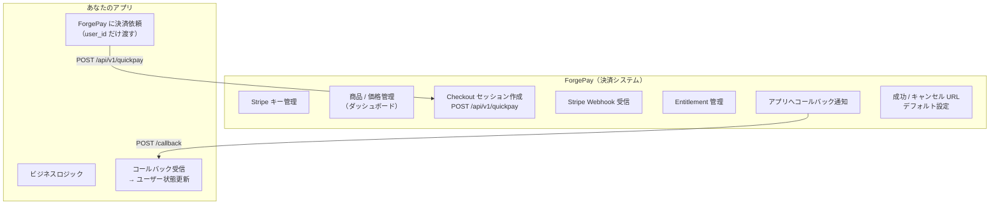

# ForgePay 統合ガイド

> ForgePay を使って自分のアプリに決済機能を追加する開発者向けガイド。
> AI コーディングアシスタントがこのガイドを読めば、ForgePay 連携アプリを自律的に構築できる。

---

## 目次

1. [ForgePay とは何か](#1-forgepay-とは何か)
2. [アーキテクチャ概要](#2-アーキテクチャ概要)
3. [責務境界：誰が何を担うか](#3-責務境界誰が何を担うか)
4. [ローカル開発環境の構築](#4-ローカル開発環境の構築)
5. [ステップバイステップ：アプリに決済を追加する](#5-ステップバイステップアプリに決済を追加する)
6. [QuickPay API リファレンス](#6-quickpay-api-リファレンス)
7. [コールバック受信の実装](#7-コールバック受信の実装)
8. [テスト手順](#8-テスト手順)
9. [本番デプロイ](#9-本番デプロイ)
10. [AI 開発者向けルール](#10-ai-開発者向けルール)

---

## 1. ForgePay とは何か

ForgePay は **集中型決済レイヤー** です。Stripe との接続・Webhook 処理・商品管理を一手に引き受けます。

あなたのアプリは Stripe を直接触る必要がありません。

```
あなたのアプリ ──→ ForgePay API ──→ Stripe
                       ↑
                 Stripe Webhook
                       │
                 ForgePay が受信
                       │
                 あなたのアプリへ
                 コールバック通知
```

**あなたのアプリに必要なもの:**
- ForgePay の API URL と API キーだけ

**あなたのアプリに不要なもの:**
- Stripe Secret Key
- Stripe Webhook Secret
- Stripe Price ID（`.env` に書く必要なし）
- `stripe` npm パッケージ

---

## 2. アーキテクチャ概要



### ポート構成（ローカル開発）

| サービス | ポート | 説明 |
|----------|--------|------|
| ForgePay バックエンド | `3000` | Express API サーバー |
| ForgePay ダッシュボード | `3001` | React 管理画面 |
| あなたのアプリ | `3002+` | 自由に設定 |
| PostgreSQL | `5432` | ForgePay 用 DB |
| Redis | `6379` | ForgePay 用キャッシュ |

---

## 3. 責務境界：誰が何を担うか

### ForgePay が担うこと

| 責務 | 詳細 |
|------|------|
| Stripe キー管理 | `.env` またはダッシュボードで設定。アプリは触らない |
| 商品・価格管理 | ダッシュボードで作成。Stripe に自動同期 |
| Checkout セッション | QuickPay API で作成。URL の組み立ても ForgePay 側 |
| Webhook 処理 | Stripe からの Webhook を受信・署名検証・冪等性管理 |
| コールバック通知 | 決済完了時にアプリの URL へ JSON POST |
| Entitlement 管理 | ユーザーの購入状態を追跡 |

### あなたのアプリが担うこと

| 責務 | 詳細 |
|------|------|
| ビジネスロジック | アプリ本来の機能（教育・SaaS・ツール etc.） |
| ForgePay に決済依頼 | `POST /api/v1/quickpay` に `purchase_intent_id` を渡すだけ |
| コールバック受信 | ForgePay からの通知で `paid` フラグを更新 |
| ユーザー状態管理 | `paid` / `free` の判定はアプリ側の DB |

### アプリが絶対にやってはいけないこと

- `.env` に `STRIPE_SECRET_KEY` を置く
- `.env` に `STRIPE_WEBHOOK_SECRET` を置く
- `.env` に `STRIPE_PRICE_ID` を置く（業務データは DB / ダッシュボードで管理）
- `stripe` npm パッケージを依存に追加する
- Stripe Webhook を直接受信するエンドポイントを作る
- `success_url` / `cancel_url` をアプリ側で組み立てる（ForgePay のデフォルト設定を使う）

---

## 4. ローカル開発環境の構築

### 4.1 ForgePay を起動

```bash
cd ForgePay

# 依存インストール
npm install
cd dashboard && npm install && cd ..

# DB + Redis 起動
npm run docker:up

# マイグレーション
npm run migrate:up

# バックエンド起動（ターミナル 1）
npm run dev
# → http://localhost:3000

# ダッシュボード起動（ターミナル 2）
cd dashboard && npm run dev
# → http://localhost:3001
```

### 4.2 API キーを取得

`http://localhost:3001` のダッシュボードを開き、**「開発者登録」** からメールアドレスを入力して API キー（`fpb_test_...`）を取得する。

### 4.3 ダッシュボードで設定

`http://localhost:3001` に API キーでログインし、**設定** ページで以下を入力：

| 項目 | 値 | 説明 |
|------|------|------|
| 成功時の遷移先 | `http://localhost:3002/checkout/success` | 支払い完了後に飛ばすページ |
| キャンセル時の遷移先 | `http://localhost:3002/checkout/cancel` | 途中でやめた時に戻るページ |
| 通知先 URL | `http://localhost:3002/callback/forgepay` | 決済完了時の通知先 |

### 4.4 商品を作成（ダッシュボード）

`http://localhost:3001/products` で商品を作成。

1. 「商品を追加」をクリック
2. 名前・価格・通貨を設定
3. 作成後に表示される **商品 ID**（UUID）をメモ

> この商品 ID をアプリから QuickPay に渡すことで、ダッシュボードで管理した価格で決済できる。
> 渡さなくても、ForgePay のデフォルト設定で動作する。

### 4.5 Stripe Webhook 設定（ローカルテスト）

```bash
# Stripe CLI をインストール: https://stripe.com/docs/stripe-cli
stripe listen --forward-to localhost:3000/api/v1/webhooks/stripe
```

表示される `whsec_...` を ForgePay の `.env` に設定：

```env
STRIPE_TEST_WEBHOOK_SECRET=whsec_表示された値
```

---

## 5. ステップバイステップ：アプリに決済を追加する

### 5.1 環境変数（アプリ側）

```env
# アプリ設定
PORT=3002
APP_URL=http://localhost:3002

# ForgePay 接続（これだけ！）
FORGEPAY_API_URL=http://localhost:3000
FORGEPAY_API_KEY=fpb_test_あなたのキー

# Stripe 関連は一切不要
```

### 5.2 ForgePay クライアント関数を作る

### 5.3 コールバック受信エンドポイントを作る

### 5.4 Express にマウント

### 5.5 決済を開始する

**これで完了です。** 決済フローは以下のように動きます：

```
1. アプリ → ForgePay: POST /quickpay { purchase_intent_id: "user_123" }
2. ForgePay → Stripe: Checkout Session 作成
3. ForgePay → アプリ: { checkout_url: "https://checkout.stripe.com/..." }
4. アプリ → ユーザー: checkout_url にリダイレクト
5. ユーザー → Stripe: 支払い
6. Stripe → ForgePay: Webhook (checkout.session.completed)
7. ForgePay → アプリ: POST /callback/forgepay { event_type: "payment.completed" }
8. アプリ: markUserAsPaid("user_123")
```

---

## 6. QuickPay API リファレンス

### `POST /api/v1/quickpay`

**ヘッダー:**
- `X-API-Key: あなたの API キー`（必須）
- `Content-Type: application/json`

**リクエストボディ:**

| フィールド | 型 | 必須 | 説明 |
|-----------|------|------|------|
| `purchase_intent_id` | string | **必須** | ユーザー ID 等の一意な識別子 |
| `product_id` | string | 任意 | ForgePay の商品 ID（ダッシュボードで作成した UUID） |
| `price_id` | string | 任意 | Stripe Price ID（直接指定する場合） |
| `name` | string | 任意 | 商品名（アドホックモード時） |
| `amount` | integer | 任意 | 金額・最小通貨単位（アドホックモード時） |
| `currency` | string | 任意 | 通貨コード `jpy`, `usd` 等（アドホックモード時） |
| `success_url` | string | 任意 | 省略時はダッシュボードのデフォルト設定 |
| `cancel_url` | string | 任意 | 省略時はダッシュボードのデフォルト設定 |
| `customer_email` | string | 任意 | 顧客のメールアドレス |
| `metadata` | object | 任意 | 追加のメタデータ |

### 3 つのモード

**モード 1: 商品 ID（推奨）**

ダッシュボードで作成した商品を使う。価格は DB から自動解決。

```json
{
  "purchase_intent_id": "user_123",
  "product_id": "550e8400-e29b-41d4-a716-446655440000"
}
```

**モード 2: Stripe Price ID**

既存の Stripe Price を直接指定する。

```json
{
  "purchase_intent_id": "user_123",
  "price_id": "price_1ABC..."
}
```

**モード 3: アドホック**

商品未登録でもその場で決済。テストや一回限りの決済に便利。

```json
{
  "purchase_intent_id": "user_123",
  "name": "Premium Plan",
  "amount": 980,
  "currency": "jpy"
}
```

**モード 0: 最小（何も指定しない）**

商品もURLも全てダッシュボードのデフォルト設定に任せる。アプリは user_id だけ渡す。

```json
{
  "purchase_intent_id": "user_123"
}
```

> ただし、ダッシュボードに `success_url` と `cancel_url` が設定されていない場合はエラーになる。

### レスポンス（201 Created）

```json
{
  "session_id": "cs_test_...",
  "checkout_url": "https://checkout.stripe.com/pay/cs_test_...",
  "expires_at": "2026-02-22T01:30:00Z"
}
```

---

## 7. コールバック受信の実装

ForgePay は決済イベント発生時に、ダッシュボードで設定した「通知先 URL」に JSON POST を送信します。

### コールバックペイロード

```json
{
  "event_id": "evt_abc123",
  "event_type": "payment.completed",
  "timestamp": "2026-02-22T00:15:00Z",
  "product": { "id": "prod_uuid", "name": "Premium Plan", "type": "one_time" },
  "customer": { "email": "user@example.com" },
  "amount": { "value": 980, "currency": "jpy", "formatted": "¥980" },
  "metadata": {
    "purchase_intent_id": "user_123",
    "session_id": "cs_test_..."
  }
}
```

### イベントタイプ一覧

| イベント | 説明 |
|----------|------|
| `payment.completed` | 決済完了。`purchase_intent_id` でユーザーを特定して有料化 |
| `refund.completed` | 返金完了。必要に応じてユーザーのアクセスを停止 |

### 実装のポイント

- 常に `200` を返す（ForgePay が再送しないように）
- `purchase_intent_id` がない場合は `400` を返す
- 冪等性を意識する（同じイベントが複数回届く可能性あり）
- Stripe の署名検証は不要（ForgePay が代行済み）

---

## 8. テスト手順

### 8.1 起動確認

テスト前に以下の 4 プロセスが稼働していることを確認する。

| ターミナル | コマンド | 確認 URL |
|-----------|---------|---------|
| 1 | `cd ForgePay && npm run dev` | http://localhost:3000/health |
| 2 | `cd ForgePay/dashboard && npm run dev` | http://localhost:3001 |
| 3 | `stripe listen --forward-to localhost:3000/api/v1/webhooks/stripe` | `Ready!` が表示される |
| 4 | `cd your-app && npm run dev` | http://localhost:3002/health |

### 8.2 自動テスト

```bash
cd your-app
npm test
```

全テストが PASS することを確認する。テストでは ForgePay・OpenAI への実通信は発生しない。

### 8.3 決済フローのエンドツーエンド確認

1. ChatGPT（または ngrok 公開 URL）からアプリを操作し、無料制限（3 回）に到達する
2. アップグレードを求めるレスポンスの `checkout_url` をブラウザで開く
3. 以下のテストカードで支払いを完了する

| カード番号 | 結果 |
|-----------|------|
| `4242 4242 4242 4242` | 決済成功 |
| `4000 0000 0000 0002` | カード拒否 |
| `4000 0025 0000 3155` | 3D Secure 要求 |

> 有効期限: 未来の任意の日付 / CVC: 任意の 3 桁

4. 支払い完了後、アプリに戻って再度質問する → `is_paid_user: true` で回答が返ることを確認

---

## 9. 本番デプロイ

### アプリ側の環境変数（本番）

```env
PORT=3000
APP_URL=https://your-app.example.com
FORGEPAY_API_URL=https://forgepay.example.com
FORGEPAY_API_KEY=fpb_live_あなたの本番キー
```

**Stripe 関連の環境変数は不要。** 全て ForgePay 側で管理。

### ForgePay ダッシュボードの設定（本番）

| 項目 | 本番値 |
|------|--------|
| 成功時の遷移先 | `https://your-app.example.com/checkout/success` |
| キャンセル時の遷移先 | `https://your-app.example.com/checkout/cancel` |
| 通知先 URL | `https://your-app.example.com/callback/forgepay` |

### Stripe の設定（ForgePay 側）

ForgePay の `.env` で本番 Stripe キーに切り替え：

```env
STRIPE_MODE=live
STRIPE_LIVE_SECRET_KEY=sk_live_...
STRIPE_LIVE_PUBLISHABLE_KEY=pk_live_...
STRIPE_LIVE_WEBHOOK_SECRET=whsec_...
```

---

## 10. AI 開発者向けルール

> このセクションは AI コーディングアシスタント（Cursor, Copilot, Codex 等）が
> ForgePay 連携アプリを生成する際に従うべきルールです。

### 必須ルール

```
1. アプリに stripe npm パッケージを追加しない
2. アプリの .env に STRIPE_ プレフィックスの変数を置かない
3. アプリに Stripe Webhook エンドポイントを作らない
4. success_url / cancel_url をアプリ側で組み立てない（ForgePay のデフォルト設定に任せる）
5. STRIPE_PRICE_ID を .env に置かない（商品は ForgePay ダッシュボードで管理）
6. 決済開始は createPayment(userId) の 1 関数で完結させる
7. コールバック受信は POST /callback/forgepay の 1 エンドポイントで受ける
8. DB カラムに stripe_ プレフィックスを使わない（payment_session_id 等の汎用名にする）
```

### アプリの .env テンプレート

```env
PORT=3002
APP_URL=http://localhost:3002
FORGEPAY_API_URL=http://localhost:3000
FORGEPAY_API_KEY=fpb_test_...
DATABASE_PATH=./data/app.db
# Stripe 関連は一切不要
```

### コード生成時のパターン

**決済セッション作成:**
```typescript
const checkout = await createPayment(userId);
// → { session_id, checkout_url }
```

**コールバック受信:**
```typescript
app.use('/callback/forgepay', callbackRouter);
// callbackRouter で payment.completed を受けて markUserAsPaid(userId) を呼ぶ
```

**支払い状態確認:**
```typescript
const status = await checkPaymentStatus(userId);
// → { active: boolean, purchase_intent_id: string }
```

### ファイル構成テンプレート

```
your-app/
├── src/
│   ├── services/
│   │   └── forgePayService.ts    # ForgePay API クライアント（createPayment, checkPaymentStatus）
│   ├── routes/
│   │   ├── callback.ts           # POST /callback/forgepay
│   │   └── checkout.ts           # POST /checkout/session, GET /checkout/success, GET /checkout/cancel
│   └── app.ts
├── .env                          # FORGEPAY_API_URL + FORGEPAY_API_KEY のみ
└── package.json                  # stripe パッケージなし
```

---

## 付録: 実装例一覧

| ファイル | 場所 | 内容 |
|----------|------|------|
| English Teacher forgePayService | `apps/english-teacher/server/src/services/forgePayService.ts` | ForgePay API クライアントの実装例 |
| English Teacher callback | `apps/english-teacher/server/src/routes/callback.ts` | コールバック受信の実装例 |
| English Teacher checkout | `apps/english-teacher/server/src/routes/checkout.ts` | チェックアウトフローの実装例 |
| English Teacher .env | `apps/english-teacher/server/.env.example` | Stripe なしの環境変数テンプレート |
