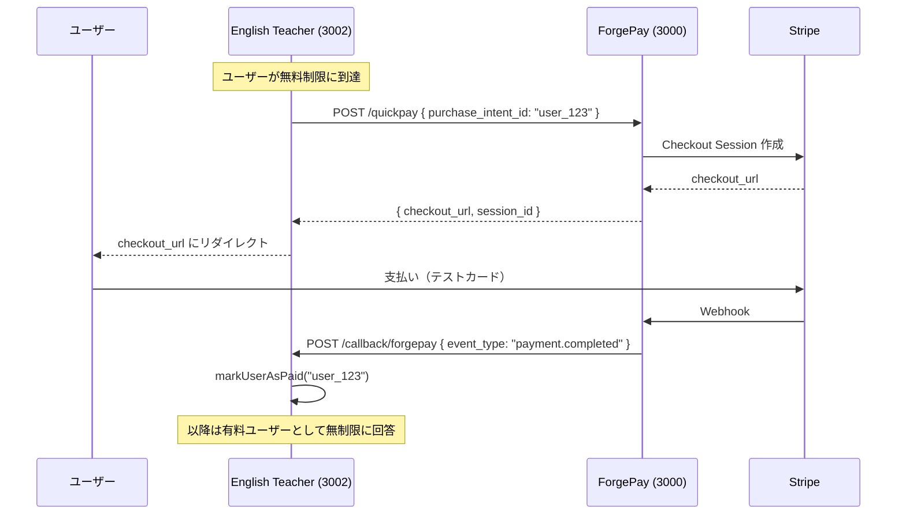

# AI English Teacher — ChatGPT App MVP

ChatGPT Apps SDK (MCP) + ForgePay 決済連携の英語教師サービス。

---

## アーキテクチャ



### 呼び出し関係

```
ChatGPT ──► English Teacher (MCP Server)
               │
               ├──► OpenAI GPT-4o-mini（英語回答生成）
               ├──► SQLite DB（ユーザー状態・質問履歴）
               └──► ForgePay API（決済）
                       │
                       └──► Stripe（ForgePay が代行）
```

**このアプリは Stripe を直接触りません。** 決済は全て ForgePay 経由。

### ポート構成

| サービス | ポート | 説明 |
|----------|--------|------|
| ForgePay バックエンド | `3000` | 決済 API |
| ForgePay ダッシュボード | `3001` | 管理画面 |
| English Teacher | `3002` | このアプリ |

---

## セットアップ

### 前提条件

- ForgePay が起動済み（[ForgePay README](../../README.md) を参照）
- ForgePay で API キーを取得済み

### 1. 環境変数の設定

```bash
cd apps/english-teacher/server
cp .env.example .env
```

`.env` を編集：

| 変数名 | 説明 | 取得先 |
|--------|------|--------|
| `OPENAI_API_KEY` | OpenAI API キー | https://platform.openai.com/api-keys |
| `FORGEPAY_API_URL` | ForgePay サーバー URL | `http://localhost:3000` |
| `FORGEPAY_API_KEY` | ForgePay API キー | ForgePay で登録後に取得 |

> **Stripe Secret Key / Webhook Secret / Price ID は不要。** 全て ForgePay が管理。

### 2. サーバーを起動

```bash
cd server
npm install
npm run dev
# → http://localhost:3002
```

### 3. ForgePay ダッシュボードで設定

`http://localhost:3001/settings` で以下を入力：

| 項目 | 値 |
|------|------|
| 成功時の遷移先 | `http://localhost:3002/checkout/success` |
| キャンセル時の遷移先 | `http://localhost:3002/checkout/cancel` |
| 通知先 URL | `http://localhost:3002/callback/forgepay` |

### 4. ForgePay ダッシュボードで商品を作成（任意）

`http://localhost:3001/products` で商品を作成。商品 ID をアプリに渡すことも、省略して ForgePay のデフォルト設定で動作させることもできる。

---

## テスト

### API テスト（curl）

```bash
# ヘルスチェック
curl http://localhost:3002/health

# 英語質問（無料枠）
curl -X POST http://localhost:3002/api/ask \
  -H "Content-Type: application/json" \
  -d '{"user_id": "test_user_1", "question": "What is the difference between affect and effect?"}'

# ステータス確認
curl -X POST http://localhost:3002/api/status \
  -H "Content-Type: application/json" \
  -d '{"user_id": "test_user_1"}'

# チェックアウト URL 生成
curl -X POST http://localhost:3002/api/checkout \
  -H "Content-Type: application/json" \
  -d '{"user_id": "test_user_1"}'
```

### 決済フローのテスト

1. 無料質問を 3 回使い切る
2. 4 回目の質問で `checkout_url` が返される
3. URL をブラウザで開き、Stripe テストカード（`4242 4242 4242 4242`）で支払い
4. ForgePay → English Teacher にコールバック通知が届く
5. `api/status` で `paid: true` を確認

### ユニットテスト

```bash
cd server
npm test
```

### Stripe テストカード

| カード番号 | 結果 |
|-----------|------|
| `4242 4242 4242 4242` | 成功 |
| `4000 0000 0000 0002` | カード拒否 |
| `4000 0025 0000 3155` | 3D Secure |

有効期限: 未来の日付、CVC: 任意の3桁

---

## ディレクトリ構成

```
english-teacher/
├── server/
│   └── src/
│       ├── services/
│       │   ├── forgePayService.ts   # ForgePay API クライアント（createPayment, checkPaymentStatus）
│       │   ├── userService.ts       # ユーザー状態管理（paid, free_questions_used）
│       │   └── openaiService.ts     # OpenAI GPT-4o-mini 呼び出し
│       ├── routes/
│       │   ├── checkout.ts          # POST /checkout/session, GET /success, GET /cancel
│       │   ├── callback.ts          # POST /callback/forgepay（ForgePay からの通知受信）
│       │   └── api.ts               # POST /api/ask, /api/status, /api/checkout
│       ├── mcp/
│       │   ├── server.ts            # MCP サーバー定義
│       │   └── tools/               # ask_teacher, get_status, create_checkout
│       ├── db/
│       │   ├── client.ts            # LibSQL クライアント
│       │   └── schema.sql           # users, question_history テーブル
│       └── app.ts                   # Express アプリ
├── widget/                          # ChatGPT 内描画ウィジェット
└── manifest.json                    # ChatGPT App 設定
```

### アプリの .env（最終形）

```env
PORT=3002
OPENAI_API_KEY=sk-...
FORGEPAY_API_URL=http://localhost:3000
FORGEPAY_API_KEY=fpb_test_...
APP_URL=http://localhost:3002
DATABASE_PATH=./data/english-teacher.db
FREE_QUESTION_LIMIT=3
ASK_RATE_LIMIT_MAX=10
```

**Stripe に関する設定はゼロ。** 商品・価格・Webhook は全て ForgePay が管理。

---

## DB スキーマ

```sql
CREATE TABLE users (
  user_id TEXT PRIMARY KEY,
  paid INTEGER NOT NULL DEFAULT 0,
  free_questions_used INTEGER NOT NULL DEFAULT 0,
  payment_session_id TEXT,          -- ForgePay 経由の決済セッション ID
  created_at TEXT DEFAULT (datetime('now')),
  updated_at TEXT DEFAULT (datetime('now'))
);
```

> 旧スキーマ（`stripe_customer_id` / `stripe_session_id`）からの移行：
> 既存 DB がある場合は `ALTER TABLE users RENAME COLUMN stripe_session_id TO payment_session_id;` と `ALTER TABLE users DROP COLUMN stripe_customer_id;` を実行。

---

## ChatGPT App への登録

1. `manifest.json` の `YOUR_DOMAIN` を実際のサーバー URL に置き換え
2. OpenAI Developer Portal でアプリを登録
3. MCP サーバーの URL を設定
4. ChatGPT でアプリを有効化してテスト

---

## ライセンス

MIT
