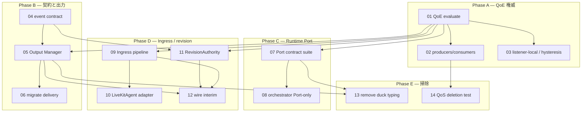

# アーキテクチャ深化 — 実行フェーズとチケット

Status: completed（tickets 01–14 すべて done／completed）  
Source: [issues/](issues/)（仕様・シーム承認済み。「承认」によりクイズ反復なしでチケット化）  
Tracker: [tickets/](tickets/)（`01`〜依存順。issues 番号とは別体系）

## フェーズ一覧

| Phase | 目的 | チケット | 候補 |
|-------|------|----------|------|
| **A** 振る舞い修正・前提 | 縮退判定の権威を QoE に単一化 | 01, 02, 03 | 2 |
| **B** 契約と出力境界 | 型付きイベント → Output Manager | 04, 05, 06 | 4 → 1 |
| **C** Runtime seam | RealtimeRuntimePort を本物の Port にする | 07, 08 | 3 |
| **D** Agent 分離と revision | Ingress 切り出しと revision 権威 | 09, 10, 11, 12 | 5, 6 |
| **E** 掃除 | duck typing 除去と旧 QoS deletion 判定 | 13, 14 | 7, 8 |

## チケット一覧（依存順）

| # | Title | Phase | Blocked by |
|---|-------|-------|------------|
| [01](tickets/01-qoe-typed-evaluate-authority.md) | QoE 縮退 evaluate 権威を型付きで確立する | A | — |
| [02](tickets/02-qoe-producers-consumers-align.md) | 観測 producer と主線 consumer を QoE decision に揃える | A | 01 |
| [03](tickets/03-qoe-listener-local-hysteresis.md) | 受聴者単位劣化と回復ヒステリシスを QoE に集約する | A | 01 |
| [04](tickets/04-typed-shared-event-contract.md) | サーバ・クライアント共有の型付きイベント契約を往復検証する | B | —（A と並行可） |
| [05](tickets/05-output-manager-module.md) | Output Manager を独立 module として公開 interface 化する | B | 01, 04 |
| [06](tickets/06-migrate-delivery-to-output-manager.md) | 聞く・読む主線の配信を Output Manager 経由に移行する | B | 05 |
| [07](tickets/07-realtime-runtime-port-contract.md) | RealtimeRuntimePort の session/turn contract suite を本物にする | C | 01 |
| [08](tickets/08-orchestrator-port-only.md) | orchestrator を Port／registry 公開面だけに依存させる | C | 07 |
| [09](tickets/09-ingress-pipeline-extract.md) | 取り込み主線を Ingress pipeline として切り出す | D | 01 |
| [10](tickets/10-livekit-agent-as-adapter.md) | LiveKitAgent を frame／end adapter に縮小する | D | 09 |
| [11](tickets/11-revision-authority-lifecycle.md) | 暫定字幕 RevisionAuthority を単一 lifecycle にする | D | 01, 04 |
| [12](tickets/12-wire-interim-to-revision-authority.md) | Ingress／Runtime interim を RevisionAuthority 経由にする | D | 11, 05, 09 |
| [13](tickets/13-remove-runtime-duck-typing.md) | 本番経路から実行時ダックタイピングを除去する | E | 05, 07 |
| [14](tickets/14-legacy-qos-deletion-test.md) | 旧 QoS 系の deletion test と利用 inventory を設ける | E | 02 |

## 依存グラフ

## Frontier（すぐ着手可）

**なし。** Phase A–E（tickets **01–14**）はすべて完了済み。

### 進捗サマリ

| Phase | チケット | 状態 |
|-------|----------|------|
| A QoE 権威 | 01, 02, 03 | done |
| B 契約と出力 | 04, 05, 06 | done |
| C Runtime Port | 07, 08 | done |
| D Ingress / revision | 09, 10, 11, 12 | done |
| E 掃除 | 13, 14 | done／completed |

### 残作業（optional・本トラック外）

- Ticket 14 は **deletion test／inventory のみ**を完了。旧 QoS 記号（例: `pipeline.py` の測定用途残存、`AdaptiveQoSController` 同居）の**実削除は行っていない**。
- 到達不能かつ現行 QoE／HybridQoS が代替している記号の削除は、別途小さな follow-up 変更として任意。即時削除はしない方針を維持。

## 番号体系

| 場所 | 番号 | 意味 |
|------|------|------|
| `issues/01`〜`08` | アーキテクチャ候補 1〜8 の仕様 | 変更しない |
| `tickets/01`〜`14` | 実行用 tracer-bullet（依存順） | 候補を 1〜3 チケットに分割したもの |

仕様が後から増えても `issues/` と `tickets/` は衝突しない。

## 微調整メモ

- Phase A を 3 分割: 権威確立 → 配線 → 受聴者単位／回復（観測と振る舞いを分離）。
- Phase B は仕様どおり **4 → 1**（契約が Output Manager 公開面を安定させる）。
- Phase C／D は 01（QoE）完了後を推奨。04 と 01 は契約設計を並行できる。
- 候補 8 は削除実行ではなく deletion test／inventory（speculative 維持）。
