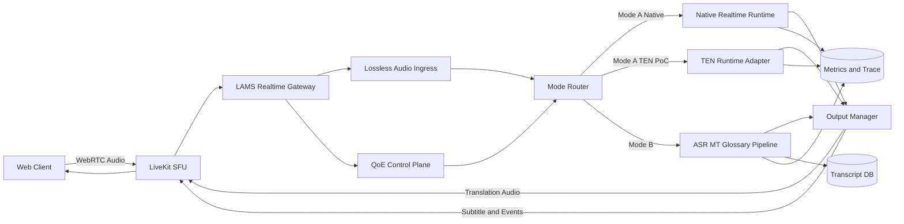

# LAMS-MVP リアルタイム多言語会議システム

## MiniCPM-V・TEN Framework分析に基づく最終改善設計

**版数：最終統合版**
**作成日：2026-07-26**

---

# 1. 目的

本設計は、次の3プロジェクトをコードレベルで比較し、LAMS-MVPのリアルタイム会議基盤を改善するものである。

* MiniCPM-V WebRTC Demo
* TEN Framework
* LAMS-MVP

特に、以下を重点対象とする。

1. 全二重音声処理
2. 持続型リアルタイム推論
3. バックプレッシャーとデータ欠落防止
4. WebRTC通信品質とAI処理品質の統合
5. TEN Framework導入の可否
6. 設計境界・制約条件・完了条件

---

# 2. 最終結論

## 2.1 採用判断

| 判断対象                    | 結論            | 理由                               |
| ----------------------- | ------------- | -------------------------------- |
| WebRTCをTEN Frameworkへ置換 | **不採用**       | 両者は同一レイヤーではない                    |
| LiveKitをAgora RTCへ置換    | **現時点では不採用**  | ベンダー依存、移行範囲、ライセンス、性能未実証          |
| WebRTC／LiveKitを維持       | **採用継続**      | LAMSの多人数会議、TURN、自前ホスト、話者別配信に適合   |
| TENをMode A実行基盤として利用     | **条件付きPoC採用** | 持続接続、割込み、Graph、Extension、監視機能が有効 |
| TENの設計思想だけをLAMSへ導入      | **即時採用**      | 低リスクで効果を得られる                     |

## 2.2 推奨方針

```text
WebRTC / LiveKit
    ＝ メディア通信基盤として維持

LAMS
    ＝ 会議制御、参加者管理、言語ルーティング、記録の主体

TEN Framework
    ＝ Mode AのリアルタイムAI実行エンジン候補
```

TEN FrameworkはWebRTCを置き換えるものではない。

TENの標準構成でもメディア通信にはAgora RTCを利用し、WebSocketは主にシグナリングや設定に利用する。つまり「WebRTCからTENへ変更」ではなく、正確には次のどちらかである。

* LiveKit RTCからAgora RTCへ変更する
* LiveKitを残し、AIパイプラインの実行にTENを使う

TENの公式アーキテクチャでも、TEN FrameworkはC/C++コアとGo、Python、Node.jsバインディングを持つ実行基盤であり、RTC、ASR、LLM、TTSなどをExtensionとして接続する構造である。

---

# 3. TEN Frameworkの技術評価

## 3.1 TEN Frameworkの位置付け

TENは、リアルタイム・マルチモーダル会話AI向けの実行フレームワークである。

主な構成要素は次のとおり。

| 構成               | 役割                                 |
| ---------------- | ---------------------------------- |
| TEN Core Runtime | メッセージ配送、Extension実行、ライフサイクル管理      |
| Extension        | RTC、ASR、LLM、TTS、VAD、Toolなど         |
| Graph            | Extension間の接続・データフロー定義             |
| TEN Server       | セッションの開始・停止・Worker管理               |
| Worker Process   | セッションごとのAIパイプライン実行                 |
| TMAN Designer    | Graph・Extension設定                  |
| Telemetry        | Prometheus、OpenTelemetry、Grafana連携 |

TENは、ASR、TTS、LLM、RTCなどを統一的なExtensionとして扱い、`cmd`、`data`、`audio_frame`、`video_frame` の4種類の接続でGraph化する。

## 3.2 TENの技術的な強み

### 3.2.1 GraphベースのAIパイプライン

TENでは、AI処理をコード内の条件分岐だけで構築せず、`property.json` のGraphとして定義できる。

```text
RTC
  ├── Audio → ASR
  ├── Audio → VAD
  └── Audio → Realtime S2S

ASR → MT → TTS
```

Extensionの差し替えが比較的容易であり、ASR、LLM、TTS、RealtimeモデルのA/Bテストにも向いている。

TENは音声フレームを送信元Extensionで分岐し、複数Extensionへ並行配送する設計を持つ。

### 3.2.2 持続型Realtime接続

TENのOpenAI Realtime Extensionは、セッション開始時にRealtime APIへ接続し、その接続を維持したまま音声フレームを送信する。

次の処理が実装されている。

* 持続WebSocket接続

* 音声フレームの連続送信

* 入力文字起こしdelta

* 出力テキストdelta

* 出力音声delta

* Server VAD

* Semantic VAD

* ユーザー発話による割込み

* 接続切断後の再接続

これは、現在のLAMSで発話ごとにRealtime Providerへ接続する方式よりも、ハンドシェイク回数を減らせる可能性が高い。

### 3.2.3 割込み制御

OpenAI Realtime Extensionは、ユーザー発話開始イベントを受けた際に、生成中のレスポンスを割込み扱いにし、以後の古い音声・テキストdeltaを破棄する。

LAMSで必要としている以下の機能と一致する。

* Barge-in
* 古い翻訳音声の停止
* 世代管理
* 途中結果の無効化
* 会話ターンの切替

### 3.2.4 Extensionの標準化

TENはASR、TTS、LLM、Multimodal LLM用のBase ClassとAPI Interfaceを持つ。

リポジトリには多数のASR、TTS、LLM、Avatar、Tool、Transport Extensionが含まれている。

Providerごとに異なる接続処理を、共通のExtension境界へ整理できる点は有効である。

### 3.2.5 可観測性

TENにはPrometheus、OpenTelemetry、Loki、Grafanaを利用した監視構成が用意されている。

測定対象には次が含まれる。

* Extensionライフサイクル時間

* Command処理時間

* P50・P95

* Extension Thread Queue待ち時間

* Queue過負荷状態

* ログとメトリクスの関連付け

これは、LAMSの現在のAI処理時間中心の監視を、Queue、Extension、Worker単位へ拡張する際に参考になる。

---

# 4. TENは本当にLAMSより高速か

## 4.1 期待できる効果

TENを利用した場合、次の部分では効率向上が期待できる。

| 項目         | 期待効果                       |
| ---------- | -------------------------- |
| Provider接続 | 発話ごとの再接続を削減                |
| 音声処理       | Audio Frameを連続配送           |
| 割込み        | VADイベントから旧レスポンスを停止         |
| Provider変更 | Extension差し替えで対応           |
| 並列処理       | Graphで複数処理へ音声を分岐           |
| 監視         | Queue待ち時間・Extension時間を標準測定 |
| 開発効率       | ASR・LLM・TTSの共通インターフェース     |

TENの資料では、RTC経路について50～150msという目安を示しているが、これはTENとLiveKitまたはLAMSを同一条件で比較したベンチマークではない。

## 4.2 性能向上を保証できない理由

エンドツーエンド遅延の大部分は、次の処理によって決まる。

```text
ネットワーク
+ VAD
+ ASR
+ 翻訳
+ LLM
+ TTS
+ 音声バッファ
+ クライアント再生
```

TEN Runtimeのメッセージ配送が高速であっても、ASRやRealtime API、TTSが遅ければ、会議全体の遅延は大きく改善しない。

また、TENの標準サーバはセッションごとにWorker Processを起動する。セッション分離には有効だが、多数の同時会議ではプロセス数、メモリ、起動時間が増える可能性がある。

したがって、

> TENを導入すれば必ず性能・効率が上がる

とは現時点では判断できない。

正しい判断は、

> 持続型Realtime処理とExtension Graphには改善可能性があるが、同一条件のPoCで実測する必要がある

である。

---

# 5. TEN全面置換を推奨しない理由

## 5.1 標準TransportがAgora RTC

TENの標準Voice Assistant構成は、Agora App IDとApp Certificateを要求し、Graph内でも `agora_rtc` Extensionを使用する。

LAMSは現在、LiveKitを自前ホストできる構成である。

LiveKitをAgoraへ変更すると、次の再設計が必要になる。

* Room参加トークン
* TURN・ICE構成
* Server-side Agent
* Participant attributes
* 話者Track管理
* 話者別・言語別翻訳Track
* 字幕DataChannel
* 会議記録
* LAN・閉域環境対応
* 障害時運用
* 利用料金管理

## 5.2 LiveKit対応が標準化されていない

TENの公開ドキュメント上のTransport例は、主に次の構成である。

* Agora RTC
* WebSocket Server
* HTTP Server

また、「標準のAgora RTCを他ベンダーへ置換する難易度」に関するFeature Requestが2026年4月時点でOpenのままである。

したがって、LiveKitをTENで利用する場合は、独自の `livekit_rtc` Extension開発が必要になる可能性が高い。

## 5.3 標準構成がVoice Agent中心

TENの標準Serverは、次の値をセッションへ注入するVoice Agent型の構成である。

* channel
* remote_stream_id
* bot_stream_id
* token

一方、LAMSには次の要件がある。

* 複数参加者
* 複数同時発話
* 参加者ごとの翻訳言語
* 参加者ごとの原声／翻訳音声選択
* 話者×言語単位の音声Track
* 正式字幕と議事録
* 用語集
* 多テナント
* RBAC

そのため、TENのVoice Assistantサンプルをそのまま利用することはできない。

## 5.4 ライセンス上の重要な制約

TEN FrameworkのLICENSEは、単純なApache License 2.0ではない。

Apache 2.0に加えて、以下の追加条件が記載されている。

* End User Device上でのホスト制限
* Agoraの提供サービスと競合する形での展開制限
* 第三者によるApplication開発・展開を可能にする利用への制限

LAMSを社外販売、SaaS提供、会議基盤製品として展開する場合、この条件に抵触しないか法務確認が必要である。

したがって、TEN採用前に必ず以下を実施する。

```text
技術PoC
    ↓
ライセンス・法務確認
    ↓
商用利用可否判断
    ↓
本番採用判断
```

---

# 6. 採用方式の比較

| 方式                         | 技術的可否 |   影響 | 評価        |
| -------------------------- | ----: | ---: | --------- |
| WebRTCを廃止してTENへ変更          |   不適切 | 非常に大 | 不採用       |
| LiveKitを廃止してAgora＋TENへ変更   |    可能 | 非常に大 | 非推奨       |
| LiveKitを維持しTEN Workerへ音声転送 |    可能 |  中～大 | PoC候補     |
| TEN用LiveKit Extensionを開発   |    可能 |    大 | 長期候補      |
| Mode AのみTEN Runtimeを利用     |    可能 |    中 | **推奨PoC** |
| TENのGraph・Extension思想だけ導入  |    容易 |  小～中 | **即時推奨**  |

---

# 7. 最終推奨アーキテクチャ

## 7.1 基本方針

WebRTC／LiveKitをMedia Planeとして維持する。

TEN Frameworkは直接Media Planeを置き換えず、Mode AのAI Runtime候補として抽象化する。



## 7.2 Realtime Runtime抽象

LAMSからTENへの依存を直接広げず、共通インターフェースを定義する。

```python
class RealtimeRuntimePort:
    async def open_session(self, context): ...
    async def append_audio(self, pcm: bytes): ...
    async def commit_turn(self, utterance_id: str): ...
    async def interrupt(self, generation_id: int): ...
    async def events(self): ...
    async def close_session(self): ...
```

実装は2種類用意する。

```text
NativeRealtimeRuntime
    現行LAMSの改良版

TenRealtimeRuntimeAdapter
    TEN Framework接続用PoC実装
```

これにより、TENが不採用になってもLAMSのアーキテクチャを戻す必要がない。

---

# 8. 改善提案1：確定発話を失わないバックプレッシャー

## 8.1 現在の問題

現行LAMSは話者別Queueに上限を設定しているが、Queue満杯時に最古データを削除する処理がある。

削除対象がpartialかfinalかを厳密に分離していない場合、正式な確定発話を失う可能性がある。

## 8.2 改善設計

Queueを3種類へ分離する。

```text
Audio Frame Lane
    生音声フレーム
    max_age超過時は破棄可能

Partial Lane
    話者ごとに最新revisionだけ保持

Final Lane
    確定発話
    原則として破棄禁止
```

## 8.3 過負荷時の縮退順序

```text
1. partial字幕を停止
2. Mode A翻訳音声を停止
3. Mode B確定字幕を継続
4. overload_degradedイベントを通知
5. 管理者・監視へ通知
```

## 8.4 完了条件

* Queue満杯時もfinal字幕欠落0件
* Queue depthを測定できる
* Queue ageを測定できる
* partial停止後もfinalを継続できる
* メモリ使用量が上限内
* 過負荷状態をUIへ通知できる

---

# 9. 改善提案2：持続型Full-Duplex Session Runtime

## 9.1 目的

発話ごとのProvider接続を廃止し、会議中はRealtime Provider接続を維持する。

## 9.2 処理構成

```text
LiveKit Audio Frame
    ↓
Realtime Session Registry
    ↓
Persistent Provider Session
    ├── Input Audio Stream
    ├── Transcript Delta
    ├── Translation Audio Delta
    ├── Server VAD
    ├── Interrupt
    └── Reconnect
```

## 9.3 セッションキー

```text
room_id
+ speaker_id
+ target_language
+ provider
```

## 9.4 世代管理

すべての生成処理へ `generation_id` を付与する。

```text
ユーザー発話開始
    ↓
generation_idを更新
    ↓
旧生成をcancel
    ↓
旧音声Queueをflush
    ↓
新generationのみ再生
```

## 9.5 TENの利用範囲

TEN PoCでは以下だけを利用する。

* Realtime Provider Extension
* VAD／Turn Detection
* Audio Frame Graph
* Interrupt
* Extension Queue Metrics
* OpenTelemetry

以下はTENへ移さない。

* Room管理
* Participant管理
* RBAC
* 用語集
* 正式会議記録
* 議事録
* 多言語Route
* Output Manager
* DB

---

# 10. 改善提案3：WebRTC QoE Control Plane

## 10.1 統合する監視対象

### Media Plane

* RTT
* jitter
* packetsLost
* concealedSamples
* availableOutgoingBitrate
* ICE candidate type
* TURN利用有無
* reconnect回数

### AI Plane

* VAD開始時間
* ASR first partial
* ASR final
* 翻訳完了
* TTS first audio
* Queue wait
* Provider error
* Provider reconnect
* interruption時間

## 10.2 自動縮退

```text
Packet Loss > 5%
    → 翻訳音声停止
    → 原声 + 字幕

Mode A P95超過
    → Mode A停止
    → Mode B字幕へ縮退

Provider切断
    → 再接続
    → 再接続中は字幕のみ

Queue過負荷
    → partial停止
    → final優先
```

## 10.3 共通イベント

```json
{
  "schema_version": 1,
  "event_id": "uuid",
  "type": "translation.audio.started",
  "room_id": "room-001",
  "speaker_id": "user-a",
  "utterance_id": "utt-001",
  "generation_id": 4,
  "sequence_id": 120,
  "revision": 0,
  "provider": "openai_realtime",
  "runtime": "native",
  "trace_id": "room-001:user-a:120",
  "timestamp_ms": 1785000000000
}
```

`runtime` は次の値を持つ。

```text
native
ten
```

これによりNativeとTENの性能を同じイベント形式で比較できる。

---

# 11. 改善提案4：TEN Framework比較PoC

## 11.1 PoC対象

Mode Aだけを対象とし、次の2系統を比較する。

```text
A系統
LAMS Native Persistent Runtime

B系統
TEN Realtime Runtime
```

両系統で以下を完全に揃える。

* 同じ音声入力
* 同じOpenAIモデル
* 同じRegion
* 同じプロンプト
* 同じ音声形式
* 同じ参加者数
* 同じ翻訳言語
* 同じネットワーク条件

## 11.2 比較指標

| 指標                       | 内容               |
| ------------------------ | ---------------- |
| First Transcript Latency | 発話開始から最初の文字      |
| Final Transcript Latency | 発話終了から確定字幕       |
| First Audio Latency      | 発話終了から翻訳音声開始     |
| Interruption Latency     | ユーザー割込みから旧音声停止   |
| P50 / P95                | 通常時と高負荷時         |
| Queue Wait               | AI処理待ち時間         |
| CPU                      | 1会議・5会議・20会議     |
| Memory                   | Worker／Session単位 |
| Reconnect Time           | Provider切断から復帰   |
| Loss Rate                | final字幕・イベント欠落率  |
| Startup Time             | 会議Worker起動時間     |
| Operational Complexity   | 起動・監視・障害復旧手順     |

## 11.3 推奨採用基準

以下を満たす場合のみTENを本採用候補とする。

* P95 First AudioがNative比15%以上改善
* 割込み停止時間300ms以内
* final字幕欠落0件
* CPU使用率がNative比10%以上悪化しない
* メモリ使用量が許容範囲
* 30分連続会議でメモリリークなし
* 5人同時発話で処理継続
* Provider再接続が自動復旧
* LiveKitとの接続が安定
* ライセンス・法務確認完了

15%はTENの性能を保証する数値ではなく、フレームワーク追加による移行コストを正当化するための推奨判断基準である。

---

# 12. 設計境界

## 12.1 対象範囲

* 音声会議
* WebRTC／LiveKit
* リアルタイム字幕
* 翻訳音声
* 持続型Realtime Session
* Barge-in
* TEN比較PoC
* 過負荷制御
* QoE監視
* Provider切替

## 12.2 対象外

* MiniCPM-V Vision機能
* 映像内容のAI解析
* 顔認識
* 感情認識
* Avatar
* LiveKitからAgoraへの本番移行
* TENによるRoom・RBAC管理
* TEN結果だけを正式議事録に利用
* クライアント端末へのTEN Runtime組込み

---

# 13. 制約条件

## 13.1 アーキテクチャ制約

* WebRTC／LiveKitをMedia Planeとして維持する
* 音声フォーク地点はGatewayに限定する
* Mode AとMode Bを内部結合しない
* 正式記録はMode Bを基準とする
* クライアント配信はOutput Manager経由に限定する
* TENはRealtimeRuntimePortの背後に隠蔽する

## 13.2 性能制約

* LiveKit Track受信処理内でProviderを待たない
* すべてのQueueに上限を設定する
* final字幕を黙って破棄しない
* 古い音声Frameにmax_ageを設定する
* generation_id不一致の音声を再生しない
* 同時翻訳言語数に上限を設定する

## 13.3 セキュリティ制約

* API Keyをログへ出力しない
* LiveKit Tokenをログへ出力しない
* TENの設定ログで秘密情報をマスクする
* 診断ログに会議本文を含めない
* Room／Tenant／Participantの認可を維持する
* 本番はHTTPS、WSS、TURN/TLSを利用する

## 13.4 ライセンス制約

TEN Framework採用前に、以下を確認する。

* LAMSの利用形態が追加ライセンス条件に抵触しない
* 社外販売の可否
* SaaS提供の可否
* 顧客環境への配備可否
* Agora競合条項への抵触有無
* 派生Extensionの配布条件
* 自社専用利用と顧客提供の違い

---

# 14. 実装ロードマップ

## Phase 0：データ欠落防止

* partial／final Queue分離
* final破棄処理の廃止
* Queue depth／age監視
* overload event
* 負荷試験

## Phase 1：Native持続型Runtime

* RealtimeRuntimePort
* NativeRealtimeRuntime
* Session Registry
* 持続Provider接続
* generation_id
* interrupt／flush
* reconnect

## Phase 2：QoE Control Plane

* WebRTC Stats収集
* AI Event統一
* State Machine
* 自動縮退
* 自動回復
* 診断レポート

## Phase 3：TEN比較PoC

* TenRealtimeRuntimeAdapter
* TEN Worker起動
* Audio Frame Bridge
* Event変換
* 性能比較
* 障害比較
* 運用比較

## Phase 4：採用判断

```text
性能基準達成
+ 安定性基準達成
+ 法務確認完了
    ↓
TENをMode Aの選択肢として採用

いずれか未達
    ↓
Native Runtimeを正式採用
TENの設計思想だけ継続利用
```

---

# 15. 完了チェックリスト

## アーキテクチャ

* [ ] WebRTC／LiveKitがMedia Planeとして維持されている
* [ ] Mode AとMode Bが分離されている
* [ ] RealtimeRuntimePortが定義されている
* [ ] NativeとTENを設定で切替できる
* [ ] TENへの依存がAdapter内部に限定されている
* [ ] Output Managerが唯一の出力境界になっている

## バックプレッシャー

* [ ] partialとfinalのQueueが分離されている
* [ ] Queue満杯時にfinalを破棄しない
* [ ] Audio Frameにmax_ageがある
* [ ] Queue depthを測定できる
* [ ] Queue ageを測定できる
* [ ] 過負荷時にpartialを停止できる
* [ ] 過負荷時にMode Aを停止できる
* [ ] final字幕欠落が0件

## Full-Duplex

* [ ] Provider接続を発話ごとに作り直さない
* [ ] 音声Frameを連続送信できる
* [ ] generation_idを発行できる
* [ ] ユーザー発話で旧生成をcancelできる
* [ ] 旧音声Queueをflushできる
* [ ] キャンセル済み音声を再生しない
* [ ] 割込み停止時間が300ms以内
* [ ] Provider切断後に自動再接続できる

## フロントエンド

* [ ] 接続状態を明示表示できる
* [ ] listening／translating／playingを区別できる
* [ ] interrupted状態を処理できる
* [ ] degraded状態を表示できる
* [ ] partial字幕をrevision順に更新できる
* [ ] final到着時にpartialを削除できる
* [ ] 不明なschema_versionを安全に無視できる
* [ ] 自動再生制限時にユーザーへ案内できる

## WebRTC・QoE

* [ ] RTTを取得できる
* [ ] jitterを取得できる
* [ ] packet lossを取得できる
* [ ] concealedSamplesを取得できる
* [ ] TURN利用状況を確認できる
* [ ] ICE candidate typeを確認できる
* [ ] Wi-Fi切替後に再接続できる
* [ ] 5% packet loss試験を実施した
* [ ] 10% packet loss時に字幕へ縮退する
* [ ] TURN-only環境で動作する

## TEN PoC

* [ ] TEN Workerを会議単位で開始・停止できる
* [ ] Zombie Workerが残らない
* [ ] LiveKit AudioをTEN audio_frameへ変換できる
* [ ] TEN音声出力をLAMS Output Managerへ戻せる
* [ ] TEN EventをLAMS共通Eventへ変換できる
* [ ] TEN障害時にNativeへ戻せる
* [ ] TENなしでもLAMSを起動できる
* [ ] Native／TENで同一テストデータを利用している
* [ ] P50／P95を比較した
* [ ] CPU／Memoryを比較した
* [ ] 30分以上の連続試験を実施した

## セキュリティ・法務

* [ ] API Keyをログへ出力していない
* [ ] LiveKit Tokenをログへ出力していない
* [ ] 会議本文を診断ログへ含めていない
* [ ] Tenant分離を維持している
* [ ] TENライセンスを法務確認した
* [ ] 社外販売の可否を確認した
* [ ] SaaS提供の可否を確認した
* [ ] Agora競合条項を確認した
* [ ] 顧客環境配備の可否を確認した

---

# 16. 最終判断

TEN Frameworkは、次の点で優れた参考実装である。

* 持続型Realtime Session
* Audio Frame中心のGraph
* Extension標準化
* 全二重割込み
* Provider差し替え
* Queue待ち時間監視
* OpenTelemetry連携

一方で、TEN FrameworkをWebRTCの代わりとして導入する判断は正しくない。

また、LiveKitをAgora RTCへ全面変更することも、現時点では以下の理由により推奨しない。

* LAMSの既存会議機能を広範囲に再実装する必要がある
* 多人数・多言語会議への適合確認が必要
* LiveKit対応Extensionが標準化されていない
* 性能優位が比較ベンチマークで証明されていない
* Agora依存が増える
* ライセンス上の追加条件がある

したがって、最終方針は次のとおりとする。

> **WebRTC／LiveKitは維持する。**
> **LAMS Native Runtimeを先に持続型Full-Duplexへ改善する。**
> **TEN FrameworkはMode A限定の比較PoCとして導入する。**
> **TENのGraph、Extension、割込み、Telemetryの設計思想はLAMSへ取り込む。**
> **本番採用は性能測定、安定性確認、法務確認の完了後に判断する。**

TENのリポジトリは2026年7月24日にも更新されており、現在も活発に開発されているが、更新頻度の高さは同時に追従コストを意味する。

現時点の推奨判定は以下である。

```text
TEN全面置換      ：NO
Agoraへの全面移行：NO
TEN限定PoC       ：YES
TEN設計思想導入  ：YES
LiveKit継続      ：YES
```
