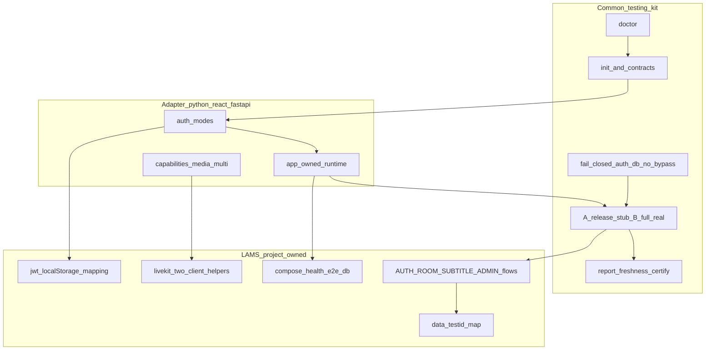
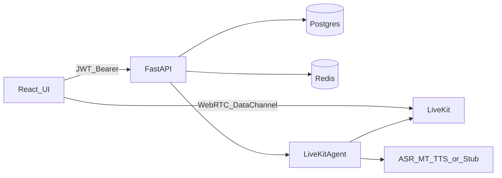

# LAMS 包括 E2E 基本設計

- 文書 ID: `lams-e2e-architecture-2026-09-06`
- 状態: 承認済み方針（案 B: kit 契約中心 + LAMS 差分）
- 対象: LAMS MVP + testing-kit v0.3.0（installed-kit）
- 作成日: 2026-09-06

## 1. 目的

多言語会議システム LAMS を、**業務シナリオ駆動の E2E** で繰り返し検証し、失敗を分類・修正・再実行して収束させる。  
理想状態は次の一本道が通ること:

```text
doctor → init → 契約宣言 → up/health → Aレーン → 失敗分類/修正 → Bレーン(任意) → certify
```

途中で「この PJ 用に毎回手作り」が発生しない。例外は **言語／フレームワーク／Realtime 固有**だけ。

## 2. 成功条件

1. A レーン（決定論）が、外部 AI 課金なしで AUTH／ROOM／RBAC／設定 UI／接続骨格を検証できる。
2. B レーンが、手動ゲート付きで主要 2 フローだけ実 AI を検証できる。
   - 日本語話者 → 英語聞き手の字幕＋翻訳音声＋ transcript
   - 管理者 AI pipeline 設定の GET／PUT／revision／復元
3. 未確認を合格にしない。UI のみ合格禁止（第二観測必須）。
4. 本番 DB wipe・auth bypass・秘密値のレポート記録をしない。
5. 管理不能な外部要因（Docker Desktop ソケット権限、quota 等）は根拠付きで明示し、コードで隠さない。

## 3. 責務分割



| 層 | 持つもの | 持たないもの |
|----|----------|--------------|
| **kit 共通** | 手順、lane、doctor、レポート、fail-closed、契約検証 | LAMS 業務意味 |
| **adapter** | FastAPI+React の起動／認証モード／能力宣言 | 会議室ドメイン |
| **LAMS** | JWT persist、LiveKit、字幕、AI 設定シナリオ、testid | 独自 Playwright 正本の常設並存 |

## 4. 契約モデル（共通の核）

唯一の宣言面:

- [`e2e/app.toml`](../../e2e/app.toml)
- [`e2e/app-owned-runtime.json`](../../e2e/app-owned-runtime.json)

### 4.1 現行 LAMS 宣言（要約）

| キー | 値 | 意味 |
|------|-----|------|
| `auth.mode` | `login` | 実ログイン必須（bypass 禁止） |
| `data.seed_mode` | `self` | API／UI で自己準備 |
| `data.requires_db` | `false` | 共有 DB wipe しない |
| `deployment.default_mode` | `existing-server` | 既起動 stack を対象 |
| `browser.media_capture` | `true` | マイク系シナリオ能力 |
| `browser.participants` | `2` | 2 クライアント能力 |
| ports | 5273 / 8090 | 既知構成 |

### 4.2 目標契約（kit 強化後）

```toml
[auth]
mode = "jwt-localstorage"   # bff-cookie | session-cookie | jwt-localstorage
login_path = "/api/auth/login"
token_storage = "localStorage"
token_key = "lams-auth"

[deployment]
default_mode = "existing-server"  # or compose

[data]
seed_mode = "self"
requires_db = false
# 将来: e2e 専用 DB なら requires_db=true かつ E2E_DB_URL に test|e2e|ci 必須

[ai]
lane_a_boundary = "http_stub"  # process_mock は非推奨（移行期間のみ）
stub_base_url_env = "LAMS_AI_STUB_URL"
```

### 4.3 原則

- 認証 bypass 禁止（testing-kit `14-MOCK-BOUNDARY` 準拠）
- 外部 AI だけ境界化（A=HTTP stub 最終形、B=実 AI）
- 自前 auth／DB／route は実物
- 未宣言 capability を使うシナリオは HARD STOP（黙って skip しない）
- identity は専用 `/__testing_kit_identity` 必須にしない（`GET /health` 等を宣言可能に）

## 5. A／B レーン設計

testing-kit の lane 用語との対応:

| 本リポ呼称 | kit 呼称 | AI | 用途 |
|------------|----------|----|------|
| **A レーン** | release 相当 | 外部 HTTP stub（暫定: process `mock`） | 決定論的回帰・発布判定寄り |
| **B レーン** | full-real 相当 | 実 LLM 必須 | 品質保証・主要 2 フローのみ |

| Lane | 検証対象 | 合格条件 |
|------|----------|----------|
| A | auth／UI／room／RBAC／設定／接続骨格 | 決定論、課金ゼロ、第二観測あり |
| B | LIVE-001 + ADMIN 設定後 1 発話 | 字幕／翻訳 track／transcript、回数制限 |

### 5.1 第二観測（必須）

UI だけで合格にしない。併記する例:

- HTTP status／JSON フィールド
- transcript 行・翻訳言語キー
- LiveKit data channel イベント
- AI pipeline `revision` 増加
- 翻訳音声 track の `audio_bytes > 0`（B）

### 5.2 Mock／Stub 方針

| 段階 | 手段 | 位置づけ |
|------|------|----------|
| 暫定 | `MockAIProvider`（`LAMS_E2E_MOCK_AI=1` / `ai_provider=mock`） | A レーンを動かすための移行手段 |
| 最終 | OpenAI 互換 **HTTP stub container** | kit 正本（process 内 Fake は release 合格に使わない） |

## 6. システム境界（観測点）



| 境界 | E2E で観測する場所 |
|------|-------------------|
| Frontend | DOM／`data-testid`／connectionStatus |
| FastAPI | status／JSON |
| Postgres | transcript API |
| Redis | preference 反映（間接） |
| LiveKit | track 購読／DataReceived |
| AI | 字幕テキスト／音声バイト（B）または stub 応答（A） |

## 7. シナリオ優先度（P0）

| ID | 内容 | レーン |
|----|------|--------|
| AUTH-001 | 登録 → メニュー | A |
| AUTH-002 | 未認証保護ルート | A |
| HEALTH-001 | API `/health` | A |
| ROOM-001 | 作成 → 一覧＋API 二次観測 | A |
| ADMIN-001 | 非 admin PUT 403／admin GET | A（admin env 任意） |
| PREF-001 | 会議室 Preference／接続状態 | A（LiveKit 欠落時 soft-skip） |
| SUBTITLE-001 | 字幕表示契約／Room 到達 | A |
| LIVE-001 | 2 クライアント字幕＋翻訳音声 | B |
| ADMIN-AI-001 | pipeline 設定スモーク＋必要なら 1 発話 | B |

業務フロー詳細: [`e2e/docs/business-flows/`](../../e2e/docs/business-flows/)

## 8. 実行トポロジ

### 8.1 existing-server（現行既定）

- 既に `5273`／`8090`（必要なら `7880`）が listen
- Playwright はサーバ起動しない（`E2E_DEPLOYMENT_MODE=existing-server`）
- Docker 不可時でも、手で stack を上げれば A レーンを実行可能

### 8.2 compose（目標）

- `app-owned-runtime.json` の `server_start` = `docker compose up -d --build`
- 起動後 `alembic upgrade head` と `/health` 待ち
- WSL から Docker Desktop ソケットへ書けない場合は **環境ブロッカー**として報告（コードで隠さない）

## 9. データ境界

| 方式 | 条件 | 備考 |
|------|------|------|
| **現行** | `seed_mode=self` + `e2e_*` プレフィックス | 共有 DB `lams` は wipe 禁止（URL に test/e2e/ci 無し） |
| **推奨将来** | DB 名 `lams_e2e` 等 | kit の reset fail-closed と整合 |

`reset_db.py` は `prod`／`staging` 等を拒否し、`test`／`e2e`／`ci` を含む URL のみ破壊操作可。

## 10. 認証設計（LAMS 固有）

- API: `POST /api/auth/login` `{email,password}` → `{access_token,user}`
- フロント: zustand persist キー `lams-auth`
- E2E: 実 login／register 後、`localStorage` に persist 形を注入（bypass なし）
- admin: `register` では作れない → `E2E_ADMIN_EMAIL`／`E2E_ADMIN_PASSWORD`（未設定なら admin ケース skip）

実装: [`e2e/helpers/auth.ts`](../../e2e/helpers/auth.ts)

## 11. 品質ゲートとの関係

| ゲート | 現状 | 目標 |
|--------|------|------|
| `./scripts/check.sh` | lint／format／type | 維持 |
| backend pytest | 手動／厚い単体 | A 前の必須 |
| frontend build | 手動 | A 前の推奨 |
| A レーン | `e2e_run_a_lane.sh` | Docker 可用時 CI |
| B レーン | `e2e_run_b_lane.sh` | 手動のみ |

## 12. 非目標

- auth bypass で緑を作る
- kit と別系統の第 2 Playwright 正本を常設
- 初回から全言語マトリクスを B で回す
- 本番 DB wipe
- 決済／メール等の外部副作用を黙って mock 合格
- 無限監視（管理可能失敗 0 で終了。外部ブロッカーは証跡付き停止）

## 13. 既知の外部ブロッカー（2026-09-06 実測）

| 要因 | 証跡 | 扱い |
|------|------|------|
| Docker Desktop WSL ソケット書込不可 | `docker.proxy.sock` mode で other に write 無し → connect Permission denied | 環境修復。existing-server で継続可 |
| testing-kit ツリーが root 所有で書込不可な場合 | installed-kit（wheel）＋ LAMS 内契約で吸収 | kit 本体改修は書込可能時／別作業 |

## 14. 段階導入

1. 契約固定（app.toml／runtime／marker）— 済
2. JWT auth helper + smoke／regression 骨格 — 済
3. A レーン安定化（レポート・フレーク）
4. AI 暫定 mock → HTTP stub へ置換
5. B レーン（LiveKit 2 クライアント＋ admin smoke）
6. certify strict／CI 接続
7. kit 本体への AuthMode／doctor 強化の還元

## 15. 参照

- testing-kit: `docs/14-MOCK-BOUNDARY.md`, `docs/16-TEST-POLICY.md`, `docs/19-USER-OPERATIONS-GUIDE.md`, `docs/20-E2E-LANES.md`
- LAMS: [`docs/テスト観点.md`](../テスト観点.md), [`CLAUDE.md`](../../CLAUDE.md), [`.cursor/rules/docker-windows-startup.mdc`](../../.cursor/rules/docker-windows-startup.mdc)
