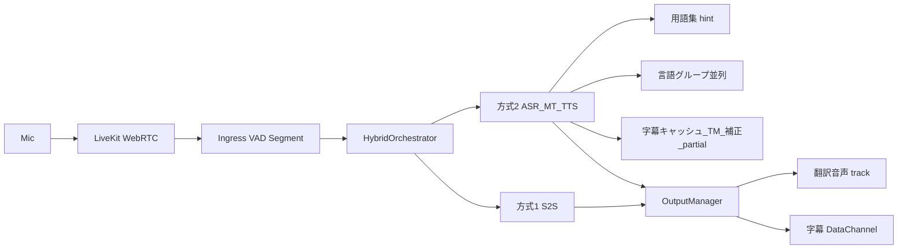
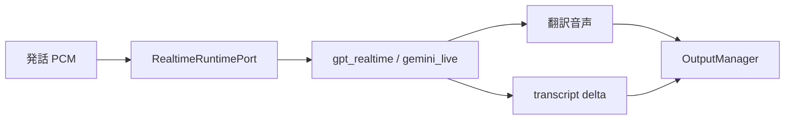
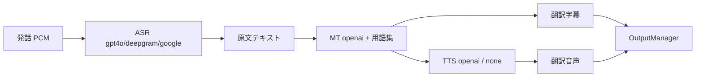
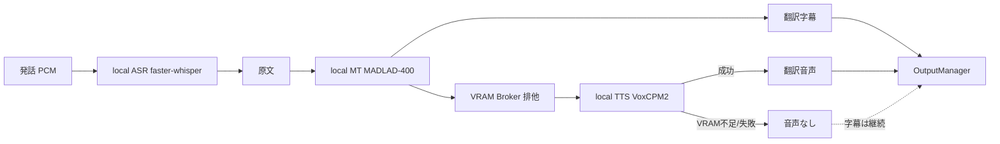

# Sonowa - 言語感知型会議システム

**Sonowa（ソノワ）／ Language-Aware Meeting System** — 社内多言語会議の認知負荷を軽減するリアルタイム音声翻訳・字幕システム。

参加者は「原声」か「翻訳音声」を自由に選択でき、聴いている音声と同じ言語の字幕が表示される。翻訳ツールではなく「言語の壁を意識させない会議体験」を目的とする。

> **名称について（2026-08-20 変更）**
> 旧称 `LAMS` は eラーニング分野の既存製品（LAMS Foundation / LAMS International の Learning Activity Management System）と
> 同一表記であり、検索・商標・SEO で衝突するため、製品名を **Sonowa（ソノワ）** に変更した。
> 由来は「音（Sono）＋輪（Wa）＝音の輪」。タグラインは **「言語の壁を、会議から消す。」**。
> 社外資料・広告・動画ではすべて Sonowa を使う。
> 内部識別子（DB 名 / DB ユーザー名 / Docker ボリューム名 / localStorage キー / `SONOWA_*` 環境変数 / WAV 透かしチャンク ID）も
> 2026-09-12 に Sonowa へ完全統一した。旧 `lams` 環境から移行する場合は DB の再作成（`alembic upgrade head`）と全ユーザーの再ログインが必要。

## 概要

| 特長 | 説明 |
|------|------|
| ユーザー主導 | 各参加者が「原声 / 翻訳音声」を自由に選択 |
| 認知負荷ゼロ | デフォルトは原声モード |
| 字幕と音声の一致 | 聴いている音声と同じ言語の字幕のみ表示 |
| 低遅延目標 | パイプライン内部の上限設定は `max_latency_ms=1200`。参加者が体感するエンドツーエンド遅延の基準は §9 の品質ゲート（字幕 P95 4秒 / 音声 P95 5秒）を用いる |
| プライバシー重視 | 社内利用前提 |
| 自動会議記録 | 全発言を記録し言語別エクスポート可能 |
| 管理者機能 | ユーザー管理・統計・RBAC（admin/moderator/user） |

**対応言語**: 日本語(ja) / 英語(en) / 中国語(zh) / ベトナム語(vi)

**AIプロバイダー**（`AI_PROVIDER` で選択。モデル名は `backend/app/config.py` の既定値）:

| プロバイダー | パイプライン / モデル | 用途 |
|---|---|---|
| `gpt4o_transcribe` | GPT-4o-transcribe ASR + GPT-4o-mini 翻訳 + tts-1 | 推奨（デフォルト） |
| `gpt_realtime` | GPT-Realtime S2S（GA対応が必要な実験経路） | 最低遅延 |
| `deepgram` | Deepgram Nova-3 ASR + GPT-4o-mini 翻訳 + tts-1 | 高精度ASR |
| `google` | Google Chirp 3 ASR + Cloud Translation v3（Mode B） | 高精度・正式記録 |
| `gemini_live` | Gemini Live S2S（鍵整備後に再検証する実験経路） | S2S 代替 |

> `google` / `gemini_live` はキー・認証未整備時、起動を止めず `gpt4o_transcribe` へ自動フォールバックする。
> ASR / MT / TTS は `ASR_PROVIDER` / `MT_PROVIDER` / `TTS_PROVIDER` で独立に差し替え可能（Composite。既定 `auto`）。
> 補正・議事録用 LLM はテキスト系モデル（GPT: gpt-4o-mini / Gemini: gemini-2.5-flash）を使用する。

### 画面上の2方式（管理者 `/admin/ai-pipeline`）

実装方式（どう翻訳するか）と会議主線（何を出すか）と受聴設定（何を聴くか）は **別レイヤ** である。

| レイヤ | 値 | どこで切替 | 意味 |
|---|---|---|---|
| **実装方式** | 方式1 Realtime S2S / 方式2 品質カスケード | 管理者 `/admin/ai-pipeline` | Provider・品質パック・実行経路 |
| **会議主線** | `a` / `b` / `hybrid` | 部屋作成・会議室サイドバー（作成者/モデレーター） | 聞く主線・読む主線・両方 |
| **受聴設定** | `original` / `translated` | 参加者 PreferencePanel | 原音を聴くか翻訳音声を聴くか |

共通の入口〜出口は同一。差分は Provider Registry 配下の実装だけに閉じる。
ローカル GPU（`asr/mt/tts=local`）は **方式ではなく**、方式2の上級実装オプションである。



#### 方式比較（違いの要約）

| 観点 | 方式1: 純リアルタイム音声 API | 方式2: 品質カスケード（用語集） |
|---|---|---|
| 管理者プリセット | `realtime_s2s` → `ai_provider=gpt_realtime`、`default_mode=a` | `quality_cascade` → `gpt4o_transcribe` + スロット `auto` + `default_mode=hybrid` + 品質パック ON |
| 処理形 | Speech→Speech（一体） | ASR → MT → TTS（分離） |
| ASR/MT/TTS スロット | **無視**（S2S 維持） | クラウド各社を選択可（上級で local 可） |
| 用語集 | 非対象（S2S のまま） | **必須**（読む主線・Composite OpenAI MT） |
| 並列・字幕最適化 | 弱め | 言語グループ並列 + キャッシュ/TM + partial + LLM 補正 |
| 典型出力 | 翻訳音声 + transcript delta | 字幕中心、TTS 任意 |
| 遅延 | 最も低い想定 | 中（REST/セグメント単位） |
| 秘密・コスト | クラウド API キー必須 | クラウド API キー必須（補正は `GEMINI_API_KEY`） |
| 適合 | 低遅延の同通・軽会議 | **既定・正式記録・業界用語** |

#### 方式1: 純リアルタイム音声 API（S2S）

音声をクラウドの Realtime API に渡し、翻訳音声を直接得る。途中の ASR/MT/TTS スロットは使わない。



```text
Mic → LiveKit → Segment → RealtimeRuntimePort
                         └─ OpenAI Realtime / Gemini Live（S2S）
                              ├─ 翻訳音声 track
                              └─ transcript delta（字幕補完）
```

#### 方式2: 品質カスケード（ASR→MT→TTS + 用語集）

認識・翻訳・合成をステージ分離し、**自社用語集**・並列・字幕最適化を品質パックとして載せる。既定運用。



```text
Mic → LiveKit → Segment → 上流 ASR（1回）
                         ├─ 読む主線: translate_text_simple（用語集・補正・TM）→ 字幕
                         ├─ Composite OpenAI MT: 同上経路に統一
                         └─ 聞く主線: Composite TTS（任意）→ 翻訳音声
                              + 言語グループ並列 / partial 字幕（品質パック）
```

方式2プリセット保存時に `enable_partial_subtitles` と `llm_correction_enabled` が ON になる（秘密は `.env` のまま。補正には `GEMINI_API_KEY` が必要）。

会議中の **a / b / hybrid**（聞く・読む・両方）は部屋作成者またはモデレーターが会議室サイドバーから切替可能（参加者の原音/翻訳受聴とは別概念）。

#### 方式2の上級実装オプション: ローカル GPU（OSS・4言語単一モデル）

トップレベル「方式」ではない。上級設定で `asr/mt/tts=local` を指定した場合のみ。用語集はクラウド MT 経路向け（local MT は非対応・警告表示）。

各段階 **1モデル** で `ja/en/zh/vi` を扱う（言語対12モデルは使わない）。

| ステージ | モデル | ライセンス | 概算 VRAM |
|---|---|---|---|
| ASR | `Systran/faster-whisper-medium` INT8 | MIT | ~1.5GB |
| MT | `google/madlad400-3b-mt` CT2 INT8 | Apache-2.0 | ~2.5GB |
| TTS | `openbmb/VoxCPM2`（`load_denoiser=False`） | Apache-2.0 | ~7.5GB |



```text
Mic → LiveKit → Segment
              ├─ ASR: faster-whisper-medium（INT8）
              ├─ MT:  MADLAD-400 単一モデル（<2ja>/<2en>/<2zh>/<2vi>）
              └─ TTS: VoxCPM2（8GB 級・他モデルと同時常駐不可）
                    失敗時 → 翻訳音声のみ停止、字幕は継続
```

#### ローカル GPU（8GB）の準備

```powershell
# GPU + local 依存込みで起動
$env:INSTALL_LOCAL = "1"
docker compose -f docker-compose.yml -f docker-compose.gpu.yml up -d --build

# モデル取得・MADLAD CT2 変換（永続ボリューム /models）
docker compose exec backend python /app/scripts/prepare_local_models.py --output-dir /models
```

推奨 env（`.env` はユーザー管理。例のみ）:

- `LOCAL_MT_MODEL_DIR=/models/madlad400-3b-mt-int8`
- `LOCAL_ASR_MODEL=Systran/faster-whisper-medium`
- `LOCAL_TTS_MODEL=openbmb/VoxCPM2`
- `VRAM_BUDGET_MB=7500`
- `GEMINI_API_KEY=...`（方式2の LLM 補正用。未設定時は警告のみで保存可）

制約: VoxCPM2 単体で約 8GB のため ASR/MT/TTS 同時常駐はできない。VRAM Broker が排他し、TTS 失敗時は字幕継続。`max_latency_ms=1200` はローカル翻訳音声の達成保証ではなく、超過時は聞く主線縮退→字幕フォールバックが合格条件。

---

## アーキテクチャ設計（本番想定）

> 本章は設計仕様書 [`改善.md`](./改善.md)（全20章）を Sonowa 実装へマッピングした本番アーキテクチャである。
> 通信は **WebRTC に統一**、翻訳は **2系統（OpenAI / Google）**、LLM は **2種（GPT / Gemini）** に限定する。

### 0. 絶対原則：2つの大主線を混ぜない

> **製品の画面方式との関係:** 管理者プリセットの「方式1 / 方式2」（本書冒頭）は
> Provider・品質パックの切替である。本節の「主線1 / 主線2」は会議内の
> **聞く（hearing）/ 読む（reading）** フォークの設計原則である。混同しないこと。
> 現行 MVP の方式2読む主線は Google 専用ではなく、`translate_text_simple`
> （用語集・TM・任意 Gemini 補正）を含むクラウド品質経路が既定である。

本システムは以下 **2本の独立した主線（パイプライン）** で構成する。両者はコードパスを共有せず、
**フォークは Gateway での音声複製のみ**、**収束は Output Manager と DB（provider/mode タグ付け）のみ**とする。

| 主線 | 方式 | 遅延 | 精度 | 定制能力 | 適合シーン |
|---|---|---:|---:|---:|---|
| **主線1（Mode A / 聞く）** | End-to-End Speech-to-Speech（OpenAI Realtime / Gemini Live）ほか | 最低/較低 | 中高 | 較弱 | 実時同伝・軽会議 |
| **主線2（Mode B / 読む）** | ASR → MT + 術語庫 → 字幕（クラウド品質経路が既定） | 較低 | 高 | 強 | **MVP 首選**・高精度・正式記録 |

- **主線1** は術語庫付き MT を**必須としない**（S2S）。出力は翻訳音声 + transcript delta。
- **主線2** は字幕・議事録特化を基本とし、用語集経路を通る。聞く主線とコードパスを混ぜない。
- **Phase 3 ハイブリッド**は「同一マイク音声を Gateway で複製し両主線へ流す」だけで、**パイプライン同士は結合しない**。

```text
                      ┌─ 主線1: OpenAI Realtime S2S ─→ 翻訳音声 + transcript delta
Mic ─WebRTC→ Gateway ─┤  (Mode Router が選択のみ)
                      └─ 主線2: Chirp 3 → 正規化 → 術語庫 → Cloud Translation → LLM補正 → 字幕/議事録
```

### 1. 全体構成

```text
Client (WebRTC)
  │  Audio Track(uplink) / Remote Audio Track(downlink) / DataChannel(字幕・制御)
  ▼
Realtime Gateway（音声複製の唯一のフォーク点）
  ▼
Session Orchestrator ─→ Mode Router ─→ Provider Registry
  ├── 主線1: OpenAIRealtimeS2SProcessor
  └── 主線2: GoogleAsrMtSubtitleProcessor
  ▼
Output Manager（翻訳音声 / 原文字幕 / 翻訳字幕 / transcript / 議事録）
```

### 2. クライアント通信方式（WebRTC 統一）

WebSocket・WebTransport・独自RTCは**正式設計対象外**。ただし WebRTC DataChannel は WebRTC の一部として利用する。

| トラック種別 | 用途 |
|---|---|
| Audio Track | ユーザー音声 uplink |
| Remote Audio Track | 翻訳音声 downlink（主線1のみ） |
| DataChannel | 原文/翻訳字幕・partial/final transcript・mode change・provider status・error/fallback |
| SRTP / DTLS | 暗号化通信 |
| ICE / TURN | NAT 越え |
| Jitter Buffer | 音声再生安定化 |

#### 2.1 メディア・トポロジー（主線ごとに分離）

- **主線1（Mode A / OpenAI S2S）**: ブラウザが**ephemeral key で OpenAI Realtime へ直接 WebRTC**接続するのが最低遅延。
  サーバーは ephemeral token 発行のみを担い、transcript delta を DataChannel 経由でログへミラーする。
- **主線2（Mode B / Google）**: 音声はサーバー側 ASR に届ける必要があるため、**SFU + サーバー側エージェント**構成。
  エージェントが各話者トラックを購読 → Opus を PCM へデコード → Chirp 3 ストリーミング ASR へ投入する。

#### 2.2 SFU 選定

| 選択肢 | 位置づけ | 理由 |
|---|---|---|
| **LiveKit（推奨・本番）** | Realtime Gateway / SFU | OSS(Apache-2.0)・自前ホスト/Cloud両対応・Python Agent SDK で server-side 参加が容易・TURN同梱 |
| **aiortc（移行ブリッジ）** | FastAPI 内 WebRTC peer | 新インフラ不要で既存 backend に同居でき、WS→WebRTC の段階移行に使える。大規模 fan-out には不向き |

> 本番（上線・販売）は **LiveKit SFU** を基盤とし、Phase 2 の検証は **aiortc ブリッジ**で先行する。

#### 2.3 シグナリング・NAT 越え

- LiveKit: サーバーが room/identity スコープの access token を発行（既存 JWT と対応付け）、ICE/SDP は LiveKit SDK が処理。
- OpenAI 直結: サーバーが ephemeral session token を発行し、クライアントが SDP offer/answer を OpenAI と交換。
- TURN: 本番は **coturn**（または LiveKit 同梱 TURN）+ TLS。STUN はパブリック/自前を併用。

#### 2.4 LiveKit イベント ↔ クライアント配信（実装済み）

WebSocket は廃止済みで、トランスポートは LiveKit へ一本化済み（旧 `websocket/handler.py` / `useWebSocket.ts` は削除済み）。
フロントは `useLiveKit.ts` で接続し、バックエンドは参加トークン発行 + LiveKit Agent（`webrtc/agent.py` 音声フォーク Gateway）でのみ LiveKit と通信する。
字幕・制御は LiveKit のデータ配信、翻訳音声は Remote Audio Track で送る。

| イベント / トラック | 配信経路（`webrtc/sink.py` ほか） | 内容 |
|---|---|---|
| `subtitle` / `subtitle_interim` | LiveKit data（`deliver_subtitle`） | 原文/翻訳字幕・partial/final |
| `qos_warning` | LiveKit data（`deliver_event`） | §9 QoS 目標逸脱通知 |
| 翻訳音声（PCM） | Remote Audio Track（`publisher.py`） | 聞く主線の翻訳音声 24kHz |

### 3. モード / Provider 切替

- **Mode Router**：`if` 文の羅列を避け、Session Orchestrator 配下で主線を選択する単一責務。
- **切替単位は3つに限定**：会議単位 / ユーザー単位（翻訳音声 ON/OFF）/ 言語ペア単位（`language_routes`）。
- **Provider Registry**（`registry.py`）：ASR（GPT-4o / Deepgram Nova-3 / Chirp 3）・MT（OpenAI / Cloud Translation）・
  TTS（OpenAI / none）をステージ単位のカタログで集中管理し、`*_PROVIDER` env で差し替える。S2S は OpenAI Realtime / Gemini Live。
- **既定は `AI_PROVIDER=gpt4o_transcribe`**（カスケード ASR→MT→TTS、標準 REST で安定）。`gpt_realtime` は
  OpenAI Realtime **GA プロトコル**へ移行済みの低遅延オプション（beta 形状は 2025 年に廃止され `beta_api_shape_disabled` になる）。
  ただし現状は発話ごとに WebSocket を張り直すため、接続ハンドシェイク分の遅延が乗る点に注意。

### 4. Provider Interface ↔ 既存 `AIProvider` 抽象の対応

`改善.md` 8.3 の4インターフェースを、既存 `app/ai_pipeline/providers/base.py::AIProvider` と整合させる。

| 改善.md Interface | 既存抽象との関係 | 実装状況 |
|---|---|---|
| `SpeechToSpeechProvider` | `gpt_realtime` / `gemini_live` | 実装済み（主線1。OpenAI Realtime + Gemini Live） |
| `ASRProvider` | `AIProvider.transcribe_*` を分離 | 実装済み（`stages.py` でステージ化。Chirp 3 / Deepgram / GPT-4o） |
| `TranslationProvider` | Composite MT ステージ | 実装済み（`OpenAIMTStage` / `GoogleMTStage` + 術語庫連携） |
| `LLMCorrectionProvider` | `correction.py` / `minutes.py` | 実装済み（補正=Gemini / 議事録=GPT優先・Gemini fallback） |

### 5. 術語庫（Glossary）・精度向上

精度競争力はモデルではなく**企業ごとの用語資産**で決まる（主線2の中核）。適用順序：

```text
ASR transcript → 人名/会社名補正 → 数字/日付/金額正規化 → 用語候補抽出
→ Cloud Translation glossary/adaptive → LLM による最終表記統一
```

`glossary_term`（tenant 単位・source/target・priority・`do_not_translate`・enabled）を新設し、CRUD API と
翻訳パイプラインの pre/post 処理として統合する。

### 6. LLM 補正

LLM は翻訳の主役ではなく**補正・整形・会議理解**に使う（表記統一/文脈補正/敬語/数字保持/議事録/ToDo抽出）。
`config.py` で次の2スロットを制御する（モデルは GPT=`gpt-4o-mini` / Gemini=`gemini-2.5-flash`）:

```bash
LLM_CORRECTION_PROVIDER=off       # off（既定・非介入） / gemini（翻訳校正）
LLM_MINUTES_PROVIDER=auto         # auto（GPT優先・Gemini fallback） / gpt / gemini / off
```

補正プロンプト原則：数字/日付/金額/固有名詞を変更しない・術語庫の指定訳を必ず使う・意味を追加しない・
推測補完しすぎない・target_language のみ出力。

### 7. データ設計 ↔ 既存モデル

| 改善.md テーブル | 既存モデル（`app/db/models.py`） | 方針 |
|---|---|---|
| `meeting` | `Room` + `MeetingSession` | 既存流用（`default_mode` 等を拡張） |
| `participant` | Redis（`rooms/manager.py`）+ 一部DB | 永続化が必要な項目のみDB化 |
| `transcript_segment` | `Subtitle.original_*` | provider/confidence/is_final を追加 or 新表 |
| `translation_segment` | `Subtitle.translations(JSON)` | provider/llm_provider/glossary_version/quality_score を分離 |
| `glossary_term` | **新規** | 多テナント術語庫 |

> 既存 `Subtitle` データは非破壊。Alembic migration で追加し、後方互換を維持する。

### 8. 主要 API（追加・拡張）

| メソッド・パス | 用途 |
|---|---|
| `POST /api/meetings` | 会議作成（source/target languages, `default_mode`, `enable_openai_s2s`） |
| `PATCH /api/meetings/{id}/mode` | モード切替（主線の選択） |
| `PATCH /api/meetings/{id}/participants/{pid}/voice-translation` | ユーザー単位の翻訳音声 ON/OFF |
| `POST /api/rooms/{id}/token` | LiveKit 参加トークン発行（WebRTC 接続用） |
| `GET /api/rooms/{id}/transcript` | 会議記録取得（`session_id` 指定で会議回単位に絞込可能） |
| `GET /api/rooms/{id}/minutes` | 議事録生成（`session_id` 指定で会議回単位に絞込可能） |
| `POST/GET/PATCH/DELETE /api/glossaries/terms` | 術語庫 CRUD（要admin） |

### 9. 品質ゲート（最低基準）

| 指標 | 目標 |
|---|---:|
| 用語命中率 | 95% 以上 |
| 数字・日付保持 | 98% 以上 |
| 翻訳字幕 P95 遅延（主線2） | 4 秒以内 |
| 音声翻訳 P95 遅延（主線1） | 5 秒以内 |
| 重大誤訳 | 0 件 |
| 会後議事録可用率 | 95% 以上 |

### 10. 障害時 Fallback（主線間の縮退）

| 障害 | 対応 |
|---|---|
| OpenAI Realtime 障害 | 主線2（Google 字幕）へ切替 |
| Google ASR 障害 | 主線1の transcript を暫定利用 |
| Google Translation 障害 | GPT で翻訳 |
| GPT 障害 / Gemini 障害 | 相互 fallback |
| 翻訳音声障害 / 字幕障害 | 片方を継続 |
| WebRTC 切断 | 再接続、失敗時は一時離脱扱い |

### 11. セキュリティ

- 通信は SRTP/DTLS（WebRTC）で暗号化。シグナリングは TLS。
- ルーム参加は JWT 由来の短命トークン（LiveKit access / OpenAI ephemeral）でスコープ制限。
- API キー・認証情報は環境変数のみ（コード・ログ・URL・引数に出さない）。多テナント分離を術語庫/データに徹底。

### 12. 実装ロードマップと現状ギャップ

| Phase | 内容 | 現状 |
|---|---|---|
| **Phase 1（MVP・主線2優先）** | Chirp 3 ASR → Cloud Translation + 術語庫 → 字幕 → 議事録 | 実装済み（現行の出荷基線） |
| **Phase 2（主線1追加）** | OpenAI Realtime S2S + ユーザー翻訳音声 ON/OFF + Mode Router | 実装あり（`mode1` は再検証/再設計対象） |
| **Phase 3（ハイブリッド）** | 同一音声を両主線へ複製（聞く=S2S / 読む=ASR+MT） | 実装あり（QoS・実機検証は継続中） |

> **通信レイヤー**：WebRTC（LiveKit）へ一本化済み（詳細は §2.4）。

---

## セットアップと起動

ローカル開発と Docker 起動は混在させず、以下のどちらか一方を選ぶ。

### 共通準備（初回のみ）

- WSL2 + Docker Desktop（Docker Compose v2）
- ローカル開発のみ Python 3.10+、Node.js 20+

環境変数ファイルを用意する。

```bash
cd sonowa
cp .env.example .env
```

**手で記入するのは API キーだけ**でよい。`HOST_IP` は起動スクリプトが自動検出して `.env` へ書き戻す。

| 変数 | 記入 | 自動設定のされ方 |
|---|---|---|
| `OPENAI_API_KEY` | **必須** | 自動化なし。`.env` に記入するか `export OPENAI_API_KEY=sk-xxx`（シェル環境変数が `.env` より優先） |
| `AI_PROVIDER` | 任意 | 既定 `gpt_realtime`。`gpt4o_transcribe` / `deepgram` / `google` / `gemini_live` |
| `DEEPGRAM_API_KEY` | `deepgram` 使用時のみ | — |
| `GEMINI_API_KEY` | `gemini_live` / LLM補正・議事録(Gemini) 使用時のみ | 未設定なら該当機能は自動無効化 |
| `GOOGLE_PROJECT_ID` ほか | `google` 使用時のみ | 未設定なら `gpt4o_transcribe` へ自動フォールバック |
| `DATABASE_URL` / `REDIS_URL` | **不要** | Docker: compose がコンテナ内向けに自動注入 / ローカル: 起動スクリプトが `localhost:5433` / `localhost:6380` を既定設定 |
| `LIVEKIT_API_KEY` / `LIVEKIT_API_SECRET` | 開発では不要 | dev 既定値（`devkey` / `devsecret...`）が `.env.example` と compose で一致済み。**本番では必ず変更** |
| `JWT_SECRET` | 開発では不要 | dev 既定値あり。**本番では必ず変更** |
| `HOST_IP` | 通常は不要 | 起動前に LAN IPv4 を検出し `.env` を更新。誤検出時だけ `--host-ip` で明示 |
| `BACKEND_PORT` / `FRONTEND_PORT` | 不要 | 既定 `8090` / `5273`。ここを変えるだけで compose・CORS・nginx が追随 |
| `ASR_PROVIDER` / `MT_PROVIDER` / `TTS_PROVIDER` | 任意 | 既定 `auto`（ステージ別差し替え用） |

> **優先順位**: `--host-ip` / シェルの `HOST_IP` > 自動検出（`.env` の古い値は検出に使わない）。
> 入口スクリプトは検出結果を `.env` の `HOST_IP` へ書き戻す。
> 本番ではクラウドの環境変数 / Docker secrets を使用し、キーをディスクに置かないこと。

## 実用起動手順

起動はリポジトリ直下の入口スクリプト1本だけを使用する。

```bash
./start-with-keys.sh --build
```

入口スクリプトは LAN IP を検出し、`.env` の `HOST_IP=` 行と異なる場合だけ値を置換してから全サービスを起動する。起動後は画面に表示された URL をブラウザで開く。

```bash
# 停止（データは保持）
docker compose down
```

### アクセス URL

| サービス | URL |
|---|---|
| フロントエンド | http://localhost:5273 |
| バックエンドAPI | http://localhost:8090 |
| API ドキュメント | http://localhost:8090/docs |

> ブラウザが直接叩くのは 5273 のみ（API は Vite が `/api` を backend へプロキシするため、CORS・LAN 公開時のポート問題を回避できる）。

---

## 複数マシンでの LAN 連動テスト

1 台の Windows + WSL2 マシンをホストにし、参加端末は同じ LAN からホストの Windows IPv4 へ接続する。ホスト IP は起動時に自動検出され、起動完了メッセージに表示される。

各参加端末で `http://<表示されたIP>:5273` を開く。全端末で同じ IP を使用し、`localhost` や WSL 内部 IP は使用しない。DHCP で IP が変わった場合は、Docker 起動スクリプトを再実行すれば LiveKit も新しい IP で再構成される。

> **注意（IP 自動検出）**:
> - 入口スクリプトは毎回ローカル IP を検出し、`.env` の `HOST_IP` を最新値へ更新する。

**Windows 側の初回設定**（PowerShell 管理者権限、1回だけ）:

```powershell
New-NetFirewallRule -DisplayName "Sonowa Frontend" -Direction Inbound -LocalPort 5273 -Protocol TCP -Action Allow
New-NetFirewallRule -DisplayName "Sonowa Backend" -Direction Inbound -LocalPort 8090 -Protocol TCP -Action Allow
New-NetFirewallRule -DisplayName "Sonowa LiveKit TCP" -Direction Inbound -LocalPort 7880,7881 -Protocol TCP -Action Allow
New-NetFirewallRule -DisplayName "Sonowa TURN" -Direction Inbound -LocalPort 3478 -Protocol TCP -Action Allow
New-NetFirewallRule -DisplayName "Sonowa TURN UDP" -Direction Inbound -LocalPort 3478 -Protocol UDP -Action Allow
New-NetFirewallRule -DisplayName "Sonowa LiveKit UDP" -Direction Inbound -LocalPort 50000-50039 -Protocol UDP -Action Allow
```

他PCのブラウザから `http://<WindowsのLAN IP>:5273` でアクセスする。

> - HTTP の LAN IP はブラウザ上の安全なコンテキストではない。検証時は各参加端末の Chrome/Edge で `chrome://flags/#unsafely-treat-insecure-origin-as-secure` に `http://<IP>:5273` を登録してブラウザを再起動する。これは検証専用であり、実運用は HTTPS 化する。
> - **Docker エンジンが WSL 内で動いている場合**（`docker inspect` の PID が WSL の `/proc` に見える構成）、公開ポートは WSL 側にしか bind されない。LAN 公開の推奨は **WSL mirrored ネットワーク**（Windows 11: `%UserProfile%\.wslconfig` に `[wsl2]` `networkingMode=mirrored` → `wsl --shutdown`）。これで TCP/UDP 全ポートが Windows の LAN IP で直接 listen され、portproxy 不要になる。
> - mirrored にできない場合は portproxy で TCP を転送する（**UDP は portproxy 非対応**のため、LiveKit メディアは TCP 7881 フォールバックで動く。音質・遅延はやや劣化）:
>
>   ```powershell
>   $wslIp = (wsl hostname -I).Trim().Split(' ')[0]
>   # 古い転送先 IP が残っていると LAN アクセスを乗っ取るため、まず対象ポートを削除
>   foreach ($p in 5273,8090,7880,7881,3478) { netsh interface portproxy delete v4tov4 listenport=$p listenaddress=0.0.0.0 2>$null }
>   foreach ($p in 5273,8090,7880,7881,3478) { netsh interface portproxy add v4tov4 listenport=$p listenaddress=0.0.0.0 connectport=$p connectaddress=$wslIp }
>   ```
>
>   WSL の IP は再起動で変わるため、変わったら再実行する。

接続確認は参加端末から次を実行する。

```text
http://<Windows LAN IP>:5273
http://<Windows LAN IP>:8090/health
```

画面は開くが音声が届かない場合は、Windows Firewall の TCP 7880/7881、UDP 50000-50039 と、起動ログの公開 IP が実際の Windows LAN IP と一致しているかを確認する。

---

## 開発コマンド

```bash
# 静的解析（コミット前必須）
./scripts/check.sh            # 全チェック
./scripts/check.sh --fix      # 自動修正付き
./scripts/check.sh --backend  # / --frontend

# テスト
cd backend && pytest

# DBマイグレーション（Alembic）
docker compose exec backend alembic upgrade head                       # 適用
docker compose exec backend alembic revision --autogenerate -m "説明"  # 作成
docker compose exec backend alembic downgrade -1                       # ロールバック
```

詳細なコーディング規約・品質管理は [DEVELOPMENT_RULES.md](./DEVELOPMENT_RULES.md) を参照。
