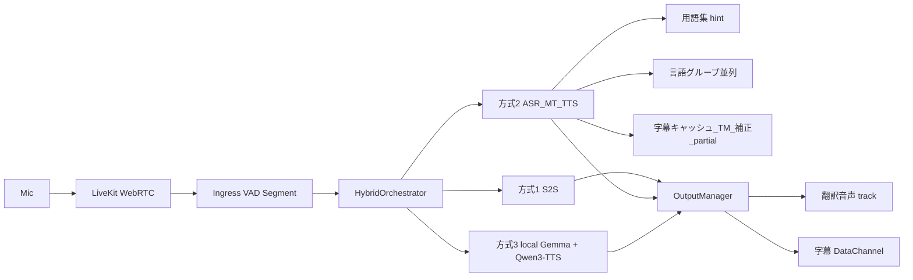
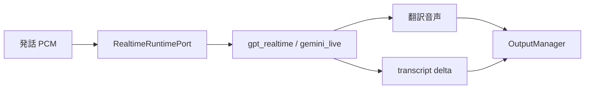
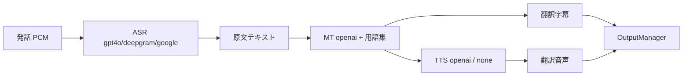
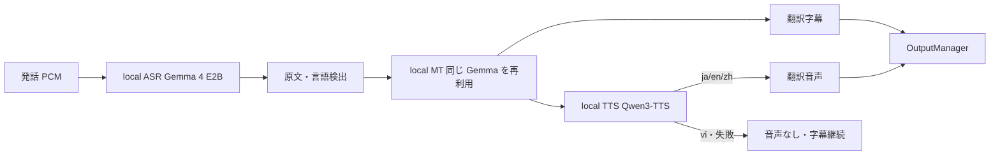

# Sonowa - 言語感知型会議システム

**Sonowa（ソノワ）／ Language-Aware Meeting System** — 社内多言語会議の認知負荷を軽減するリアルタイム音声翻訳・字幕システム。

参加者は「原声」か「翻訳音声」を自由に選択でき、聴いている音声と同じ言語の字幕が表示される。翻訳ツールではなく「言語の壁を意識させない会議体験」を目的とする。

> **名称について（2026-08-20 変更）**
> 旧称 `LAMS` は eラーニング分野の既存製品（LAMS Foundation / LAMS International の Learning Activity Management System）と
> 同一表記であり、検索・商標・SEO で衝突するため、製品名を **Sonowa（ソノワ）** に変更した。
> 由来は「音（Sono）＋輪（Wa）＝音の輪」。タグラインは **「言語の壁を、会議から消す。」**。
> 社外資料・広告・動画ではすべて Sonowa を使う。
> 内部識別子（DB 名 / DB ユーザー名 / Docker ボリューム名 / localStorage キー / `SONOWA_*` 環境変数 / WAV 透かしチャンク ID）も
> 2026-09-12 に Sonowa へ完全統一した。旧 `lams` 環境から移行する場合は DB の再作成（`alembic upgrade head`）と全ユーザーの再ログインが必要。

> **はじめて使う方へ**: スクリーンショット付きの [操作マニュアル（`docs/manual.html`）](./docs/manual.html) を用意している。
> 参加者向けの使い方と管理者向けの設定手順をまとめてある。

## 概要

| 特長 | 説明 |
|------|------|
| ユーザー主導 | 各参加者が「原声 / 翻訳音声」を自由に選択 |
| 認知負荷ゼロ | デフォルトは原声モード |
| 字幕と音声の一致 | 聴いている音声と同じ言語の字幕のみ表示 |
| 低遅延目標 | パイプライン内部の上限設定は `max_latency_ms=1200`。参加者が体感するエンドツーエンド遅延の基準は §9 の品質ゲート（字幕 P95 4秒 / 音声 P95 5秒）を用いる |
| プライバシー重視 | 社内利用前提 |
| 自動会議記録 | 全発言を記録し言語別エクスポート可能 |
| 管理者機能 | ユーザー管理・統計・RBAC（admin/moderator/user） |

**対応言語**: 日本語(ja) / 英語(en) / 中国語(zh) / ベトナム語(vi)

### 機能一覧

| 分類 | 機能 | 説明 |
|---|---|---|
| 会議 | 会議室の作成・参加 | ロール（admin/moderator/user）に応じた作成・参加・退出 |
| 会議 | リアルタイム翻訳音声 | 参加者ごとに「原声 / 翻訳音声」を切替（`PreferencePanel`） |
| 会議 | リアルタイム字幕 | 聴いている音声と同じ言語で表示。partial（暫定）字幕にも対応 |
| 会議 | 会議主線の切替 | `a`（聞く）/ `b`（読む）/ `hybrid` を作成者・モデレーターが切替 |
| 会議 | QoS 監視と自動縮退 | 遅延超過時に翻訳音声を止め字幕へフォールバック |
| 記録 | 会議記録（transcript） | 全発言を原文・翻訳付きで保存、言語別エクスポート |
| 記録 | 議事録の自動生成 | LLM で要約・ToDo 抽出（GPT 優先・Gemini フォールバック） |
| 品質 | 用語集（Glossary）管理 | 企業ごとの用語資産を CRUD し、翻訳の前後処理に適用 |
| 品質 | LLM 補正 | 表記統一・文脈補正・数字/固有名詞の保持（既定 OFF） |
| 品質 | 翻訳キャッシュ / TM | 同一表現の再翻訳を抑制し遅延とコストを削減 |
| 運用 | AI パイプライン設定 | 管理画面で方式1 / 方式2 / 方式3 とステージ別プロバイダーを切替 |
| 運用 | 言語設定 | 利用可能言語の有効・無効を管理 |
| 運用 | ユーザー管理・統計 | ユーザー一覧・権限変更・利用統計 |
| 運用 | 離線重跑（オフライン再処理） | 記録済みパイプライン事件を高品質モデルで再処理し、実時出力との差分から訓練訂正候補を生成 |
| 運用 | A/B テスト | プロバイダー・設定の実験メトリクスを収集し比較 |
| 学習 | 学習データ収集 | ASR / 翻訳の修正履歴、話者登録、TTS 同意、評価サンプルを蓄積 |
| 基盤 | WebRTC（LiveKit） | 音声・字幕・制御を LiveKit に一本化 |
| 基盤 | ローカル GPU 実行（方式3） | ASR / MT を Gemma 4 E2B、TTS を Qwen3-TTS で自ホスト（12GB GPU。vi 向けは字幕のみ） |

**AIプロバイダー**（`AI_PROVIDER` で選択。モデル名は `backend/app/config.py` の既定値）:

| プロバイダー | パイプライン / モデル | 用途 |
|---|---|---|
| `gpt_realtime` | GPT-Realtime S2S（OpenAI Realtime GA プロトコル） | **既定（デフォルト）**・最低遅延 |
| `gpt4o_transcribe` | GPT-4o-transcribe ASR + GPT-4o-mini 翻訳 + tts-1 | 方式2の基準実装・全フォールバックの受け皿 |
| `deepgram` | Deepgram Nova-3 ASR + GPT-4o-mini 翻訳 + tts-1 | 高精度ASR |
| `google` | Google Chirp 3 ASR + Cloud Translation v3（Mode B） | 高精度・正式記録 |
| `gemini_live` | Gemini Live S2S | S2S 代替 |

> **既定 ≠ フォールバック先**。既定は `gpt_realtime` だが、`google` / `gemini_live` はキー・認証未整備時に
> 起動を止めず `gpt4o_transcribe` へ自動フォールバックする。明示的な `local` 指定は対象外で、クラウドへの自動切替や A/B 実験による置換を行わない。
> ASR / MT / TTS は `ASR_PROVIDER` / `MT_PROVIDER` / `TTS_PROVIDER` で独立に差し替え可能（Composite。既定 `auto`）。
> 補正・議事録用 LLM はテキスト系モデル（GPT: gpt-4o-mini / Gemini: gemini-2.5-flash）を使用する。

### 画面上の3方式（管理者 `/admin/ai-pipeline`）

実装方式（どう翻訳するか）と会議主線（何を出すか）と受聴設定（何を聴くか）は **別レイヤ** である。

| レイヤ | 値 | どこで切替 | 意味 |
|---|---|---|---|
| **実装方式** | 方式1 Realtime S2S / 方式2 品質カスケード / 方式3 完全ローカル | 管理者 `/admin/ai-pipeline` | Provider・品質パック・実行経路 |
| **会議主線** | `a` / `b` / `hybrid` | 部屋作成・会議室サイドバー（作成者/モデレーター） | 聞く主線・読む主線・両方 |
| **受聴設定** | `original` / `translated` | 参加者 PreferencePanel | 原音を聴くか翻訳音声を聴くか |

共通の入口〜出口は同一。差分は Provider Registry 配下の実装だけに閉じる。
方式3（完全ローカル）は、ASR/MT/TTS のスロットを `local`（Gemma 4 E2B + Qwen3-TTS）にした構成である。外部通信なしで字幕と翻訳音声を出力する（vi 向けは字幕のみ）。



#### 方式比較（違いの要約）

| 観点 | 方式1: 純リアルタイム音声 API | 方式2: 品質カスケード（用語集） | 方式3: 完全ローカル |
|---|---|---|---|
| 管理者プリセット | `realtime_s2s` → `ai_provider=gpt_realtime`、`default_mode=a` | `quality_cascade` → `gpt4o_transcribe` + スロット `auto` + `default_mode=hybrid` + 品質パック ON | `local_gemma` → `asr/mt/tts=local`、`default_mode=hybrid`、補正 OFF |
| 処理形 | Speech→Speech（一体） | ASR → MT → TTS（分離） | ASR → MT（同じ Gemma）→ TTS（Qwen3-TTS） |
| ASR/MT/TTS スロット | **無視**（S2S 維持） | クラウド各社を選択可 | ASR/MT/TTS=`local`（TTS は差し替え口の契約で結線） |
| 用語集 | 非対象（S2S のまま） | **必須**（読む主線・Composite OpenAI MT） | 非対応（警告表示） |
| 並列・字幕最適化 | 弱め | 言語グループ並列 + キャッシュ/TM + partial + LLM 補正 | 同一翻訳の共有のみ |
| 典型出力 | 翻訳音声 + transcript delta | 字幕中心、TTS 任意 | 字幕 + 翻訳音声（ja/en/zh。vi 向けは字幕のみ） |
| 遅延 | 最も低い想定 | 中（REST/セグメント単位） | 1区間の処理 約5〜7秒（RTX 3060・FLEURS 実測） |
| 秘密・コスト | クラウド API キー必須 | クラウド API キー必須（補正は `GEMINI_API_KEY`） | キー不要・12GB GPU 必須 |
| 適合 | 低遅延の同通・軽会議 | **既定・正式記録・業界用語** | 社外通信不可の会議・機密会議 |

#### 方式1: 純リアルタイム音声 API（S2S）

音声をクラウドの Realtime API に渡し、翻訳音声を直接得る。途中の ASR/MT/TTS スロットは使わない。



```text
Mic → LiveKit → Segment → RealtimeRuntimePort
                         └─ OpenAI Realtime / Gemini Live（S2S）
                              ├─ 翻訳音声 track
                              └─ transcript delta（字幕補完）
```

#### 方式2: 品質カスケード（ASR→MT→TTS + 用語集）

> **TODO（方式2 の将来形・現状は未実装）**: 方式1 と同じ音声→音声（S2S）を、クラウドではなく**ローカルモデル**で実現する。2026-09-24 時点では、商用利用可・ja/en/zh/vi 対応・12GB GPU に収まるローカル S2S モデルが無いため使えない。それまでは下記のクラウドのカスケードで運用する。
>
> 実装時に使える既存の枠組み:
>
> - `backend/app/ai_pipeline/runtime/port.py` の `RealtimeRuntimePort`（`open_session` / `run_turn` / `interrupt` / `close_session`）: 方式1 と同じ S2S の境界。ローカル S2S はこの契約を満たす実装を追加すればよい
> - 実装例: `runtime/per_utterance.py`（発話単位）、`runtime/native_persistent.py`（持続接続）、`runtime/factory.py`（生成）、`providers/gpt_realtime.py` / `providers/gemini_live.py`（S2S provider）
> - 登録と切替: `ai_pipeline/registry.py`（Provider Registry）、管理画面のプリセット（`frontend/src/pages/AiPipelineSettingsPage.tsx`）
> - VRAM 調停・固定 revision・オフライン読込の型: `ai_pipeline/vram_broker.py`、`providers/local_multimodal.py` / `providers/local_tts.py`
> - 実行基盤の検討資料: `docs/MiniCPM-V・TEN Framework分析に基づく最終改善設計.md`（TEN Framework を Mode A 実行基盤として条件付き PoC 採用）
>
> 候補モデル（**ライセンス・対応言語は未検証。採用前に要確認**）: Meta SeamlessM4T v2 / SeamlessStreaming（CC-BY-NC で商用不可と認識）、Kyutai Hibiki（仏→英のみと認識）、Qwen の Omni 系（音声出力あり、言語対応は要確認）、MiniCPM-o（ライセンス要確認）。

認識・翻訳・合成をステージ分離し、**自社用語集**・並列・字幕最適化を品質パックとして載せる。既定運用。



```text
Mic → LiveKit → Segment → 上流 ASR（1回）
                         ├─ 読む主線: translate_text_simple（用語集・補正・TM）→ 字幕
                         ├─ Composite OpenAI MT: 同上経路に統一
                         └─ 聞く主線: Composite TTS（任意）→ 翻訳音声
                              + 言語グループ並列 / partial 字幕（品質パック）
```

方式2プリセット保存時に `enable_partial_subtitles` と `llm_correction_enabled` が ON になる（秘密は `.env` のまま。補正には `GEMINI_API_KEY` が必要）。

会議中の **a / b / hybrid**（聞く・読む・両方）は部屋作成者またはモデレーターが会議室サイドバーから切替可能（参加者の原音/翻訳受聴とは別概念）。

#### 方式3: 完全ローカル（Gemma 4 E2B + Qwen3-TTS）

管理画面 `/admin/ai-pipeline` のプリセット「方式3」を選ぶ（`asr/mt/tts=local`、`default_mode=hybrid`、LLM 補正 OFF）。認識・翻訳・音声合成をすべてローカル GPU で行い、外部へ音声・テキストを送らない。local のロード・推論に失敗してもクラウドへ自動切替しない（ASR/MT 失敗は翻訳不可、TTS 失敗は字幕継続）。用語集はクラウド MT 経路向けで、方式3 では非対応（警告表示）。

| ステージ | モデル | ライセンス | 概算 VRAM |
|---|---|---|---|
| ASR + MT | `google/gemma-4-E2B-it` テキスト側 NF4、音声側 BF16（同じモデルを共有） | Apache-2.0 | ~7.3GB |
| TTS | `Qwen/Qwen3-TTS-12Hz-0.6B-CustomVoice`（ja: Ono_Anna / en: Ryan / zh: Vivian）。実行は `faster-qwen3-tts`（MIT、CUDA グラフ） | Apache-2.0 | ~2.4GB |

2モデルは同時常駐する（実測 Torch ピーク約9.7GB、`VRAM_BUDGET_MB=10000`）。**vi 向けの翻訳音声は出さない**（商用可でベトナム語を合成できるローカル TTS が無いため。vi の話者の発話を他言語へ訳した音声は出る）。



**local TTS の差し替え口**: `backend/app/ai_pipeline/providers/local_tts.py` は `synthesize(text, language) -> WAV | None` 契約、VRAM Broker 調停、生成の直列化、空・無音波形の拒否を持ち、モデルは `MODEL_ID` / `MODEL_REVISION` / `MODEL_SIZE_MB` / `VOICES` / `_load_model()` と `scripts/prepare_local_models.py` の取得対象だけで差し替えられる。ベトナム語に対応した商用可のモデルが出たら、ここへ結線する。採用条件は、商用利用可・Gemma（約7.3GB）と 12GB GPU に同時常駐・実時間より速い合成の3つ。

**依存の固定**: `qwen-tts-hf` の互換層が transformers 5.15 系前提のため、`transformers==5.15.1` / `tokenizers==0.22.2` に固定する（5.17 は `rope_theta` で失敗。Gemma の認識結果は 5.15.1 でも同一を確認）。`faster-qwen3-tts` / `qwen-tts-hf` は gradio 等の不要依存を避けるため Dockerfile で `--no-deps` 導入する。

2026-09-24 時点の TTS 評価:

| モデル | ライセンス | 不採用理由 |
|---|---|---|
| `openbmb/VoxCPM2`（2B） | Apache-2.0 | Gemma と同時常駐で約12.1GB。交互ロードでは1発話あたり約50秒 |
| `k2-fsa/OmniVoice`（0.6B） | CC-BY-NC | 非商用ライセンス |
| `Qwen/Qwen3-TTS-12Hz-0.6B-CustomVoice` | Apache-2.0 | **採用**（ja/en/zh）。公式 `qwen-tts` は実時間の3〜4倍かかるため `faster-qwen3-tts` で実時間の約0.25〜0.5倍 |
| `FunAudioLLM/Fun-CosyVoice3-0.5B` | Apache-2.0 | ベトナム語非対応 |
| Piper `vi_VN` 音声（vais1000 / 25hours / vivos） | MIT（コード） | 学習元データが商用不可（Blizzard 2013 lessac）・不明・CC-BY-NC-SA |
| `pnnbao-ump/VieNeu-TTS` / `facebook/mms-tts-vie` | Apache-2.0 / CC-BY-NC | 学習データが CC-BY-NC / 非商用ライセンス |
| `ResembleAI/chatterbox` | MIT | ベトナム語非対応 |

**方式3 のライセンス（すべて商用利用可）**: Gemma 4 E2B（Apache-2.0）、Qwen3-TTS 0.6B CustomVoice / qwen-tts-hf（Apache-2.0）、faster-qwen3-tts（MIT）、librosa（ISC）、einops / onnxruntime（MIT）、Silero VAD（MIT）、PyTorch / torchaudio / soundfile（BSD）、Transformers / Accelerate / SentencePiece / Resemblyzer / LiveKit（Apache-2.0）、bitsandbytes / webrtcvad（MIT）。検証用音声の FLEURS（CC-BY-4.0）は製品に同梱しない。イメージ内の OS パッケージ `ffmpeg`（Debian 版は GPL/LGPL）は別プロセスで呼び出しているだけだが、イメージを第三者へ配布する場合はソースの提供義務を確認すること。

#### 方式3 の準備（RTX 3060 12GB で検証）

```powershell
# INSTALL_LOCAL=1 を .env に設定すると入口スクリプトが GPU オーバーライドを自動で付ける
./start-with-keys.sh --build

# Gemma 4 E2B と Qwen3-TTS を取得（永続ボリューム /models・初回のみ）
docker compose exec backend python /app/scripts/prepare_local_models.py --output-dir /models
docker compose restart backend
```

**翻訳音声の品質ゲート**: 方式1 / 2 の聞く主線は P95 5秒を超えると字幕のみへ縮退する。方式3（`tts=local`）はローカル GPU の ASR→MT→TTS が常に5秒を超え、同じ目標では翻訳音声が一度も流れないため、聞く主線だけ目標を **15秒**（`LOCAL_HEARING_P95_TARGET_MS`、逐次通訳相当）に緩めている。15秒を超えれば方式3 でも字幕のみへ縮退する。

GPU オーバーライド（`docker-compose.gpu.yml`）は `VAD_BACKEND=silero` を既定にする。Silero のモデルは pip パッケージ `silero-vad` 同梱の重みを読む（`torch.hub` による GitHub からの取得・実行はしない。通信遮断環境でも動く）。エネルギー VAD では、背景雑音のある録音で 8 秒の強制切断と断片の誤認識（入力にない文の生成）が起き、小音量の録音では発話が丸ごと欠落した（FLEURS 実測）。`.env` かシェルで `VAD_BACKEND` を指定すれば上書きできる。

管理設定で ASR/MT が `local` の場合、起動時に Gemma をロードして初回推論を準備する。モデル欠損時はログに失敗を残し、クラウドへ切り替えない。音声入力は30秒以下。音声エンコーダーの量子化は認識品質を壊すため禁止する。オフライン再処理（`POST /api/admin/sessions/{id}/rerun`）も同じ Gemma を使い、別モデルを追加しない。

実機検証は `scripts/verify_local_pipeline.py`（12方向）と `scripts/verify_local_livekit.py`（LiveKit 2クライアント、`--source` / `--target` で言語を指定）を使う。入力は `scripts/prepare_local_speech_fixtures.py` で取得する FLEURS の自然発話（CC-BY-4.0）とする。過去の判定は [検証記録](docs/testing/report/local-pipeline-verification.md) を参照。

---

## 会議を使うまでの手順（前提）

会議は **ホスト 1 台**（Docker と GPU を動かす PC）と、**参加端末**（ブラウザだけの PC・スマートフォン）で行う。参加端末の設定は 1 台につき 1 回だけでよい。

### 1. ホストの準備（1 回だけ）

| 項目 | 内容 |
|---|---|
| ハードウェア | NVIDIA GPU 12GB 以上（RTX 3060 で検証）。本番は他のサービスと相乗りしない専用機を推奨（CPU を取り合うと遅延が大きく伸びる） |
| ソフトウェア | Windows 11 + WSL2 + Docker Desktop（GPU 有効） |
| `.env` | `cp .env.example .env` のうえで `ENV=production`、`INSTALL_LOCAL=1`、ランダムな `JWT_SECRET`・`LIVEKIT_API_KEY`・`LIVEKIT_API_SECRET`・`DB_PASSWORD` を設定する（§本番デプロイ）。方式3（ローカル）だけを使うなら API キーは不要 |
| 起動 | `./start-with-keys.sh --build`。初回は `docker compose exec backend python /app/scripts/prepare_local_models.py --output-dir /models` でモデルを取得し、`docker compose restart backend` |
| 証明書と Firewall | 管理者 PowerShell で `scripts\setup-windows.ps1 -CaPath certs\ca.crt` を実行する。社内 CA の信頼登録と、TCP 443 / 80 / 7881 / 3478・UDP 3478 / 50000-50039 の受信許可（同一サブネットからのみ）を行う |
| 方式の選択 | 管理者で `https://<HOST_IP>` にログインし、`/admin/ai-pipeline` で方式を選ぶ（方式3 = 完全ローカル） |

起動が終わると、画面に `https://<HOST_IP>:443` が表示される。この URL を参加者に伝える。

### 2. 参加端末の準備（1 台につき 1 回だけ）

1. ホストの `certs/ca.crt` を受け取る（USB・共有フォルダなど）。`certs/ca.key` は秘密鍵なので**絶対に配らない**
2. `ca.crt` を「信頼されたルート証明機関」に登録する

| 端末 | 登録方法 |
|---|---|
| Windows | 管理者 PowerShell で `.\setup-windows.ps1 -CaPath .\ca.crt -ClientOnly`（または `ca.crt` をダブルクリック →「証明書のインストール」→「ローカル コンピューター」→「信頼されたルート証明機関」） |
| macOS | `ca.crt` をダブルクリックしてキーチェーンに追加 →「Sonowa Local CA」の「信頼」を「常に信頼」にする |
| iPhone / iPad | プロファイルをインストール → 設定 → 一般 → 情報 → 証明書信頼設定で「Sonowa Local CA」をオンにする |
| Android | 設定 → セキュリティ → 暗号化と認証情報 → 証明書のインストール →「CA 証明書」 |
| Firefox | Windows とは別の証明書ストアのため、設定 → 証明書を表示 → 認証局証明書 → インポート |

3. ブラウザ（Chrome / Edge 推奨）を再起動し、`https://<HOST_IP>` を開いて警告が出ないことを確かめる

登録はホストの IP が変わっても不要（サーバー証明書だけが自動で作り直される）。`certs/ca.crt` を消すと全端末で登録し直しになるため消さない。

### 3. 会議の流れ

1. `https://<HOST_IP>` を開き、アカウントを登録してログインする（母語を選ぶ）
2. 会議室を作る（作成者）か、会議室一覧から入る（参加者）
3. 初回だけブラウザのマイク使用を「許可」する。画面のマイクボタンを **ON** にすると発言が相手に届く
4. 左の設定パネルで聴き方を選ぶ: **原声**（話者の声）か **翻訳**（翻訳音声 + その言語の字幕）。翻訳では字幕・音声の言語も選ぶ
5. 字幕欄に原文と訳文が会議記録として残る。終了は「退室」

方式3 の目安（RTX 3060 実測）: 字幕は発話の区切りから数秒、翻訳音声は発話開始から約8〜22秒（逐次通訳に近い）。ベトナム語向けの翻訳音声は出ず字幕のみ。

### 4. うまくいかないとき

| 症状 | 確認すること |
|---|---|
| 「保護されていない通信」と出る・マイクボタンが押せない | その端末に `ca.crt` を登録したか。ブラウザを再起動したか。`http://` ではなく `https://` で開いているか |
| 画面は開くが相手の声・字幕が届かない | ホストの Firewall（`setup-windows.ps1` を実行したか）、端末とホストが同じ LAN か |
| 翻訳音声だけ来ない | 聴き方が「翻訳」か。聴く言語がベトナム語ではないか（方式3 は vi 音声なし） |
| backend が起動しない | `docker compose logs backend`。本番で開発用・短すぎる `JWT_SECRET` / `LIVEKIT_API_SECRET` だと起動を拒否する |

## アーキテクチャ設計（本番想定）

> 本章は設計仕様書 [`docs/改善.md`](./docs/改善.md)（全20章）を Sonowa 実装へマッピングした本番アーキテクチャである。
> 通信は **WebRTC に統一**、翻訳は **2系統（OpenAI / Google）**、LLM は **2種（GPT / Gemini）** に限定する。

### 0. 絶対原則：2つの大主線を混ぜない

> **製品の画面方式との関係:** 管理者プリセットの「方式1 / 方式2」（本書冒頭）は
> Provider・品質パックの切替である。本節の「主線1 / 主線2」は会議内の
> **聞く（hearing）/ 読む（reading）** フォークの設計原則である。混同しないこと。
> 現行 MVP の方式2読む主線は Google 専用ではなく、`translate_text_simple`
> （用語集・TM・任意 Gemini 補正）を含むクラウド品質経路が既定である。

本システムは以下 **2本の独立した主線（パイプライン）** で構成する。両者はコードパスを共有せず、
**フォークは Gateway での音声複製のみ**、**収束は Output Manager と DB（provider/mode タグ付け）のみ**とする。

| 主線 | 方式 | 遅延 | 精度 | 定制能力 | 適合シーン |
|---|---|---:|---:|---:|---|
| **主線1（Mode A / 聞く）** | End-to-End Speech-to-Speech（OpenAI Realtime / Gemini Live）ほか | 最低/較低 | 中高 | 較弱 | 実時同伝・軽会議 |
| **主線2（Mode B / 読む）** | ASR → MT + 術語庫 → 字幕（クラウド品質経路が既定） | 較低 | 高 | 強 | **MVP 首選**・高精度・正式記録 |

- **主線1** は術語庫付き MT を**必須としない**（S2S）。出力は翻訳音声 + transcript delta。
- **主線2** は字幕・議事録特化を基本とし、用語集経路を通る。聞く主線とコードパスを混ぜない。
- **Phase 3 ハイブリッド**は「同一マイク音声を Gateway で複製し両主線へ流す」だけで、**パイプライン同士は結合しない**。

```text
                      ┌─ 主線1: OpenAI Realtime S2S ─→ 翻訳音声 + transcript delta
Mic ─WebRTC→ Gateway ─┤  (Mode Router が選択のみ)
                      └─ 主線2: Chirp 3 → 正規化 → 術語庫 → Cloud Translation → LLM補正 → 字幕/議事録
```

### 1. 全体構成

```text
Client (WebRTC)
  │  Audio Track(uplink) / Remote Audio Track(downlink) / DataChannel(字幕・制御)
  ▼
Realtime Gateway（音声複製の唯一のフォーク点）
  ▼
Session Orchestrator ─→ Mode Router ─→ Provider Registry
  ├── 主線1: OpenAIRealtimeS2SProcessor
  └── 主線2: GoogleAsrMtSubtitleProcessor
  ▼
Output Manager（翻訳音声 / 原文字幕 / 翻訳字幕 / transcript / 議事録）
```

### 2. クライアント通信方式（WebRTC 統一）

WebSocket・WebTransport・独自RTCは**正式設計対象外**。ただし WebRTC DataChannel は WebRTC の一部として利用する。

| トラック種別 | 用途 |
|---|---|
| Audio Track | ユーザー音声 uplink |
| Remote Audio Track | 翻訳音声 downlink（主線1のみ） |
| DataChannel | 原文/翻訳字幕・partial/final transcript・mode change・provider status・error/fallback |
| SRTP / DTLS | 暗号化通信 |
| ICE / TURN | NAT 越え |
| Jitter Buffer | 音声再生安定化 |

#### 2.1 メディア・トポロジー（主線ごとに分離）

- **主線1（Mode A / OpenAI S2S）**: ブラウザが**ephemeral key で OpenAI Realtime へ直接 WebRTC**接続するのが最低遅延。
  サーバーは ephemeral token 発行のみを担い、transcript delta を DataChannel 経由でログへミラーする。
- **主線2（Mode B / Google）**: 音声はサーバー側 ASR に届ける必要があるため、**SFU + サーバー側エージェント**構成。
  エージェントが各話者トラックを購読 → Opus を PCM へデコード → Chirp 3 ストリーミング ASR へ投入する。

#### 2.2 SFU 選定

| 選択肢 | 位置づけ | 理由 |
|---|---|---|
| **LiveKit（推奨・本番）** | Realtime Gateway / SFU | OSS(Apache-2.0)・自前ホスト/Cloud両対応・Python Agent SDK で server-side 参加が容易・TURN同梱 |
| **aiortc（移行ブリッジ）** | FastAPI 内 WebRTC peer | 新インフラ不要で既存 backend に同居でき、WS→WebRTC の段階移行に使える。大規模 fan-out には不向き |

> 本番（上線・販売）は **LiveKit SFU** を基盤とし、Phase 2 の検証は **aiortc ブリッジ**で先行する。

#### 2.3 シグナリング・NAT 越え

- LiveKit: サーバーが room/identity スコープの access token を発行（既存 JWT と対応付け）、ICE/SDP は LiveKit SDK が処理。
- OpenAI 直結: サーバーが ephemeral session token を発行し、クライアントが SDP offer/answer を OpenAI と交換。
- TURN: 本番は **coturn**（または LiveKit 同梱 TURN）+ TLS。STUN はパブリック/自前を併用。

#### 2.4 LiveKit イベント ↔ クライアント配信（実装済み）

WebSocket は廃止済みで、トランスポートは LiveKit へ一本化済み（旧 `websocket/handler.py` / `useWebSocket.ts` は削除済み）。
フロントは `useLiveKit.ts` で接続し、バックエンドは参加トークン発行 + LiveKit Agent（`webrtc/agent.py` 音声フォーク Gateway）でのみ LiveKit と通信する。
字幕・制御は LiveKit のデータ配信、翻訳音声は Remote Audio Track で送る。

| イベント / トラック | 配信経路（`webrtc/sink.py` ほか） | 内容 |
|---|---|---|
| `subtitle` / `subtitle_interim` | LiveKit data（`deliver_subtitle`） | 原文/翻訳字幕・partial/final |
| `qos_warning` | LiveKit data（`deliver_event`） | §9 QoS 目標逸脱通知 |
| 翻訳音声（PCM） | Remote Audio Track（`publisher.py`） | 聞く主線の翻訳音声 24kHz |

### 3. モード / Provider 切替

- **Mode Router**：`if` 文の羅列を避け、Session Orchestrator 配下で主線を選択する単一責務。
- **切替単位は3つに限定**：会議単位 / ユーザー単位（翻訳音声 ON/OFF）/ 言語ペア単位（`language_routes`）。
- **Provider Registry**（`registry.py`）：ASR（GPT-4o / Deepgram Nova-3 / Chirp 3）・MT（OpenAI / Cloud Translation）・
  TTS（OpenAI / none）をステージ単位のカタログで集中管理し、`*_PROVIDER` env で差し替える。S2S は OpenAI Realtime / Gemini Live。
- **既定は `AI_PROVIDER=gpt_realtime`**（管理者プリセット「方式1 `realtime_s2s`」と一致）。OpenAI Realtime の
  **GA プロトコル**へ移行済み（beta 形状は 2025 年に廃止され `beta_api_shape_disabled` になる）。
  現状は発話ごとに WebSocket を張り直すため接続ハンドシェイク分の遅延が乗る点は実機検証を継続中。
- **`gpt4o_transcribe`** はカスケード ASR→MT→TTS（方式2 `quality_cascade`）の基準実装。標準 REST で安定しており、
  他プロバイダーが使えないときのフォールバック先を兼ねる。正式記録・用語集重視の運用ではこちらを明示指定する。

### 4. Provider Interface ↔ 既存 `AIProvider` 抽象の対応

設計仕様書 8.3 の4インターフェースを、既存 `app/ai_pipeline/providers/base.py::AIProvider` と整合させる。

| 設計インターフェース | 既存抽象との関係 | 実装状況 |
|---|---|---|
| `SpeechToSpeechProvider` | `gpt_realtime` / `gemini_live` | 実装済み（主線1。OpenAI Realtime + Gemini Live） |
| `ASRProvider` | `AIProvider.transcribe_*` を分離 | 実装済み（`stages.py` でステージ化。Chirp 3 / Deepgram / GPT-4o） |
| `TranslationProvider` | Composite MT ステージ | 実装済み（`OpenAIMTStage` / `GoogleMTStage` + 術語庫連携） |
| `LLMCorrectionProvider` | `correction.py` / `minutes.py` | 実装済み（補正=Gemini / 議事録=GPT優先・Gemini fallback） |

### 5. 術語庫（Glossary）・精度向上

精度競争力はモデルではなく**企業ごとの用語資産**で決まる（主線2の中核）。適用順序：

```text
ASR transcript → 人名/会社名補正 → 数字/日付/金額正規化 → 用語候補抽出
→ Cloud Translation glossary/adaptive → LLM による最終表記統一
```

`glossary_term`（tenant 単位・source/target・priority・`do_not_translate`・enabled）を新設し、CRUD API と
翻訳パイプラインの pre/post 処理として統合する。

### 6. LLM 補正

LLM は翻訳の主役ではなく**補正・整形・会議理解**に使う（表記統一/文脈補正/敬語/数字保持/議事録/ToDo抽出）。
`config.py` で次の2スロットを制御する（モデルは GPT=`gpt-4o-mini` / Gemini=`gemini-2.5-flash`）:

```bash
LLM_CORRECTION_PROVIDER=off       # off（既定・非介入） / gemini（翻訳校正）
LLM_MINUTES_PROVIDER=auto         # auto（GPT優先・Gemini fallback） / gpt / gemini / off
```

補正プロンプト原則：数字/日付/金額/固有名詞を変更しない・術語庫の指定訳を必ず使う・意味を追加しない・
推測補完しすぎない・target_language のみ出力。

### 7. データ設計 ↔ 既存モデル

| 設計テーブル | 既存モデル（`app/db/models.py`） | 方針 |
|---|---|---|
| `meeting` | `Room` + `MeetingSession` | 既存流用（`default_mode` 等を拡張） |
| `participant` | Redis（`rooms/manager.py`）+ 一部DB | 永続化が必要な項目のみDB化 |
| `transcript_segment` | `Subtitle.original_*` | provider/confidence/is_final を追加 or 新表 |
| `translation_segment` | `Subtitle.translations(JSON)` | provider/llm_provider/glossary_version/quality_score を分離 |
| `glossary_term` | **新規** | 多テナント術語庫 |

> 既存 `Subtitle` データは非破壊。Alembic migration で追加し、後方互換を維持する。

### 8. 主要 API（追加・拡張）

| メソッド・パス | 用途 |
|---|---|
| `POST /api/meetings` | 会議作成（source/target languages, `default_mode`, `enable_openai_s2s`） |
| `PATCH /api/meetings/{id}/mode` | モード切替（主線の選択） |
| `PATCH /api/meetings/{id}/participants/{pid}/voice-translation` | ユーザー単位の翻訳音声 ON/OFF |
| `POST /api/rooms/{id}/token` | LiveKit 参加トークン発行（WebRTC 接続用） |
| `GET /api/rooms/{id}/transcript` | 会議記録取得（`session_id` 指定で会議回単位に絞込可能） |
| `GET /api/rooms/{id}/minutes` | 議事録生成（`session_id` 指定で会議回単位に絞込可能） |
| `POST/GET/PATCH/DELETE /api/glossaries/terms` | 術語庫 CRUD（要admin） |
| `GET /api/meetings/active/{room_id}` | 進行中の会議セッション取得 |
| `POST /api/translate` | テキスト翻訳（キャッシュ・用語集付き） |
| `GET/PATCH /api/admin/users`, `GET /api/admin/stats` | ユーザー管理・利用統計（要admin） |
| `GET/PUT /api/admin/settings/languages` | 利用可能言語の設定（要admin） |
| `GET/PUT /api/admin/settings/ai-pipeline` | AI パイプライン設定・プリセット適用（要admin） |
| `/api/admin` 配下（離線重跑 / A/Bテスト） | 保存音声の再処理と実験メトリクス取得（要admin） |

### 9. 品質ゲート（最低基準）

| 指標 | 目標 |
|---|---:|
| 用語命中率 | 95% 以上 |
| 数字・日付保持 | 98% 以上 |
| 翻訳字幕 P95 遅延（主線2） | 4 秒以内 |
| 音声翻訳 P95 遅延（主線1） | 5 秒以内 |
| 重大誤訳 | 0 件 |
| 会後議事録可用率 | 95% 以上 |

### 10. 障害時 Fallback（主線間の縮退）

| 障害 | 対応 |
|---|---|
| OpenAI Realtime 障害 | 主線2（Google 字幕）へ切替 |
| Google ASR 障害 | 主線1の transcript を暫定利用 |
| Google Translation 障害 | GPT で翻訳 |
| GPT 障害 / Gemini 障害 | 相互 fallback |
| 翻訳音声障害 / 字幕障害 | 片方を継続 |
| WebRTC 切断 | 再接続、失敗時は一時離脱扱い |

### 11. セキュリティ

- 通信は SRTP/DTLS（WebRTC）で暗号化。シグナリングは TLS。
- ルーム参加は JWT 由来の短命トークン（LiveKit access / OpenAI ephemeral）でスコープ制限。
- API キー・認証情報は環境変数のみ（コード・ログ・URL・引数に出さない）。多テナント分離を術語庫/データに徹底。

### 12. 実装ロードマップと現状ギャップ

| Phase | 内容 | 現状 |
|---|---|---|
| **Phase 1（MVP・主線2優先）** | Chirp 3 ASR → Cloud Translation + 術語庫 → 字幕 → 議事録 | 実装済み（現行の出荷基線） |
| **Phase 2（主線1追加）** | OpenAI Realtime S2S + ユーザー翻訳音声 ON/OFF + Mode Router | 実装済み（既定経路。発話ごとの再接続遅延は実機検証を継続中） |
| **Phase 3（ハイブリッド）** | 同一音声を両主線へ複製（聞く=S2S / 読む=ASR+MT） | 実装あり（QoS・実機検証は継続中） |

> **通信レイヤー**：WebRTC（LiveKit）へ一本化済み（詳細は §2.4）。

---

## セットアップと起動

ローカル開発と Docker 起動は混在させず、以下のどちらか一方を選ぶ。

### 共通準備（初回のみ）

- WSL2 + Docker Desktop（Docker Compose v2）
- ローカル開発のみ Python 3.10+、Node.js 20+

環境変数ファイルを用意する。

```bash
cd sonowa
cp .env.example .env
```

**手で記入するのは API キーだけ**でよい。`HOST_IP` は起動スクリプトが自動検出して `.env` へ書き戻す。

| 変数 | 記入 | 自動設定のされ方 |
|---|---|---|
| `OPENAI_API_KEY` | **必須** | 自動化なし。`.env` に記入するか `export OPENAI_API_KEY=sk-xxx`（シェル環境変数が `.env` より優先） |
| `AI_PROVIDER` | 任意 | 既定 `gpt_realtime`。他に `gpt4o_transcribe` / `deepgram` / `google` / `gemini_live` |
| `DEEPGRAM_API_KEY` | `deepgram` 使用時のみ | — |
| `GEMINI_API_KEY` | `gemini_live` / LLM補正・議事録(Gemini) 使用時のみ | 未設定なら該当機能は自動無効化 |
| `GOOGLE_PROJECT_ID` ほか | `google` 使用時のみ | 未設定なら `gpt4o_transcribe` へ自動フォールバック |
| `DATABASE_URL` / `REDIS_URL` | **不要** | Docker: compose がコンテナ内向けに自動注入 / ローカル: 起動スクリプトが `localhost:5433` / `localhost:6380` を既定設定 |
| `LIVEKIT_API_KEY` / `LIVEKIT_API_SECRET` | 開発では不要 | dev 既定値（`devkey` / `devsecret...`）が `.env.example` と compose で一致済み。**本番では必ず変更** |
| `JWT_SECRET` | 開発では不要 | dev 既定値あり。**本番では必ず変更** |
| `HOST_IP` | 通常は不要 | 起動前に LAN IPv4 を検出し `.env` を更新。誤検出時だけ `--host-ip` で明示 |
| `BACKEND_PORT` / `FRONTEND_PORT` | 不要 | 既定 `8090` / `5273`。ここを変えるだけで compose・CORS・nginx が追随 |
| `ASR_PROVIDER` / `MT_PROVIDER` / `TTS_PROVIDER` | 任意 | 既定 `auto`（ステージ別差し替え用） |

> **優先順位**: `--host-ip` / シェルの `HOST_IP` > 自動検出（`.env` の古い値は検出に使わない）。
> 入口スクリプトは検出結果を `.env` の `HOST_IP` へ書き戻す。
> 本番ではクラウドの環境変数 / Docker secrets を使用し、キーをディスクに置かないこと。

## 実用起動手順

起動はリポジトリ直下の入口スクリプト1本だけを使用する。

```bash
./start-with-keys.sh --build
```

入口スクリプトは LAN IP を検出し、`.env` の `HOST_IP=` 行と異なる場合だけ値を置換してから全サービスを起動する。起動後は画面に表示された URL をブラウザで開く。

```bash
# 停止（データは保持）
docker compose down
```

### アクセス URL

| サービス | URL |
|---|---|
| フロントエンド | http://localhost:5273 |
| バックエンドAPI | http://localhost:8090 |
| API ドキュメント | http://localhost:8090/docs |

> ブラウザが直接叩くのは 5273 のみ（API は Vite が `/api` を backend へプロキシするため、CORS・LAN 公開時のポート問題を回避できる）。

---

## 本番デプロイ（社内 LAN・HTTPS）

`.env` で `ENV=production` にすると、入口スクリプトが本番構成（`docker-compose.prod.yml`）を重ねる。ブラウザがマイクを使うには HTTPS が必須で、HTTPS ページからは `ws://` の LiveKit に接続できないため、nginx が TLS を終端して `/`・`/api`・LiveKit シグナリング `/rtc` を 443 番で中継する。

| 項目 | 本番構成 |
|---|---|
| 入口 | `https://<HOST_IP>`（HTTP 80 は HTTPS へ転送） |
| フロント | 本番ビルド（Vite 開発サーバーは使わない） |
| 非公開 | backend 8090・PostgreSQL・Redis・LiveKit シグナリング 7880 は `127.0.0.1` のみ |
| LAN 公開のまま | LiveKit メディア UDP 50000-50019 / TCP 7881、TURN 3478（WebRTC に必要） |
| 証明書 | `scripts/generate-tls-cert.sh` が社内ローカル CA（`certs/ca.crt`）と、それが署名したサーバー証明書（SAN に HOST_IP）を作る |
| 起動時検査 | 既知の開発用・32文字未満の `JWT_SECRET` / `LIVEKIT_API_SECRET` なら backend が起動を拒否する |

`.env` に必要な本番値（値はランダムに生成し、ファイルを共有しない）:

- `ENV=production`
- `JWT_SECRET`（32文字以上）、`LIVEKIT_API_KEY`、`LIVEKIT_API_SECRET`（32文字以上）
- `DB_PASSWORD`（既存 DB では先に `ALTER USER sonowa PASSWORD '...'` を実行してから変える）と、ホスト側ツール用の `DATABASE_URL=postgresql://sonowa:<同じ値>@localhost:5433/sonowa`
- 方式1 を使う場合は `OPENAI_REALTIME_MODEL` に OpenAI のモデル名（例 `gpt-realtime-2025-08-28`）
- 方式2 の LLM 補正を使う場合は有効な `GEMINI_API_KEY`

ホストの証明書登録と Firewall、参加端末の設定は §会議を使うまでの手順（前提）を参照（`scripts/setup-windows.ps1`）。

## 複数マシンでの LAN 連動テスト

1 台の Windows + WSL2 マシンをホストにし、参加端末は同じ LAN からホストの Windows IPv4 へ接続する。ホスト IP は起動時に自動検出され、起動完了メッセージに表示される。

各参加端末で `http://<表示されたIP>:5273` を開く。全端末で同じ IP を使用し、`localhost` や WSL 内部 IP は使用しない。DHCP で IP が変わった場合は、Docker 起動スクリプトを再実行すれば LiveKit も新しい IP で再構成される。

> **注意（IP 自動検出）**:
> - 入口スクリプトは毎回ローカル IP を検出し、`.env` の `HOST_IP` を最新値へ更新する。

**Windows 側の初回設定**（PowerShell 管理者権限、1回だけ）:

```powershell
New-NetFirewallRule -DisplayName "Sonowa Frontend" -Direction Inbound -LocalPort 5273 -Protocol TCP -Action Allow
New-NetFirewallRule -DisplayName "Sonowa Backend" -Direction Inbound -LocalPort 8090 -Protocol TCP -Action Allow
New-NetFirewallRule -DisplayName "Sonowa LiveKit TCP" -Direction Inbound -LocalPort 7880,7881 -Protocol TCP -Action Allow
New-NetFirewallRule -DisplayName "Sonowa TURN" -Direction Inbound -LocalPort 3478 -Protocol TCP -Action Allow
New-NetFirewallRule -DisplayName "Sonowa TURN UDP" -Direction Inbound -LocalPort 3478 -Protocol UDP -Action Allow
New-NetFirewallRule -DisplayName "Sonowa LiveKit UDP" -Direction Inbound -LocalPort 50000-50039 -Protocol UDP -Action Allow
```

他PCのブラウザから `http://<WindowsのLAN IP>:5273` でアクセスする。

> - HTTP の LAN IP はブラウザ上の安全なコンテキストではない。検証時は各参加端末の Chrome/Edge で `chrome://flags/#unsafely-treat-insecure-origin-as-secure` に `http://<IP>:5273` を登録してブラウザを再起動する。これは検証専用であり、実運用は HTTPS 化する。
> - **Docker エンジンが WSL 内で動いている場合**（`docker inspect` の PID が WSL の `/proc` に見える構成）、公開ポートは WSL 側にしか bind されない。LAN 公開の推奨は **WSL mirrored ネットワーク**（Windows 11: `%UserProfile%\.wslconfig` に `[wsl2]` `networkingMode=mirrored` → `wsl --shutdown`）。これで TCP/UDP 全ポートが Windows の LAN IP で直接 listen され、portproxy 不要になる。
> - mirrored にできない場合は portproxy で TCP を転送する（**UDP は portproxy 非対応**のため、LiveKit メディアは TCP 7881 フォールバックで動く。音質・遅延はやや劣化）:
>
>   ```powershell
>   $wslIp = (wsl hostname -I).Trim().Split(' ')[0]
>   # 古い転送先 IP が残っていると LAN アクセスを乗っ取るため、まず対象ポートを削除
>   foreach ($p in 5273,8090,7880,7881,3478) { netsh interface portproxy delete v4tov4 listenport=$p listenaddress=0.0.0.0 2>$null }
>   foreach ($p in 5273,8090,7880,7881,3478) { netsh interface portproxy add v4tov4 listenport=$p listenaddress=0.0.0.0 connectport=$p connectaddress=$wslIp }
>   ```
>
>   WSL の IP は再起動で変わるため、変わったら再実行する。

接続確認は参加端末から次を実行する。

```text
http://<Windows LAN IP>:5273
http://<Windows LAN IP>:8090/health
```

画面は開くが音声が届かない場合は、Windows Firewall の TCP 7880/7881、UDP 50000-50039 と、起動ログの公開 IP が実際の Windows LAN IP と一致しているかを確認する。

---

## 開発コマンド

```bash
# 依存インストール（ローカル開発時。Docker だけを使う場合は不要）
cd backend && pip install -e ".[dev]"   # ローカル GPU も使うなら ".[dev,local]"
cd frontend && npm install

# 静的解析（コミット前必須）
./scripts/check.sh            # 全チェック
./scripts/check.sh --fix      # 自動修正付き
./scripts/check.sh --format   # フォーマットのみ
./scripts/check.sh --backend  # / --frontend

# ローカル開発起動（DB/Redis は Docker、backend/frontend はホストで直接起動）
./scripts/start-local.sh

# 単体テスト
cd backend && pytest

# 実ブラウザ2台の会議テスト（擬似マイク。本番相当スタック起動済みで実行）
# E2E_BASE_URL=https://<HOST_IP> E2E_FAKE_MIC_WAV=<話者WAV> E2E_SILENT_WAV=<無音WAV> npx playwright test -c e2e/playwright.config.ts --project meeting
# E2E テスト（frontend:5273 / API:8090 が起動済みであること）
./scripts/e2e_run_a_lane.sh   # A レーン: mock provider・外部 API キー不要
./scripts/e2e_run_b_lane.sh   # B レーン: 実 AI / LiveKit

# DBマイグレーション（Alembic）
docker compose exec backend alembic upgrade head                       # 適用
docker compose exec backend alembic revision --autogenerate -m "説明"  # 作成
docker compose exec backend alembic downgrade -1                       # ロールバック
```

詳細なコーディング規約・品質管理は [DEVELOPMENT_RULES.md](./DEVELOPMENT_RULES.md)、
貢献方法は [CONTRIBUTING.md](./CONTRIBUTING.md) を参照。

---

## ライセンス

Copyright 2026 Sonowa contributors

[Apache License 2.0](./LICENSE) で公開している。

## 謝辞

Sonowa は以下のオープンソースプロジェクトとサービスの上に成り立っている。開発者・コミュニティに感謝する。

| 区分 | プロジェクト |
|---|---|
| リアルタイム基盤 | [LiveKit](https://github.com/livekit/livekit)（SFU・Agent SDK・クライアント SDK / Apache-2.0）、[coturn](https://github.com/coturn/coturn) |
| バックエンド | [FastAPI](https://github.com/fastapi/fastapi)、[Uvicorn](https://github.com/encode/uvicorn)、[SQLAlchemy](https://github.com/sqlalchemy/sqlalchemy)、[Alembic](https://github.com/sqlalchemy/alembic)、[Pydantic](https://github.com/pydantic/pydantic)、[asyncpg](https://github.com/MagicStack/asyncpg)、[redis-py](https://github.com/redis/redis-py)、[python-jose](https://github.com/mpdavis/python-jose)、[cryptography](https://github.com/pyca/cryptography)、[httpx](https://github.com/encode/httpx)、[NumPy](https://github.com/numpy/numpy)、[Ruff](https://github.com/astral-sh/ruff) |
| フロントエンド | [React](https://github.com/facebook/react)、[Vite](https://github.com/vitejs/vite)、[TypeScript](https://github.com/microsoft/TypeScript)、[Zustand](https://github.com/pmndrs/zustand)、[React Router](https://github.com/remix-run/react-router)、[i18next](https://github.com/i18next/i18next) / [react-i18next](https://github.com/i18next/react-i18next)、[ESLint](https://github.com/eslint/eslint) |
| ローカル GPU（任意） | [Gemma 4](https://huggingface.co/google/gemma-4-E2B-it)（Apache-2.0）、[Silero VAD](https://github.com/snakers4/silero-vad)、[PyTorch](https://github.com/pytorch/pytorch)、[Transformers](https://github.com/huggingface/transformers)、[SentencePiece](https://github.com/google/sentencepiece)、[Resemblyzer](https://github.com/resemble-ai/Resemblyzer) |
| インフラ / テスト | [PostgreSQL](https://www.postgresql.org/)、[Redis](https://github.com/redis/redis)、[Docker](https://www.docker.com/)、[Nginx](https://github.com/nginx/nginx)、[Playwright](https://github.com/microsoft/playwright) |
| クラウド AI | OpenAI（Realtime / GPT-4o-transcribe / GPT-4o-mini / TTS）、Google（Chirp 3 / Cloud Translation / Gemini）、Deepgram（Nova-3） |

各プロジェクトのライセンスは、それぞれのリポジトリの表記に従う。
